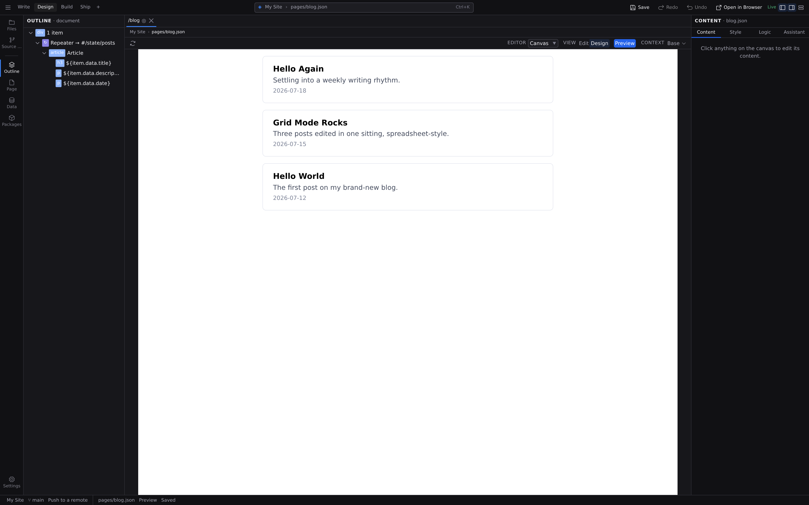
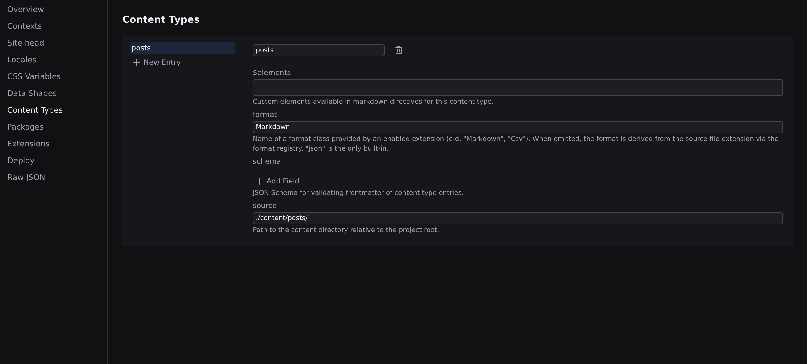
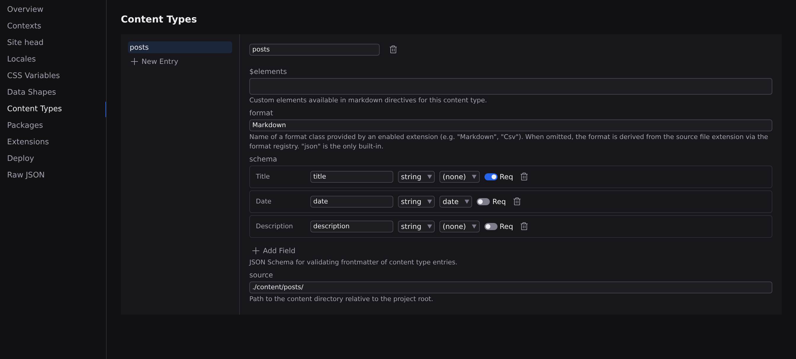
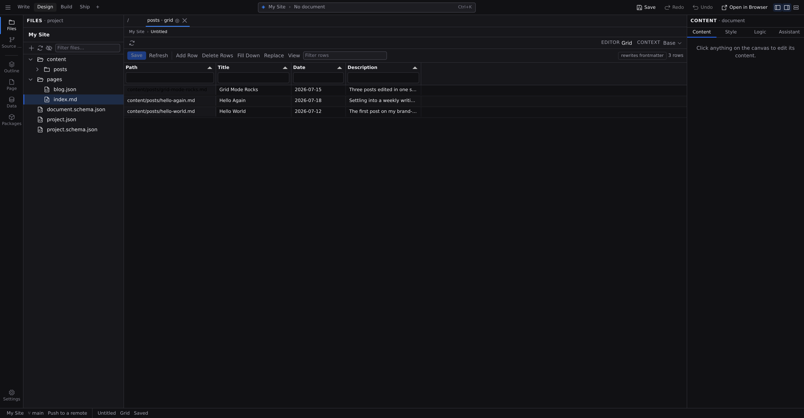
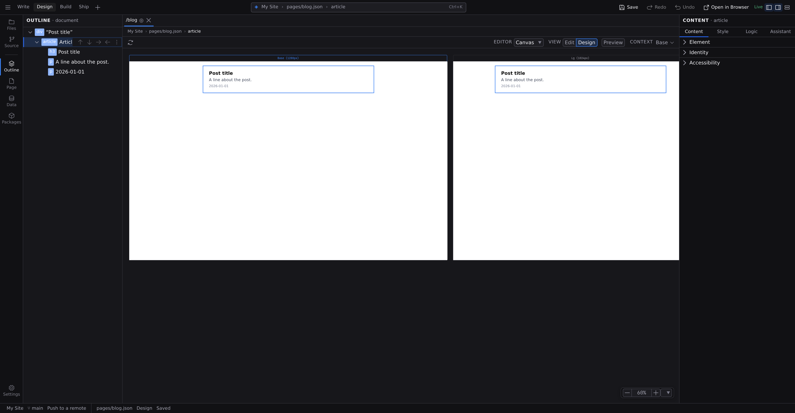
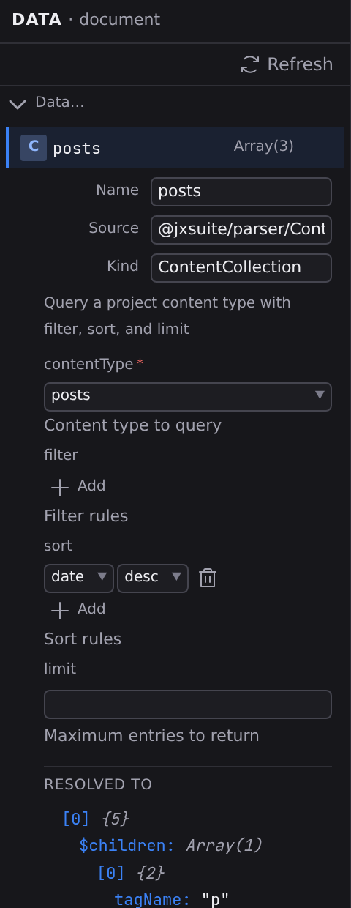
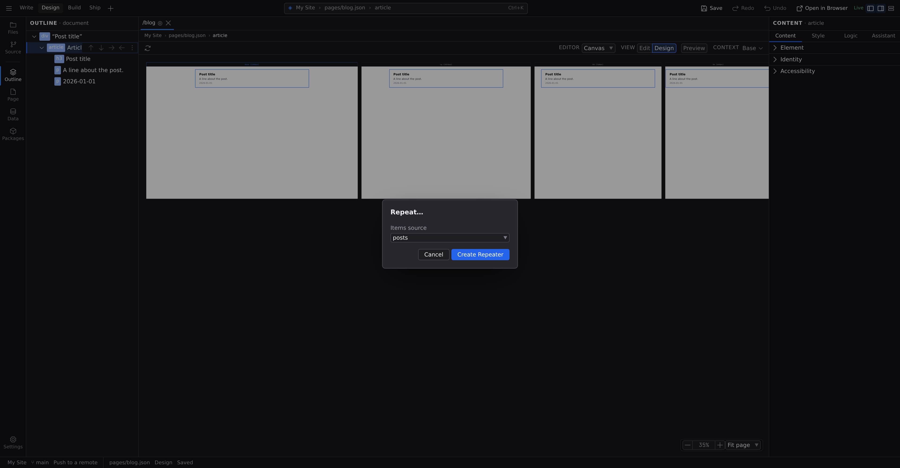
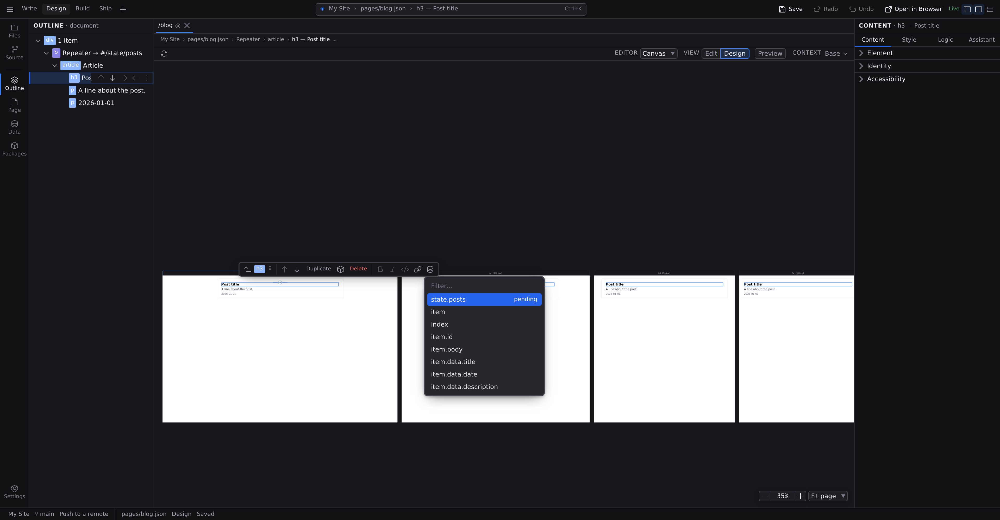
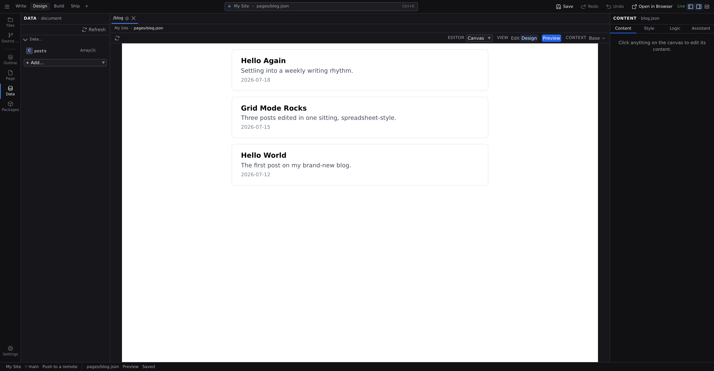

# Tutorial: a blog with content collections

In this tutorial you give your site a blog the structured way: a `posts` content type with a field schema, three entries created from it, a round of bulk editing in Grid mode, and a Blog page that lists every post from live data. Add a fourth post next month and the page updates itself.

**About 20 minutes.** Before you start:

- Have a project open in Jx Studio. **[Your first project](/docs/start/first-project)** gets you there.
- Knowing your way around the canvas and panels helps; **[Tutorial: your first interactive component](/docs/start/first-component)** is the gentlest way in, but isn't required.

## 1. Create the posts content type

A content type is your CMS schema: where a collection's entries live, and what fields each one carries.

1. Open the **Settings** menu at the foot of the rail and pick **Open Project Settings › Content Types**. (:kbd[⌘K] and **Open Project Settings** gets you to the same place.)
2. Click **New Entry** at the bottom of the type list.
3. Type `Posts` and click **Create**.

You should see the new type selected, named `posts`, with a matching source folder (`content/posts/`) and an empty field schema ready to fill.

## 2. Give it fields

Add three fields. For each one, click **Add Field**, type the name, pick its type, and click **Add**:

1. `title`, type **string**, with the **Required** switch on.
2. `date`, type **string**, format **date**, so entries get a proper date field.
3. `description`, type **string**.

You should now see three field rows in the schema. These become the form every post fills in. Leave **Source** and **Format** as they are, and close Settings. Everything else the builder can do, from nested fields to references between types, is in **[Content types](/docs/studio/projects/content-types)**.

## 3. Create your first post

1. Press :kbd[⌘⇧E] to open **The Library**.
2. Click **New**. The menu now lists an item for the type you just defined, so pick **Posts**.
3. Name the entry `hello-world`.

Studio creates the file in `content/posts/` with every schema field pre-filled with a sensible blank, and opens it. Back in The Library, the entry appears under the **Content** filter, labeled with its type.

## 4. Fill it in

The post opens in **Edit** view with a **Document Header** card docked at the top of the canvas, holding the same fields your schema defined:

1. Type `Hello World` into **title**.
2. Pick today in the **date** field.
3. Give **description** a sentence: `The first post on my brand-new blog.`

Then click into the page below and write a paragraph or two of body text.

You should see the frontmatter form filled in and your words on the page. The same fields also live in the **Page** panel, :kbd[⌘5]. See **[Frontmatter and page metadata](/docs/studio/editing/frontmatter)**.

## 5. Add two more posts

Repeat step 3 twice, choosing **New** > **Posts** and naming them `grid-mode-rocks` and `hello-again` (or anything you like). This time skip the fields on purpose; you'll fill them in bulk next.

You should now have three entries under The Library's **Content** filter, two of them with empty frontmatter.

## 6. Open the collection as a grid

Editing entries one file at a time doesn't scale, so Studio can open the whole collection as a spreadsheet:

1. Click **Files** in the **Project** group of the Navigator rail, or press :kbd[⌘1].
2. Right-click the `content/posts` folder and choose **Edit Collection in Grid**.

You should see one row per post and one column per schema field, with the **Path** column pinned at the left, and your two blank rows plain to see.

## 7. Fill in the blanks and save

1. Double-click each empty **title** cell and type one. Cells are typed, so **date** cells give you a date field.
2. Fill in the **date** and **description** cells the same way. Edited cells are highlighted, and nothing touches your files yet.
3. Click **Save**, which counts your pending changes, or press :kbd[⌘S] (macOS) or :kbd[Ctrl+S] (Windows/Linux).

Studio writes every change in one batch and reports what saved. Ranges, fill-down, and find & replace are covered in **[Grid mode](/docs/studio/editing/grid)**.

:::doc-note
Saving a collection row rewrites that file's frontmatter block, which is exactly what fills in your blank entries here.
:::

## 8. Create the Blog page

1. Open **The Library** again, then **New** > **Page**, and name it `Blog`. Studio writes the page and opens it at your site's `/blog` address.
2. In the **View** control on the pane's context bar, click **Design**.

You should see the empty page on the design canvas, once per breakpoint.

## 9. Design one post card

Design a single card, which the repeater will copy per post:

1. Press :kbd[⌘K] and run **Show Insert**. With nothing selected, click the **article** card.
2. With the article selected, click the **h3** card, then the **p** card twice. Each new element lands inside the selection.
3. Select each of the three in turn and give it placeholder text via **Text Content** in the Inspector's **Content** tab: `Post title`, `A line about the post.`, and `2026-01-01`.

You should see one plausible-looking post card on the canvas. Style it as much or as little as you like; **[Design mode](/docs/studio/design)** covers the tools.

## 10. Query the collection from state

The page needs the posts as data it can render:

1. Press :kbd[⌘6] for the **Data** panel, then click the **+ Add…** picker.
2. Pick **ContentCollection**, listed with the sources your project's imports and extensions provide.
3. Rename the new entry to `posts` (type the name and press :kbd[Enter]).
4. Set **contentType** to `posts`, and add a **sort** rule on the `date` field with order `desc`, so the newest post lists first.

Open the **Data** panel (:kbd[⌘6]) and you should see `posts` worth `Array(3)`, which is your three entries, live. Filters, limits, and the other sources are covered in **[Data sources](/docs/studio/logic/data-sources)**.

## 11. Repeat the card for every post

1. Right-click the article, on the canvas or in **Outline**, and choose **Repeat…**.
2. In the dialog, set **Items source** to `posts`.
3. Click **Create Repeater**.

Your card is now the repeater's _template_, marked **↻** in Outline. On the design canvas it still renders once, which is the template view. Everything about repeaters lives in **[Repeaters](/docs/studio/design/repeaters)**.

## 12. Bind the card to each post's fields

Inside the template, each post's data is in scope:

1. Double-click the heading, select the placeholder text, and delete it.
2. Click **Insert data** on the floating toolbar and pick `item.data.title`. A live placeholder lands in the text.
3. Do the same for the two paragraphs: `item.data.description` and `item.data.date`.

Each text now holds a placeholder that fills itself from the current post. (A collection entry's schema fields live under `item.data`; `item` and `index` are there too.)

## 13. Preview and save

Pick **Preview** in the **View** control on the context bar.

You should see the single card expand into three, newest first, each filled in from its own post. Switch the **View** control back to **Design**, then save your open documents with :kbd[⌘S] / :kbd[Ctrl+S]. When you're ready, commit the lot from **Source Control**. See **[Source control](/docs/studio/publish/source-control)**.

## Give each post its own page

The listing links nowhere yet, and that's deliberate: one page per post is the job of a _dynamic page_, a single page file with a parameter in its name (like `[slug]`) that the build expands into one page per entry of the collection. That wiring lives in the page's own format rather than a Studio panel today; **[Routing](/docs/framework/site/routing)** shows the exact file, and **[Content collections](/docs/framework/site/content-collections)** covers looking up "the entry this URL names". Once a dynamic page exists, Studio meets you halfway: opening it puts a picker per URL parameter in the context bar's **resolving with** popover, so the canvas previews a real post instead of a placeholder.

## What you built

A complete content pipeline, end to end:

- A **content type** (`posts`) gives you schema-backed entries with one-click creation from The Library.
- **Three entries**, edited both one at a time (the Document Header card) and in bulk (**Grid mode**).
- A **ContentCollection** state entry is the collection as live, sorted data on a page.
- A **repeater** whose template binds `item.data` fields is one designed card, rendered per post.

:::doc-note
On disk this is all plain files: your types in the `content` section of `project.json`, one file per post in `content/posts/`, and the Blog page holding the query and the repeater. The formats are documented in **[Content collections](/docs/framework/site/content-collections)** and **[Lists](/docs/framework/concepts/lists)**.
:::

## Next steps

- Turn the post card into a reusable component with **[Working with components](/docs/studio/design/components)**.
- Add an author type and point posts at it with a **reference** field: **[Content types](/docs/studio/projects/content-types)** and **[Relationships](/docs/framework/site/relationships)**.
- Give posts their own pages with a dynamic route, described in **[Routing](/docs/framework/site/routing)**.
- Publish it, following **[Publish](/docs/studio/publish)**.
