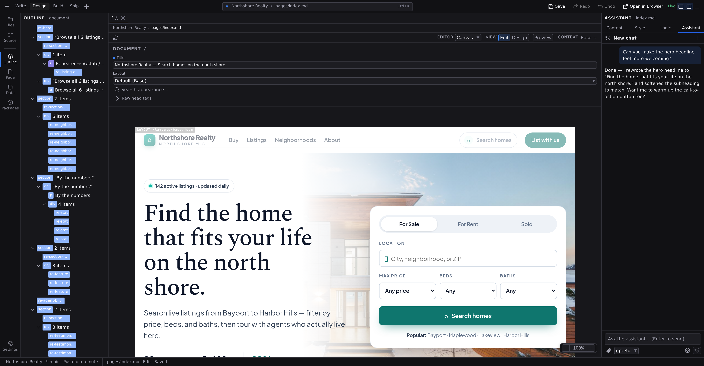

# AI assistant

Studio has a built-in AI assistant: a chat panel that answers questions about your project and changes it for you. It creates pages and components, edits the page on the canvas while you watch, and tells you what it finds in your files. It runs against an AI provider **you** connect; Studio ships no account, no hosted AI, and sends nothing anywhere until you do.

The assistant is the **fourth tab of the Inspector**, beside Content, Style and Logic. Show it with :kbd[⌘⇧4] (macOS) / :kbd[Ctrl+Shift+4] (Windows/Linux), or by clicking the tab. Because it shares the Inspector's width, showing it costs the canvas nothing. It's available in every state: before you open a project, with a project open, and with a page on the canvas. What the assistant can do grows with each of those.

## What it can do

**With nothing open**, the assistant bootstraps. Describe a site and it creates a project for you: name, folders, starter pages, and a design quickstart (colors and fonts) derived from your description, then keeps building inside it. It will ask you where to put the project before creating anything. Tell it a folder (or, on the cloud, a GitHub account or organization). It can also clone a live site. Point it at a URL and it crawls the pages, extracts the styles and assets, finds the shared layout and the repeating components, and opens the project. Where Studio runs against your own machine it opens straight away, so the Files panel fills up in front of you while the crawl runs; where the project is a repository being built for you, it opens once the import is committed, because there is nothing to look at until then. It reports each phase as it goes, and stops to ask you about the judgement calls that are yours to make. The **[New Project](/docs/studio/projects/create)** dialog's **Agent** and **Import** tabs are these same two jobs as a form you fill in.

**With a project open**, the assistant works across files. It can list and read any project file, find files by name, create new pages and components, and rewrite files whole. Anything it writes as a Jx document is validated before it touches disk. It can also open a page on the canvas to continue there.

It also knows which extensions your project has turned on and which ones your setup can run, so a request that needs a capability Jx does not have on its own can be answered by turning one on rather than by hand-building it. Ask for a blog and it enables the content extension before writing your first collection. It installs the package and enables it in one step, the same way the **[Extensions](/docs/studio/projects/settings)** section does, and it tells you which it turned on. Installing is not undoable, and it will not uninstall anything without asking.

**With a page on the canvas**, the assistant edits that page live: text, styles, element properties, adding, moving, and removing elements, and the page's state entries. This is the most precise mode, and the one you can watch and undo; see **[Document assistant](/docs/studio/ai/document-assistant)**.

In every state it also answers questions ("what does this page's state do?", "which component renders the header?") by reading the same files you see.

Each request gets five working rounds: five turns of thinking and calling tools before it must reply. If a big request runs out, the assistant stops and lists what it finished and what went wrong; send another message to continue, or split the request into smaller ones.

## Connect a provider

Until AI is connected, the tab shows the chat as usual with one line beneath it (_No AI provider is connected yet_) and an **Open Preferences…** button. A provider key is something you set once for the whole app, so it lives in **[Preferences](/docs/studio/interface/preferences)** › **Assistant** (:kbd[⌘,]) rather than occupying the panel. That is also where you can see it listed and disconnect it later.

### Connect Cloudflare (Jx Cloud)

On Jx Cloud that section leads with **Connect Cloudflare**: Studio brokers **Workers AI** on your own Cloudflare account, so you need no API key and no third-party provider account. Click **Connect Cloudflare**, approve the authorization in the Cloudflare window that opens, and you land back in Studio with the assistant connected. Inference runs on your own Cloudflare account and bills to it; Jx only brokers the request.

If your Cloudflare login covers more than one account, Studio cannot guess which one to bill, so it asks: a short list appears, you pick the account, and the assistant unlocks. You can change that choice later in **[Preferences](/docs/studio/interface/preferences)** › **Accounts**.

This option appears only where a platform can run that hosted flow. The desktop app and the dev server show the key form alone.

#### When the connection expires

A Cloudflare authorization does not last forever. When yours lapses, the same place in Preferences says so and the button reads **Reconnect Cloudflare**. One click through the same approval screen and the assistant works again. Nothing else about the project changes, and your model choice is remembered. If a session goes stale while you are working, the first request that hits the lapsed grant flips the panel back to **Reconnect Cloudflare** rather than leaving you with an assistant that quietly stops answering.

:::doc-note
If Cloudflare itself is briefly unreachable, Studio does **not** ask you to reconnect, because reconnecting would not help. The assistant reports the provider as unavailable and keeps the connection you already have.
:::

### Bring your own key

Below the Cloudflare option (or on its own, everywhere else) is the **AI provider key** form:

1. Paste an API key. Any OpenAI-compatible key works: OpenAI itself, a compatible hosted provider, or a local model server.
2. Optionally set an **Endpoint**. Leave it empty for OpenAI, or point it at a compatible server such as a local LLM (for example `http://localhost:11434/v1`).
3. Pick a **Model**. Click **Fetch models** to list what your key can use under the field, then open the list and choose one, or type a model ID directly: anything you type is accepted, whether or not the list has it, and if it does the list opens on your row. Leave it empty to use your provider's own default.
4. Click **Save**. The form keeps showing what it saved, so you can see the endpoint it kept and the model it recorded.

To change any of this later, click the gear button (**API key & endpoint**) at the bottom of the tab. It reopens **Preferences › Assistant**. You can also switch models per conversation with the model picker next to the message box.

:::doc-tip
Fetch models tests the key and endpoint **currently in the form**, not the ones already saved, so you can paste a new key and check it lists what you expect before saving it.
:::

:::doc-note
**Reasoning models work.** When a model streams its thinking beside its answer, Studio keeps that thinking with the turn and hands it back to the provider on the next round, which providers like DeepSeek require once the assistant starts calling tools. You never see it in the chat; it is part of what the model is owed, not part of the reply.
:::

:::doc-note
The key, endpoint, and model choice are stored locally on your machine, per browser or app install. If the Studio backend you're running already holds credentials (a dev server started with an `OPENAI_API_KEY` environment variable, or a Cloudflare account you connected earlier), the assistant unlocks without asking for anything.
:::

Whichever route you take unlocks the AI features everywhere in Studio, including the [New Project](/docs/studio/projects/create) dialog's **Import** and **Agent** tabs.

## What leaves your machine

Nothing is sent anywhere until you send a message. When you do, Studio sends what the assistant needs to answer to your configured provider, and nowhere else:

- your message and the rest of the conversation,
- any context you attached (the current page reference, the selected element),
- the full contents of the page open on the canvas,
- a summary of the open project: its name and settings, component names, and file paths,
- whatever files the assistant reads while working on your request.

Requests travel through Studio's own local proxy straight to the endpoint you configured; your key rides along only on those requests. If you point the endpoint at a model running on your own machine, nothing leaves it at all.

## Learn the two surfaces

- **[The AI assistant](/docs/studio/ai/chat)**: the chat itself, covering attaching context, watching edits land, answering a question it stops to ask, following a long job, chat history, and reviewing or undoing what the assistant changed.
- **[Document assistant](/docs/studio/ai/document-assistant)**: how the assistant works when a page is open on the canvas, and when to use that instead of project-wide edits.

## Next

- Create a project for the assistant to work in: **[New Project](/docs/studio/projects/create)**
- The state entries it can add for you are explained in the **[Data panel](/docs/studio/logic/data)**
- Working the same project from outside Studio, with a coding agent or in CI: **[Working with agents](/docs/framework/agents)**
  - packages/studio/src/surfaces/ai-credentials-form.ts
  - packages/studio/src/surfaces/ai-model-picker.ts
