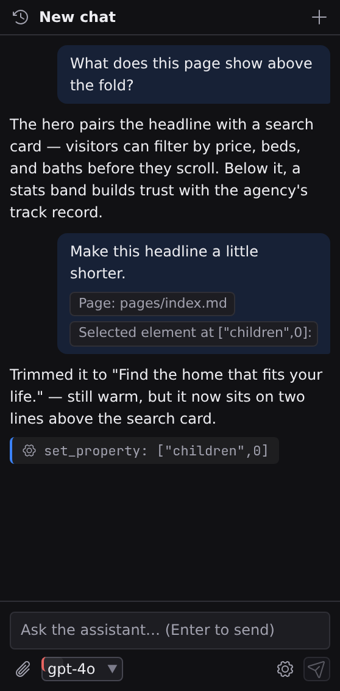

# The AI assistant

The assistant lives in the Inspector, as its fourth tab beside Content, Style and Logic. It survives tab switches (your draft message, scroll position, and conversation are all still there when you come back), and it works in every state of Studio, from the welcome screen to a page mid-edit. Because it shares the Inspector's width, showing it costs the canvas nothing.

## Open it

Press :kbd[⌘⇧4] (macOS) / :kbd[Ctrl+Shift+4] (Windows/Linux), or click the **Assistant** tab at the top of the Inspector. :kbd[⌘⇧A] / :kbd[Ctrl+Shift+A] does the same and puts the cursor in the message box, ready to type. That works on the welcome screen too, before any project is open. Drag the Inspector's inner edge to resize it; the width and which tab you left selected are both remembered across sessions.

If no AI provider is set up yet, the tab still opens on a chat, with one line under it (_No AI provider is connected yet_) and an **Open Preferences…** button that opens Preferences on its Assistant page. See **[Connect a provider](/docs/studio/ai#connect-a-provider)**.

## Send a message

Type in the message box at the bottom and press :kbd[Enter] to send. :kbd[Shift+Enter] inserts a newline. The box grows as you type, and the send button enables once there's something to send.

The row under the message box holds the composer's controls:

- **Attach context** (paperclip) pins the current page or the selected element to your message (below).
- The **model picker** switches models mid-conversation. The list comes from the provider you have configured, and only from that one: change the key or the endpoint and the picker re-asks rather than showing you the previous provider's catalogue. Where the provider says which of its models can call tools, one that cannot is labelled, and picking it puts a line under the picker: that model will answer your questions but will not edit anything. It is a fine choice when you want to think out loud, just not the one to blame when nothing changes on the canvas.
- **API key & endpoint** (gear) reopens the **Assistant settings** dialog.
- **Send** becomes **Stop** while the assistant is replying; click it to halt the reply and any further actions.

## How much the assistant is holding

The chat header shows how much of the model's context the conversation is using: `18.4k` for about eighteen thousand tokens. It appears once there's something to count and stays quiet until it matters.

Past **half** the model's window it turns amber. That is the point at which the assistant starts dropping the oldest turns to make room, so a long conversation quietly forgets what you told it near the beginning. When you see amber and the assistant seems to have lost the thread, start a new chat: the reply that follows will have your whole message rather than the tail of it.

## Attach context

The paperclip menu offers two attachments, each shown as a removable chip above the message box:

- **Current page**: the file open in the active tab.
- **Selected element**: the element currently selected on the canvas, identified by its tag and a snippet of its text.

With several elements selected, the chip carries the **primary** one (the last you added), so the attachment always names a single, unambiguous target. Attaching the selected element is the precise way to say "this one": "make _this_ heading smaller" works reliably when the heading rides along as a chip. One chip of each kind is kept, chips clear after sending, and sent messages display their chips so you can see later what a request pointed at.

Even without attachments the assistant already knows a lot: each message carries the open page's full contents and a summary of the project (its name, settings, component names, and file paths). Attachments are for pointing, not for granting access.

## Watch it work

The assistant's reply streams in live. When it acts on your project, each action appears as a small labeled chip in the reply (one per edit or file operation), and each chip says what **became** of that action: a tick and the change it made, or a cross and the reason it was refused. A chip with neither is still in flight.

Under the chips, a reply that changed anything carries a one-line summary: "Changed 3 files", plus a count of any that were **written to disk, where undo cannot reach them**. Expand it for the list of paths. When every change in a reply went through the editor, the summary also offers **Restore to here**, which rolls that whole reply back in one step.

Document edits land on the canvas as they happen, so for canvas work you can literally watch the page change. If something goes wrong mid-request (a lost connection, a provider error), the chat shows the error with advice on how to recover, and a **Retry** button that sends your last message again.

A long request that reaches the assistant's per-message limit on tool calls is not an error: it finishes with a note saying it ran out of rounds and listing what it did apply, and everything it changed stays changed. Send another message to continue.

## When the assistant asks you something

Some decisions are not the assistant's to make. These are yours: which pages of a site actually matter, whether to keep a design or replace it, whether a page that came out at 61% of the original is close enough. When the assistant hits one, it **stops and asks**, right in the conversation, and waits.

A question appears as a card in the reply. If there is a short list of sensible answers it offers them as buttons; you can always ignore them and type your own instead, because the composer beneath is live. Its placeholder changes to **Answer the assistant…** so you can see the difference. Whatever you send goes back as the answer to that question, not as a new message, and the assistant carries straight on from there.

Three things follow from that:

- **You can decline.** Every question has a **You decide** button. The assistant takes its best guess and tells you what it chose.
- **Waiting costs the assistant nothing.** A reply that stops to ask you three questions still has its full budget of work left. The limit is on how much it does on its own, and it does nothing at all while it waits for you. If you'd rather it stopped altogether, **Stop** ends the whole reply.
- **A question does not survive a reload.** Reload Studio while one is open and the card stays in the transcript but goes quiet, with a line saying so. Just send a message to pick the thread back up.

:::doc-tip
The assistant is told to ask sparingly: only for things that are genuinely your judgement, only one at a time, and never for something it could have looked up itself. When it asks, the answer changes what it builds.
:::

## Watching a long job

Some work takes minutes instead of seconds: cloning a site with **[Import](/docs/studio/projects/create)** is the main one. It runs as one of those chips, with its log open beneath it, reporting the phase it is in, what it is doing right now, and every line it has reported so far.

The log is a scroll region you own. It follows the newest line as it arrives, and stops following the moment you scroll up to read something, so you can go back through what happened without being yanked to the bottom every second.

**When the run ends the log stays.** The panel collapses to its outcome (`Imported example.com`, or the reason it failed) with a count of the lines folded behind it, and clicking the summary opens the whole thing again. A finished import is exactly when you want to reread what it warned you about.

The chip's own summary says how many pages the run found, what it skipped, and which pages didn't render faithfully if you asked it to check. That report is there so the assistant can act on it, and so it can ask you about the parts that were genuinely ambiguous.

:::doc-note
An import opens its project immediately, a few seconds in, rather than waiting for the run to finish. You watch the log in the Inspector while the Files panel fills up beside it.
:::

## Review and undo edits

What the assistant may change, and how you take it back, follows two rules:

**Edits to a page open on the canvas** are applied to the open editor, not to disk. The page's tab is marked unsaved, exactly as if you had made the edits yourself. Review them on the canvas, then save the tab to keep them or close without saving to discard. They also enter the page's normal undo history as **one undo step per request**: press :kbd[⌘Z] (macOS) or :kbd[Ctrl+Z] (Windows/Linux) once to roll back everything the assistant did to that page in its last reply. If one request edited several pages, each page carries its own single step.

**File-level changes** (new pages, new components, whole-file rewrites) are saved straight to disk and are **not undoable** from Studio's history. Two guards keep this safe: Jx documents are validated (and test-rendered) before writing, and the assistant refuses to overwrite a file you have open with unsaved changes. When it writes a file you _do_ have open (with no unsaved edits), the tab refreshes to show the new contents.

:::doc-tip
For disk-level changes, source control is the review tool: the **[Source Control](/docs/studio/publish/source-control)** panel shows every file the assistant touched as a pending change you can diff or discard before committing.
:::

## Chats and history

The header names the current chat and holds two buttons: the history button (left) opens the **Chats** list, and **+** starts a new chat.

- Chats are titled after your first message and listed newest-first with a timestamp and message count.
- Click a chat to reopen it; the conversation continues where it left off.
- Hover a row and click the trash button to delete a chat. Deleting the open one leaves you in a fresh empty chat.
- When you reopen Studio, your last open chat is restored.

History is stored on your machine and kept per project, so conversations never mix between projects. Each project keeps its 20 most recent chats, and each chat keeps its latest 50 messages. What is stored is everything the provider needs to carry on, including a reasoning model's own thinking (which providers such as DeepSeek require back before they will answer again), so a reopened chat continues rather than starting over.

## By name, not only by button

Everything the chat can do is also a command, so it is in the palette under **Assistant**, works from the keyboard, and can be rebound: **Focus Composer** (:kbd[⌘⇧A]), **New Chat**, **Chat History**, **Retry**, **Attach Selection** and **Stop**. The header's buttons run those same commands rather than a private copy of them, which is why a button's tooltip always prints the shortcut you actually have.

Two of them state when they cannot act instead of going quiet: **Retry** needs a connected provider and a last message to re-send, and **Stop** is live only while a reply is streaming. Hover either one, or read the greyed row in the palette, and it says which.

## Next

- How the assistant edits the open page: **[Document assistant](/docs/studio/ai/document-assistant)**
- What each message shares with your provider: **[AI assistant](/docs/studio/ai#what-leaves-your-machine)**
- Where saved and unsaved files live: **[Documents and panes](/docs/studio/interface/tabs)**
