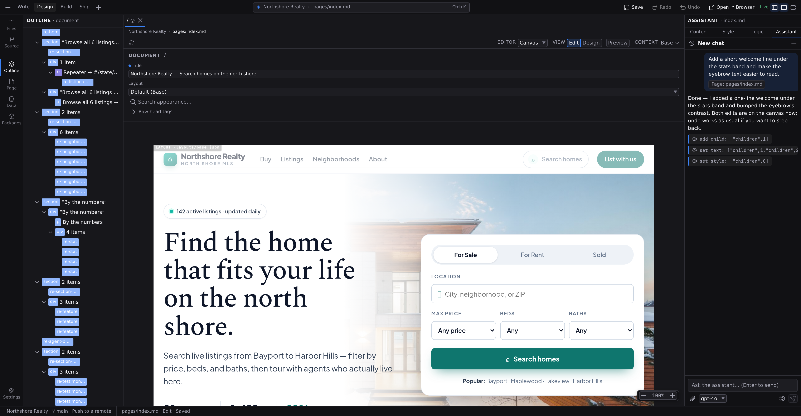

# Document assistant

The document assistant is what the **[AI assistant](/docs/studio/ai/chat)** becomes when a page or component is open on the canvas: the same chat, now scoped to that document. It isn't a separate panel. Opening a document simply hands the assistant that page's full structure and a set of precise editing abilities it doesn't have otherwise. This is the mode to use when you want to _see_ the assistant work and be able to take it back.

The assistant is the fourth tab of the Inspector: show it with :kbd[⌘⇧4] (macOS) or :kbd[Ctrl+Shift+4] (Windows/Linux), or by clicking **Assistant**. Provider setup lives in **[Preferences › Assistant](/docs/studio/interface/preferences)**, not in the panel itself. A provider key belongs to Studio rather than to one panel, and the panel that is missing one is the wrong place to go looking for it.

The assistant uses the model you picked in **[Preferences](/docs/studio/interface/preferences)**. If you have not picked one, it uses whatever your provider says it prefers.

## What it can do on the open page

With a document active, the assistant edits the page the way you would, one change at a time:

- rewrite any text,
- restyle elements property by property (the same styles you'd set in the **[style inspector](/docs/studio/design/style-inspector)**),
- change element properties: tags, classes, attributes, component options,
- add new elements, move them, and remove them,
- add or update the page's state entries (the same ones the **[Data panel](/docs/studio/logic/data)** shows).

These abilities follow the canvas. Project Settings and the grid editors are documents too, but they aren't element trees to restructure. With one of those in front of you the assistant can still read and answer, and the editing tools step back, exactly as **Delete** and **Duplicate** do for you in the Outline. It is one rule, not two: the assistant is held to the same condition you are. Its **Delete** and **Duplicate** are, in fact, those same commands: removing several elements at once is one undo step, the copies it makes become the selection, and a refusal you would see in the Outline (the document root, a repeater's template, a switch case) is the refusal it reads.

Every change lands on the canvas the moment it's made, so the page updates in front of you while the reply streams. To aim the assistant at one specific element, select it on the canvas and attach it with the composer's paperclip menu. See **[Attach context](/docs/studio/ai/chat#attach-context)**.

## Every edit is checked

After each change, Studio validates the document and test-renders it out of sight. If an edit introduced a problem (an invalid property, something that breaks rendering), the assistant is told exactly what went wrong and fixes it with follow-up edits in the same request. The page may pass through an imperfect intermediate state while it iterates; that's the self-correction loop working, not the final result.

The rules it's checked against are your project's own, the same generated schemas the **[code editor](/docs/studio/logic/code)** underlines against, so sections contributed by the extensions you've enabled are enforced too. Writes to `project.json` go through the same gate before they reach disk, and a change to your enabled extensions updates the rules for both surfaces immediately.

If the assistant runs out of working rounds before everything is fixed, it stops and lists what was applied and which problems remain, so nothing fails silently.

## Undo and save

Document edits follow Studio's normal editing rules:

- They go into the page's undo history as **one step per request**, so :kbd[⌘Z] (macOS) or :kbd[Ctrl+Z] (Windows/Linux) rolls back the assistant's whole last reply on that page. If a request switched between pages, each page gets its own single step, including the second page.
- They live in the open editor, not on disk: the tab is marked unsaved until you save it, and closing without saving discards them.

The full review workflow (including the file-level changes that _don't_ work this way) is covered in **[Review and undo edits](/docs/studio/ai/chat#review-and-undo-edits)**.

## Page open or not: which to choose

Where the assistant works depends only on what's on the canvas, so you steer it by what you open:

- **Open the page first** when you care about watching and undoing. With the page on the canvas, requests like "tighten the hero spacing" become live, validated, undoable canvas edits to that page.
- **Leave the canvas empty (or ignore it)** for project-wide work. Without a document scope the assistant creates and rewrites files directly. That is faster for "scaffold an about page and a contact page", but those writes go straight to disk and aren't undoable from Studio.
- **Let it switch itself.** The assistant can open a page on the canvas as part of a request; from then on its document edits target that page. It does this when you ask to see a page, or when fine-grained editing suits the task better than rewriting the file.

Not every project-wide action is a file write. Asking for something the core does not do on its own, a blog or a search box or a feed, can make the assistant turn on an **[extension](/docs/studio/projects/settings)** for you. Turning one off is an ordinary configuration change you can undo; turning one on may also install a package, which undo cannot take back. It tells you which it turned on either way.

A simple habit: if you'd want to press undo afterwards, open the page before you ask.

## Next

- The chat itself, with composer, history and reviewing edits: **[The assistant's chat](/docs/studio/ai/chat)**
- What the assistant can do in every state, and provider setup: **[AI assistant](/docs/studio/ai)**
- The state entries it adds are explained in the **[Data panel](/docs/studio/logic/data)**
