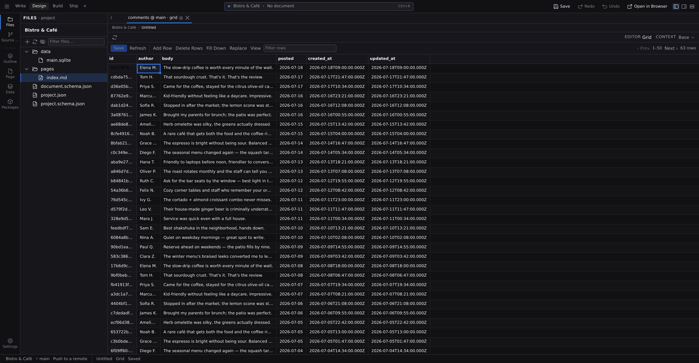

# Data grid

The data grid is **[Grid mode](/docs/studio/editing/grid)** pointed at a database table. The spreadsheet surface is the same one: typed cells, range selection, fill down, find & replace, one batched **Save**. What changes is where the rows come from, a live database instead of files in your project. Use it to check what visitors have submitted, fix a bad value, seed test rows, or clean out old data.

## Open a table

Click **Open Data Grid** in the action row of _Settings > Connections_ or _Settings > Data Tables_. The picker lists every grid-able source in one place: pages and content collections under **Project**, then a **Data** group per connection with its tables. A connection with no tables yet says so in place of its list, and asks you to push a schema first: define and push in **[Data tables](/docs/studio/data/tables)**, then come back.

Each table opens as its own tab, so you can keep a grid alongside the page you're building.

## Read the columns

Columns come straight from the real database, so the grid always shows what's actually there, including columns your schema no longer mentions and the account tables the auth extension creates. Three columns are managed for you and read-only: the id column (pinned at the left) and the `created_at` / `updated_at` timestamps. Everything else edits with the control its type calls for: text, number, checkbox for booleans, a date field for dates. Structured values show as JSON text.

## Page through rows

Big tables aren't loaded whole: the grid shows 50 rows at a time, with **‹ Prev** / **Next ›** and the current range next to the total count in the toolbar. The **Filter rows** box searches within the rows currently loaded, so use the pager to move through the rest. The per-column filter boxes and click-to-sort headers that file grids offer aren't drawn on a database grid, because they would only ever act on the page in front of you.

## Sort, group, and save the view

The **View** button works here as it does in **[Grid mode](/docs/studio/editing/grid)**, covering columns, sort, group by, and saved views. One thing differs:

- **Sort** is done by the database, over the whole table, not just the rows on screen. Change it and the grid re-reads the first page of the new order.
- **Group by** and **Filter rows** work on the rows currently loaded, so on a table longer than one page they group and search that page.

Saved views are per table: arrange `comments` the way you review it (the three columns you care about, newest first), save it as "Triage", and it's waiting the next time you open that table. Views live in Studio on this computer, not in the database or your project.

## Edit, add, delete

Editing works exactly as in **[Grid mode](/docs/studio/editing/grid)**: double-click a cell, edit ranges, **Fill Down**, **Replace**, undo and redo. Nothing touches the database until **Save**:

- **Add Row** appends a pending row; fill in its cells (required fields must be provided).
- **Delete Rows** marks the selected rows; they're removed on save, after a confirmation.
- **Save** (:kbd[⌘S] / :kbd[Ctrl+S]) writes the whole batch, and the button counts your pending changes.

On save, each row becomes its own write to the database. Rows that succeed are done; a row the database refuses (a missing required value, a wrong type) stays pending with the reason attached to its cells, so you can fix it and save again. There are no stale-file checks here because there are no files: the database itself is the authority, and **Refresh** re-reads it at any time.

:::doc-warning
Database rows aren't files in your project. They're not in version control, and a saved deletion cannot be undone. Studio confirms before deleting, but after that the rows are gone.
:::

## Where it's different from file grids

|                 | File grids (collections, pages, CSV)                                     | Data grid                       |
| --------------- | ------------------------------------------------------------------------ | ------------------------------- |
| Rows are        | files in your project                                                    | rows in a database              |
| Loaded          | whole                                                                    | 50 per page                     |
| Sorting         | in Studio, over every row                                                | in the database, over every row |
| Save writes     | files (frontmatter, CSV cells)                                           | one database write per row      |
| Conflict safety | stale-file detection                                                     | per-row database errors         |
| Undo after save | revert the file in [Source control](/docs/studio/publish/source-control) | none, because the write is live |

## User accounts in the grid

With the auth extension enabled, its `user` and session tables show up in the picker like any other table. Editing user rows here is also how roles are assigned; see **[Auth and secrets](/docs/studio/data/auth-and-secrets)**.

## Next

- **[Grid mode](/docs/studio/editing/grid)** covers the shared spreadsheet surface in full: ranges, fill down, find & replace.
- **[Data tables](/docs/studio/data/tables)** is where you change what columns a table has.
