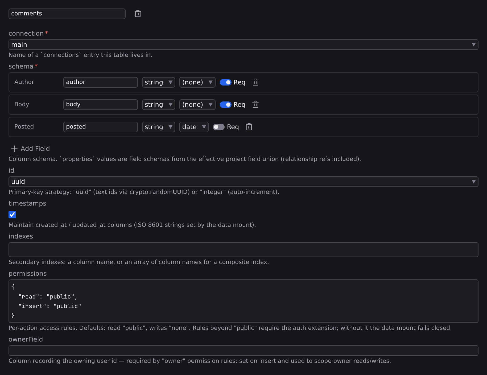

# Data tables

A data table is like a content type for live data: a name, a set of fields, and the connection its rows are stored in. You define tables here; **Push Schema** then creates them in the actual database. Pick **Open Project Settings › Data Tables** from the **Settings** menu at the foot of the rail. You can also open **[Project settings](/docs/studio/projects/settings)** any other way (:kbd[⌘K] then **Open Project Settings**, or the **⬢ menu**) and choose _Data Tables_: tables on the left, the selected table's editor on the right.

## Create a table

1. Click **New Entry** at the bottom of the table list.
2. Type a name and click **Create**. "Comments" becomes `comments`.

The new table starts empty, readable by everyone and writable by no one. First pick its **connection**, a dropdown of the entries from **[Connections](/docs/studio/data/connections)**.

## Build the fields

The **schema** editor is the same visual field builder as **[content types](/docs/studio/projects/content-types)**: each field has a name, a type (string, number, boolean, array, object, reference), an optional format for string and array fields, and a **Req** toggle. Required fields must be provided whenever a row is inserted.

A **reference** field links a row to something else. Its **Target** picker lists your content types, and the row stores the target entry's id. How references resolve is the same story as content **[relationships](/docs/framework/site/relationships)**.

Studio draws one picker for every field that points at a collection, wherever that field appears: a schema-driven settings form, a content entry's **[frontmatter](/docs/studio/editing/frontmatter)**, a row inside a repeatable group. It lists that collection's entries, and it never quietly hides a problem: an id that no longer matches an entry stays in the field, flagged as not found, and if the entries can't be listed at all the field keeps editing as plain text with the reason beside it and a **Retry**.

:::doc-note
Under the hood a table's fields are ordinary Jx field schemas in the `data` section of `project.json`. The schema format also allows table-to-table references: a to-one reference becomes a `<field>_id` column, and a to-many reference between two tables materializes a junction table on push. The visual Target picker currently offers content types, so table targets are written in the JSON directly.
:::

## Table options

- **id**: whether rows are identified by `uuid` (random text ids, the default) or `integer` (1, 2, 3…).
- **timestamps**: on by default; every row gets `created_at` and `updated_at` columns the server maintains for you.
- **indexes**: column names to index for faster lookups; an inner list makes one composite index.
- **permissions**: who may do what, one rule per action (`read`, `insert`, `update`, `delete`). Rules are `public` (anyone), `none` (no one), `authenticated` (any signed-in user), `owner` (the row's owner), or `role:<name>`. Defaults are read `public` and every write `none`, so nothing is writable until you say so. Every rule beyond `public` and `none` needs the auth extension; without it those actions are simply denied. The rules are explained in **[Auth and secrets](/docs/studio/data/auth-and-secrets)**.
- **ownerField**: the column that records which user a row belongs to; required for `owner` rules, and stamped automatically on signed-in inserts.

## Push the schema

Defining a table describes it; pushing creates it. Click **Push Schema** in the action row:

1. Studio first compiles a **plan** (a dry run, nothing touched yet) and shows it as a list of steps: tables to create, columns to add, indexes, junction tables, and (with the auth extension) its account tables. Warnings appear below the steps. If everything already matches, the dialog says the schema is already up to date, and there is no apply button.
2. Click **Apply** to execute the plan, or **Cancel** to back out. The dialog then reports either "Schema applied." or the errors, with nothing half-done claimed.

From the Data Tables section a push covers every connection; from the Connections section, selecting a connection first scopes the push to it.

Pushes are **additive only**: they create missing tables and columns and never drop, rename, or retype anything that exists. Removing a field from a schema leaves its column (and its data) in place, and the plan notes such drift as a warning instead of destroying data. This makes pushing safe to run repeatedly.

A terminal or CI can push too: `jx db push` applies the same additive rules and takes the same `--dry-run` flag; see the **[CLI reference](/docs/framework/build/cli)**. Two differences matter. The CLI pushes the tables you define here and nothing else, so the auth extension's account tables come only from the button above. And the CLI talks to each connection exactly as declared, while the button goes through Studio's local backend. So for a **Cloudflare D1** connection, which is stood in by a local SQLite file while you develop, `jx db push` is what creates the tables in the real D1 database.

## Using tables from pages

Rows never pass through your project files. Pages talk to the tables live. In the **[Data panel](/docs/studio/logic/data)**, the connector's sources appear in the **+ Add…** picker alongside the built-in **[data sources](/docs/studio/logic/data-sources)**:

- **Table query**: a list of rows. **filter** and **sort** take the same rules as a content collection query; **limit** and **offset** page through a longer list; **include** names reference fields to expand, so a query on `comments` can come back with each row's linked `post` filled in (the whole row, not just its id), and to-many references expand into arrays the same way.
- **Table entry**: one row by **id**. The id can be a fixed value, a `${…}` expression, or the current route's parameter, which is how a detail page like `pages/posts/[id].json` fetches exactly the row its URL names.
- **Table insert**, **update**, and **delete**: write actions, made to be wired to a form's submit event. After a successful write, every query on the page refreshes itself.

Filtering, sorting, and paging all happen in the database rather than in the browser, so a query with a limit fetches only that many rows.

:::doc-note
Compiled pages carry no extension code. Each source is lowered at build time into a plain request to your site's own `/_jx/data` routes: `GET /_jx/data/comments?filter=…&sort=…&limit=…&offset=…&include=…` for a query, `GET /_jx/data/comments/<id>` for an entry, and `POST`/`PATCH`/`DELETE` for the actions. Each write action becomes an inline handler that reads the submitted form. Permission rules are evaluated on the server for every one of those requests.

In the JSON, a route parameter binds as `{ "$ref": "#/$params/id" }` (the same way a **[dynamic route](/docs/framework/site/routing)** binds a content entry), and a form points at a write action with `"onsubmit": { "$ref": "#/state/addComment" }`. That last one is written in the **[Code editor](/docs/studio/logic/code)** today, because the **[Events](/docs/studio/logic/events)** section of the Inspector's **Logic** tab (:kbd[⌘⇧3]) lists plain functions in its handler picker, and a write action is not one.
:::

To see and fix the rows by hand, open the **[Data grid](/docs/studio/data/grid)**.

## Next

- **[Data grid](/docs/studio/data/grid)** is where you browse, insert, and edit rows.
- **[Auth and secrets](/docs/studio/data/auth-and-secrets)** is what makes permission rules beyond `public` work.
