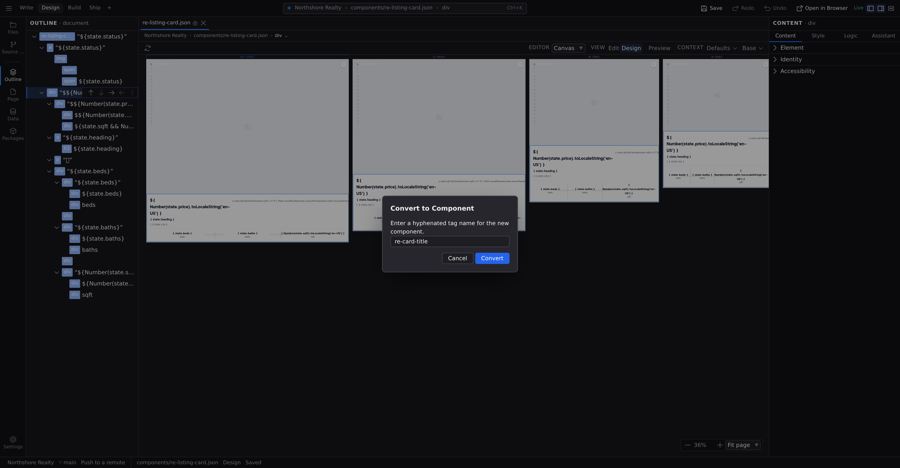

# Working with components

A component is a piece of design you build once and use everywhere: a card, a header, a pricing row. Each use is an _instance_; edit the component and every instance follows. This page covers the component workflows on the Design canvas; the bigger picture of what belongs in a component lives in **[Pages, layouts, components](/docs/studio/projects/pages-layouts-components)**.

## Convert a selection into a component

The natural way to make a component is to design it in place first, then promote it:

1. Build the element on the canvas: structure, styles, content.
2. Right-click it (on the canvas or in [Outline](/docs/studio/design/layers)) and choose **Convert to Component**.
3. Give it a tag name (lowercase, with a hyphen, like `pricing-card`) and click **Convert**. Studio validates the name as you type and won't let you collide with an existing component.

Studio saves the component as its own file in the project's `components/` folder, swaps your selection for an instance of it, and adds it to the [Insert palette](/docs/studio/design/elements). Drop more instances anywhere from there. If the component's slots need attention, Studio files it on **[Problems](/docs/studio/interface/problems-and-progress)** naming the component file, so it stays listed until you fix it.

To open a component from an instance, right-click the instance and choose **Edit Component**, or click **→ Edit definition** under **Component Settings** on the Content tab.

## Props: the component's options

Props are the knobs an instance can turn: the card's title, its image, whether it's featured. A component's props come from its state: every plain value you declare in the component's **Data** panel becomes a prop, with that value as its default. See **[Logic](/docs/studio/logic)** for declaring state.

On an instance, the [Content tab](/docs/studio/design/properties) shows a **Component Settings** section with a fitting control per prop (checkbox, number field, dropdown, media or color picker). Each prop can also be _bound_: click the **value source** chip beside its label and pick **From data…** for a signal, or **Mixed text** for a value that mixes text and data, so the instance follows live data instead of a fixed setting. It is the same three-rung choice, spelled the same way, that every other bindable row in Studio offers. See **[Formulas and expressions](/docs/studio/logic/formulas)**.

With the component's own definition open, the same section becomes **Component Defaults**: the values here are the ones the component ships, so a page that sets nothing gets these. There's no _from the component_ badge and no **→ Edit definition** link, because you're already there.

Each prop row also says where its value came from, in the same four-state chip the [Style tab](/docs/studio/design/style-inspector) uses. It is the same question asked of a second cascade:

- A prop you have filled in on this instance carries an accent **set here** dot; click it to clear the prop and hand it back to the component.
- A prop you have left alone, where the component declares a default, reads _from the component default_ in amber. Its tooltip states the default, and clicking it opens the component that defines it, so you can read the default rather than guess at it.
- A prop that is bound reads in violet, naming the signal it follows (or _a template_ / _a formula_ when it follows one of those).
- A prop with no value and no declared default draws nothing at all, because a badge on every empty row is noise.

**→ Edit definition** at the foot of the section opens the component. Below it, a **Usage** section counts the other places the project places this component (_Used on 2 pages and 1 other file_, or _Not used yet_) and lists those files; click one to open it. When the count cannot be taken the heading reads **Usage · unknown** and says so, with a **Retry**: "we could not check" and "nothing uses this" are answers you must never confuse.

## Slots: openings for content

By default an instance renders exactly what the component defines. A **slot** is a deliberate opening. Add a `slot` element inside the component definition, and whatever an instance holds as children flows into that opening. Give slots names to offer several openings (a card with an icon slot and a body slot). In [Outline](/docs/studio/design/layers), slots show a **▣** badge; hover it for the slot's name. Layouts distribute page content the same way.

## Preview with test props

A component file open on its own renders with its defaults, but defaults are often empty. Open the context bar's **resolving with** popover and you get one field per prop, stacked; type a value to see the component render with it, live on the canvas at every breakpoint. Numbers, `true`/`false`, and lists in JSON form are understood as such; anything else counts as text. Each field is also a command, so you can set one by name without reaching for the popover: press :kbd[⌘K] and run **Set Test Value**.

Test values are a preview lens only: they're never saved into the component, and clearing a field returns the prop to its default. They pair with the **Preview** toggle described in **[Modes and preview](/docs/studio/interface/modes)**.

:::doc-note
A component is a plain file (`components/pricing-card.json`), and converting also records a reference to it in the page's `$elements` list. The format is described in **[Components](/docs/framework/concepts/components)**.
:::

## Next

- Repeat a component once per item of a list with **[Repeaters](/docs/studio/design/repeaters)**.
- Insert instances from the **[Insert palette](/docs/studio/design/elements)**.
