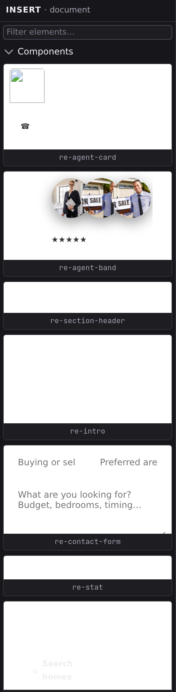

# Insert palette

Insert is the palette of things you can add to the page: the standard HTML building blocks plus your own components, laid out as cards.

## Open it

Insert has no button on the Navigator rail, because it is a palette you reach for at the moment you need it rather than a view you sit in. Two doors:

- Press :kbd[⌘K] and run **Show Insert**.
- In the **[Outline](/docs/studio/design/layers)** panel of an empty page, click **Add an element**.

It opens in the Navigator, under an **INSERT · document** header. Unlike the other document panels it is happy with no document open, because an element palette still means something before you have chosen where to put anything.

## What's in the palette

- **Components** are at the top: your project's own, plus components from installed packages once they're enabled for the project (see **[Dependencies](/docs/studio/projects/dependencies)**). Project components render a live preview on their card, so you see the real thing before you place it.
- **Element categories** come below: the HTML elements grouped by category in accordion sections. Each card shows a small preview of the element and its tag name.

Type in the **Filter elements…** box to narrow the palette by name; categories with no matches disappear. Click a category header to collapse or expand it. When a filter matches nothing at all, the panel says so and offers **Clear the filter** rather than leaving you with a blank column.

## Insert by click

1. On the canvas or in [Outline](/docs/studio/design/layers), select the element you want to insert into.
2. Click a card. The new element lands inside the selection, after its existing children.

With nothing selected, the element is added at the end of the document. With [several elements selected](/docs/studio/design/layers#select-several-at-once), it lands inside the last one you added to the selection, because inserting is a one-place verb and that is the place you pointed at most recently.

## Insert by drag

For an exact placement, drag the card instead:

1. Press and drag any card toward the canvas.
2. As you move over the page, an indicator line shows where the element will land: before, after, or inside the element under the cursor.
3. Drop to insert, or press :kbd[Esc] to cancel.

The new element arrives selected, ready for the Inspector's [Content](/docs/studio/design/properties) and [Style](/docs/studio/design/style-inspector) tabs. Dragging works the same in Edit and Design view. **[The canvas](/docs/studio/interface/canvas)** covers the other ways to insert: the **+** affordance between elements and the slash menu.

:::doc-note
Inserting adds one element node to the open file. A component card adds an instance tag like `<site-card>`. The format is described in **[Components](/docs/framework/concepts/components)**.
:::

## Next

- Get your own cards to appear here with **[Working with components](/docs/studio/design/components)**.
- Rearrange what you inserted in the **[Outline panel](/docs/studio/design/layers)**.
  - packages/studio/src/surfaces/panel-elements.json
  - packages/studio/src/surfaces/panel-elements.ts
