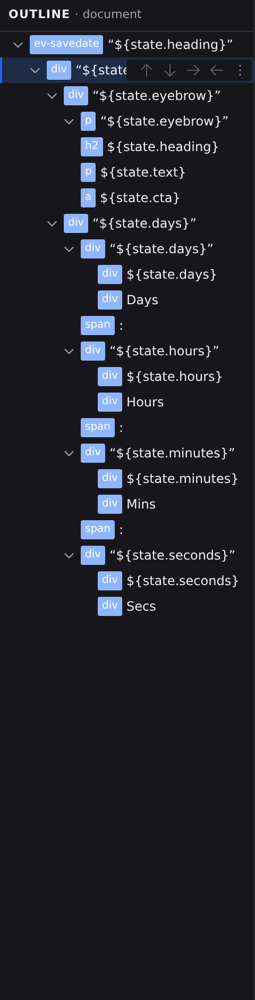

# Outline panel

Outline is the page's structure as a tree: every element in the open file, nested the way it nests on the page. Open it by clicking **Outline** in the **Document** group of the Navigator rail, or with :kbd[⌘5]. Use it whenever the thing you want to grab is hard to click on the canvas: a wrapper with no visible edges, an element hidden behind another, or the exact parent in a deep stack.

The panel's header names it and the level it works at, **OUTLINE · document**, because the tree is always the tree of the file in front of you. Open a different document and the panel follows.

## Read the tree

Each row shows a badge and a name. The badge tells you what the row is:

- The element's type: `div`, `h2`, `img`, and so on. An element whose [tag is chosen](/docs/framework/concepts/expressions#choosing-an-elements-tag) rather than fixed reads as both, `a|div`. It is still one row and one element, and the tag settles when it's created. Hover it to see which is which.
- **↻**: a [repeating list](/docs/studio/design/repeaters), an element that renders one copy per item.
- **⇄**: a condition, an element that shows one of several cases; each case appears as a child row named after the case.
- **▣**: a slot, the placeholder where a component or layout receives content. Hover it to see the slot's name.

Hover any badge for the plain-English version of what it marks.

Text sits in its own dimmed, italic rows, and rows with children get a chevron. Click it to collapse or expand that branch without changing the selection.

An empty page has no tree to show, so the panel says so and offers **Add an element**, which opens the **[Insert palette](/docs/studio/design/elements)**. With no document open at all, the panel says what it needs: "Open a page to see the elements it is built from."

## Select and navigate

Click a row to select that element. The canvas pans to bring it into view, and the Inspector's [Content](/docs/studio/design/properties), [Style](/docs/studio/design/style-inspector) and [Logic](/docs/studio/logic/events) tabs switch to it. If the element is inside a [popover](/docs/framework/concepts/overlays), the popover opens first, so a row you can see in Outline is always a thing you can see on the canvas. Selection works in both directions: click something on the canvas and its row highlights and scrolls into view in Outline.

## Select several at once

Outline is where a selection of more than one element is built:

- **:kbd[Shift]-click** a row and everything from the **anchor** (the row the selection started at) down to the row you clicked is selected, inclusive. The anchor stays where it is, so shift-clicking a third row redraws the range from the same starting point instead of starting over.
- **:kbd[⌘]-click** (macOS) / :kbd[Ctrl]-click (Windows/Linux) adds one row to the selection, or takes it out again if it is already in.
- **:kbd[Shift+↑]** and **:kbd[Shift+↓]** extend the same range from the keyboard.

A range covers the rows you can actually see, so collapsing a branch keeps its children out of a range drawn past it.

Every selected row is highlighted, and the last one you added is the **primary**. It holds the keyboard position in the tree, and it is the one element that the surfaces which can only speak about one thing address: the block action bar, and the ancestor trail in the status bar, which puts **N selected** in front of the trail to say the trail is naming one member of a set. On the canvas, every selected element gets a box.

What a multiple selection changes:

- **The Inspector says Mixed** wherever the selected elements disagree about a value, instead of showing the primary's value as though it were everyone's. The chip counts the elements it speaks for, reading **mixed (6)**. Typing a value writes it to all six in one step, and clicking the chip clears it from all six. See the **[Content tab](/docs/studio/design/properties)**.
- **Delete and Duplicate act on the whole selection, as a single undo step**: one :kbd[⌘Z] brings all six elements back. They are the canvas keys :kbd[Delete] and :kbd[⌘D], and they are also in the [command palette](/docs/studio/interface/quick-access). Duplicating leaves the copies selected, in page order; deleting leaves the primary's parent selected.
- **Whatever the elements have in common, one decision covers.** A style value typed with six cards selected is one transaction, so it is one undo step rather than six.
- **A selection that includes something with no sibling position is refused rather than half-applied.** The document element, a repeating list's template row and a condition's case row cannot be spliced, so **Duplicate** and **Delete** turn unavailable for the whole selection (greyed, with the reason they always give) instead of quietly acting on the rest of it.
- **Right-clicking a row that is already selected keeps the selection**; right-clicking anywhere else selects that row alone.

:::doc-note
**Move up / down / in / out stay single-target**, because moving several elements that are not siblings one slot along has no single meaning. From the [block action bar](/docs/studio/interface/canvas#the-block-action-bar) they act on the primary; from a row's own buttons they act on that row. The same goes for renaming and for dragging: you drag the row you grabbed, not the set.
:::

## Rename an element

Rows are named automatically from the element's content. To give one a name of your own ("Hero section" beats a `div` with a text preview), double-click the row, type the name, and press :kbd[Enter]. From the keyboard, :kbd[Enter] or :kbd[F2] on the focused row starts the same rename. Press :kbd[Esc] to cancel, or commit an empty name to go back to the automatic label.

:::doc-note
The name is a display title only. Studio stores it as a `$title` key on the element in the file. It never changes what the page renders.
:::

## Rearrange the page

Select a row, or just hover it, and its actions appear on the right:

- **Move up** / **Move down** arrows swap the element with its neighbors.
- The **right arrow** moves the element inside the sibling above it.
- The **left arrow** moves the element out of its parent, to sit just after it.
- **More actions** holds **Duplicate** and **Delete**.

A row's buttons act on **that row**, the one under your pointer, which is not always the one you selected. An action that cannot apply (moving the first child up, say) is shown greyed rather than hidden, with a tooltip saying what it needs. The buttons never move under your cursor.

:::doc-tip
The tree is keyboard-navigable. :kbd[↑] and :kbd[↓] walk the rows and take the selection with them, :kbd[→] expands a row or steps into it, :kbd[←] collapses it or climbs to its parent, and :kbd[Home] / :kbd[End] jump to the ends.
:::

For bigger moves, drag the **⠿** handle (it appears on any row you hover) or the row itself. An indicator shows where the element will land: above or below the row under the cursor, or inside it as a child. You can also drag a row straight onto the canvas and drop it at the spot you see. Press :kbd[Esc] mid-drag to cancel with nothing changed. Dropping an element into itself or its own descendants is blocked.

## Right-click for everything else

Right-clicking a row opens the same context menu as the canvas: **Copy**, **Duplicate**, **Copy styles**, **Wrap in Div**, **Repeat...**, **Convert to Component**, **Delete**, and more. The full list is in **[The canvas](/docs/studio/interface/canvas)**. **Set Title** in that menu starts the same rename as double-clicking.

In **Project Styles** the Outline panel switches to the element catalog instead of the document tree. See **[Project Styles](/docs/studio/design/stylebook)**.

## Next

- Add new elements from the **[Insert palette](/docs/studio/design/elements)**.
- Inspect what you selected in the Inspector's **[Content tab](/docs/studio/design/properties)**.
