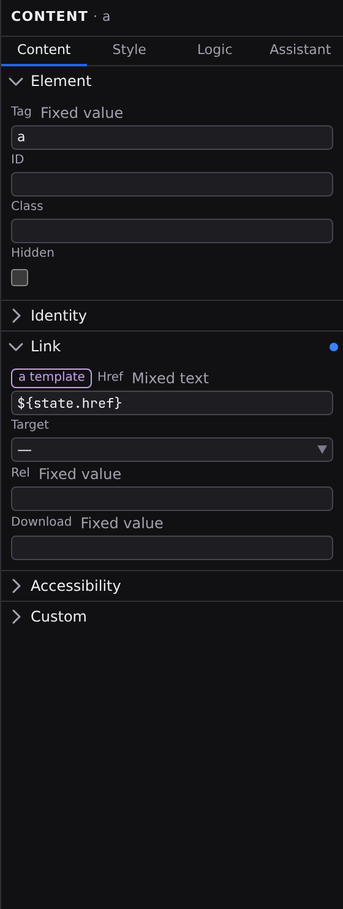

# Content tab

The Inspector has four tabs (**Content · Style · Logic · Assistant**), and Content is the first of them, :kbd[⌘⇧1]. It edits what the selected element _is_ and _says_: its kind, its attributes, its text, and, for component instances, their settings. Select an element on the canvas or in [Outline](/docs/studio/design/layers), then click **Content** at the top of the Inspector.

Each tab renders under a header naming the tab and what it is pointed at: the selected element, or the document when nothing is selected. With no file open the tab offers **Open a page…**; with a file open and nothing selected it asks you to click anything on the canvas. **Style** and **Logic** ask for the same thing in the same words, so the whole Inspector reads as one requirement rather than three. The tab you were last on comes back with the file, because the choice is remembered per document.

## The Element section

Every element starts with the same basics:

- **Tag**: the element's type. Change it to turn a `div` into a `section`, a `p` into an `h2`. Like other fields, it carries a **value-source** chip: switch it from **Fixed value** to **Formula** and the element becomes an `a` when it has somewhere to go and a `div` when it doesn't, wrapping the same content either way. You build that formula in the same operator editor you use everywhere else, with one difference: a tag has to be a name the page can be built from before it runs, so the editor offers only the two operators that choose between names, `?:` and `switch`, and no formula catalog. There is no _Mixed text_ option here either, because a tag is a name and not something you assemble from other text. The tag is settled when the element is created; see [Choosing an element's tag](/docs/framework/concepts/expressions#choosing-an-elements-tag).
- **ID** and **Class**: the element's identifier and CSS classes.
- **Text Content**: the element's text, shown when it has no child elements.
- **Hidden**: a checkbox that removes the element from the rendered page without deleting it.

## Where a value came from

Every row's label carries a **provenance chip** that answers one question before you type: where does the value in this box come from? It has four states.

- **Set here**: an accent dot. This element carries the value itself; click the dot to clear it.
- **Inherited**: amber, and it names its donor. A component prop left alone on the instance reads _from the component default_, and clicking it opens the component that defines it.
- **Default**: nothing at all. An unset row with nothing behind it draws no chip, because a badge on every empty row is noise.
- **Bound**: violet, naming the signal or formula the value comes from. Click it to open that entry in the [Data panel](/docs/studio/logic/data), with its row already expanded. A binding whose entry this page no longer defines still names it, but does not offer the jump.

Section headings carry a dot of their own when anything inside them is set, so a collapsed section still tells you whether it has something to say.

:::doc-tip
The same four states appear on the [Style tab](/docs/studio/design/style-inspector) and on the [Logic tab](/docs/studio/logic/events), read against those tabs' own cascades. One vocabulary, three surfaces.
:::

## Attribute sections

Below the basics, Studio shows only the attributes that apply to the selected element's type, grouped into sections: **Identity**, **Link**, **Media**, **Form**, **Table**, and **Accessibility**. An image gets its source, alt text, and loading behavior; a form input gets its name, placeholder, and validation attributes; a plain `div` gets almost none of these. The image source field has **Upload** and **Browse** buttons beside it, so you can add a new picture to the project or pick one you already have without leaving the tab ([Media](/docs/studio/projects/media)). Sections that already have values open automatically.

Links get special treatment. On an `a` element, the **Link** row pairs a kind picker (**Internal Page**, **External URL**, **Anchor**, **Email**, **Phone**) with the matching input; choosing **Internal Page** lists your site's pages so you pick a destination instead of typing a path. The **Open in** attribute becomes a dropdown of the standard targets.

Buttons and inputs get an **Interactive** section holding the two [popover](/docs/framework/concepts/overlays) invoker attributes. **Opens popover** is a picker over the popovers this document declares, not a text field. An id that names nothing does nothing, an id that names the wrong panel is worse, and neither says anything when you get it wrong. A popover declared in another file is not in the list, so the picker keeps whatever value is already there and offers **Type an id…** for the rest. **Action** chooses `toggle`, `show` or `hide`.

`popover` itself is a global attribute and lives in **Identity**, beside `hidden`. Its value is one of `auto`, `manual` or `hint`. `auto` is the one you almost always want, and the only one that closes on Escape and on a click outside. Whether the popover is currently _open on the canvas_ is a view control, not a value in the file: see [The canvas](/docs/studio/interface/canvas).

Anything not covered lives in the **Custom** section: click **+ Add attribute** to add any attribute by name, edit its value inline, or remove it with the **Remove** button at the end of its row.

## Make any value dynamic

Beside the label of every bindable row sits a **value source** chip naming, in plain words, how that value is produced. Click it and a picker opens listing the sources this row accepts, all at once, so any one of them is a single action away. Across Studio the whole vocabulary is four names:

- **Fixed value**: a value you type here, the same every time.
- **From data…**: the current value of a signal, picked from a list.
- **Mixed text**: text with `${…}` placeholders that fill in from signals.
- **Formula**: computed from other values, built up operator by operator.

Those four names are the same everywhere a value can be produced from something else: the Content tab, the [Style tab](/docs/studio/design/style-inspector), the [Logic tab](/docs/studio/logic/events) and the operands inside a formula all say them the same way. Which of them a given row offers follows what the document format accepts in that position: an attribute, a component setting or the text content take **Fixed value**, **From data…** or **Mixed text**. A row with only one possible source shows its name and nothing to click.

Studio remembers what you had at each source for the rest of the session, so switching away and back restores your value rather than resetting it, and typing a `${` into a fixed value doesn't swap the widget out from under your cursor. **From data…** is dropped from the picker when the document has nothing to point at yet; the signals it offers come from the document's state, so declare them first in the **[Data panel](/docs/studio/logic/data)**.

## Component settings

When the selection is a component instance, a **Component Settings** section lists the options the component exposes (see **[Working with components](/docs/studio/design/components)**). Each one gets a control matched to its type: a checkbox for on/off options, a number field, a dropdown for a fixed set of choices, a media picker for images, a color control for colors. Its value source chip switches the prop between a fixed value, a signal, and mixed text; its provenance chip says whether the value is set on this instance or still the component's own default. **→ Edit definition** opens the component itself, and a **Usage** section beneath counts and lists the other files that place it. A component with no options declared yet says so instead of showing an empty section, and a tag the project's library doesn't know says that instead. When you have the component's **own definition** open instead, the section is titled **Component Defaults** and edits what the component ships: the fallback each setting takes when a page doesn't supply one. Same controls, different question: on an instance you're overriding, in the definition you're deciding what there is to override.

## Several elements at once

In [Outline](/docs/studio/design/layers), shift-click a row to extend a range and :kbd[⌘]-click (:kbd[Ctrl] on Windows and Linux) to add one element at a time.

The **attribute** rows then edit the whole selection: typing into one writes the same value to every selected element as **one** undoable step. Where the selected elements disagree about an attribute, its chip reads **Mixed** and names how many are involved, rather than showing one element's value as though it spoke for the rest. Typing sets them all; clicking the chip clears them all.

The **Element** section and **Component Settings** stay pointed at the _primary_, the last element you added to the selection.

## What lives elsewhere

- **A page's layout, title, and SEO fields** are on the **Document Header** card at the top of the page itself, covered in **[Page settings and frontmatter](/docs/studio/editing/frontmatter)**.
- **Repeaters, conditions, events**, and a custom element's observed attributes and CSS interface are on the **[Logic tab](/docs/studio/logic/events)**, because wiring a condition and wiring a click handler are the same job. Select a repeating list and Content says so rather than drawing an empty accordion: its items, filter, sort and template are all wiring, so the tab offers an **Open Logic** button instead.
- **Breakpoints and colour schemes** are defined once, for the whole project, in _Project Settings > Contexts_. See **[Breakpoints](/docs/studio/design/breakpoints)**. Choosing which one to work in is the pane context bar's job, so adding a breakpoint never costs you your element selection.

## Layout elements

A page's **[layout](/docs/studio/projects/pages-layouts-components)** puts its own content around yours: a header, a footer, a `<noscript>`. Those regions render dimmed and carry a `LAYOUT · layouts/base.json` chip, so it's clear at a glance which parts aren't coming from the page you're on, and clicking one selects it: the tab shows a read-only **Layout Element** section with the element's tag, its classes, and the layout file it comes from. (The containers that merely _wrap_ your page content stay ordinary, or the whole document would dim.)

Layout content is not editable from the page that uses it, because one page must not silently rewrite the header of every other. **Open Layout →** opens the layout file in the tab with that same element already selected, and from there it's ordinary editable content.

:::doc-note
Every field writes a key on the selected element in the open file: attributes into `attributes`, component props into `$props`. The file format is described in **[Components](/docs/framework/concepts/components)**.
:::

## Next

- Style the same selection in the **[Style inspector](/docs/studio/design/style-inspector)**.
- Give it behavior in the **[Logic tab](/docs/studio/logic/events)**.
- Bind attributes and props to real data in **[Logic](/docs/studio/logic)**.
