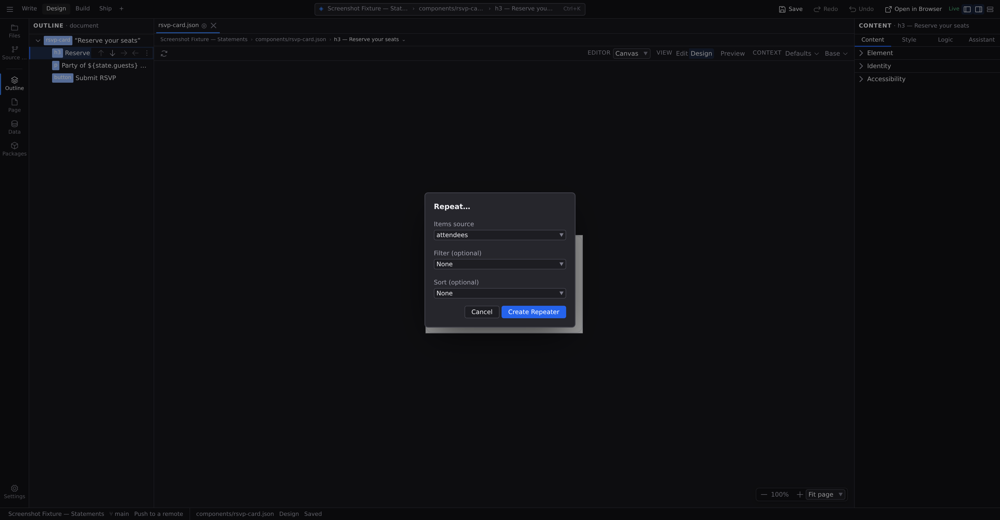

# Repeaters

A repeater renders one element once per item of a list: design a single card, bind it to your products, and get a card per product. The element you design becomes the repeater's _template_; the list it follows can be state, a content collection, or a data source.

## Turn an element into a repeater

1. Design one instance of the repeating thing: one card, one row, one gallery tile.
2. With it selected, run **Repeat…** by right-clicking it on the canvas, or press :kbd[⌘K] and search for the command by name.
3. In the dialog, pick the **Items source**: a list from the document's state, or **Create new...** to declare a fresh one by name.
4. Optionally pick a **Filter** or **Sort** function, if the document defines any.
5. Click **Create Repeater**.

Your element is now the template of a repeater, marked **↻** in Outline. The repeated items render directly where the element stood. No wrapper is added around them.

The command needs an element with a sibling position to repeat into, and refuses on the document root and on a repeater you have already made. See **[Commands](/docs/studio/interface/commands)** for the full list.

## Bind the list

The items source is what makes a repeater useful. It can be:

- **A plain list in state**: start with `Create new…` and fill in items later in the **Data** panel.
- **A content collection**: every blog post, product, or team member in your project's content. See **[Content types](/docs/studio/projects/content-types)**.
- **A data source**: anything that produces a list, like a `Request` fetching from an API.

Declaring and feeding these lives in **[Logic](/docs/studio/logic)**. With the repeater selected, the Inspector's **[Logic tab](/docs/studio/logic/events)** (:kbd[⌘⇧3]) shows a **Repeating list** section where you can rebind **Items** and add or change **Filter** and **Sort** after the fact. Binding a list and binding a click handler are the same job, so they share a tab.

All three are ordinary Inspector rows. Each carries a **value source** chip offering **Fixed value** or **From data…**, plus a provenance dot you can click to clear **Filter** or **Sort** again. That is the same vocabulary every bindable row in Studio uses, described in **[Formulas and expressions](/docs/studio/logic/formulas)**. Filter and Sort are always drawn, empty until you fill them: type into one and it is set, clear it and it is gone. **Items** is the one row a repeater cannot do without, so it has nothing to clear.

The Content tab has nothing to say about a repeating list, and says so: select one and Content offers an **Open Logic** button, because its items, filter, sort and template are all wiring.

## Edit the template

Select the repeater and click **Edit template →** in the **Repeating list** section, or just click into the repeated content on the canvas. On the design canvas the template renders once, as the single element you design; switch on the **Preview** toggle to see the list expanded with its real items (see **[Modes and preview](/docs/studio/interface/modes)**).

Inside the template, each item's data is in scope:

- While editing text, the **Insert data** button on the block action bar offers `item` (the current item) and `index`, its position, alongside the item's own fields: `item.data.title` for a content collection's fields, or `item.name`-style fields for lists of records. The same insertion is a command, **Insert Data**, so you can reach it from :kbd[⌘K] with the token typed rather than picked.
- In the Inspector, any row whose **value source** is set to **From data…** offers the current item and its position alongside the document's own signals.

Bind the template's text and attributes to item fields and every rendered copy fills itself in from its own item.

:::doc-warning
The template is one element styled once, so changes to it apply to every repeated item. To make one item special, style by position with a selector like `:first-child` (see **[Hover states and selectors](/docs/studio/design/states-and-selectors)**) or use data-driven styling.
:::

:::doc-note
A repeater is stored in the file as an `Array` node with `items` (the binding), `map` (the template), and optional `filter` and `sort`. The reactive model behind it is described in **[Reactivity](/docs/framework/concepts/reactivity)**.
:::

## Next

- Feed repeaters from the collections defined in **[Content types](/docs/studio/projects/content-types)**.
- Make the template a reusable component with **[Working with components](/docs/studio/design/components)**.
  - packages/studio/src/surfaces/convert-repeater.ts
