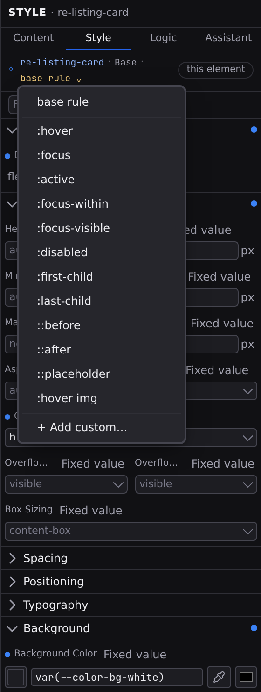

# Hover states and selectors

Buttons darken on hover, inputs glow on focus, disabled controls fade. Those are the same element in a different _state_, and each state can carry its own styles. In Studio you style states from the **selector** segment of the [Style tab](/docs/studio/design/style-inspector)'s Target Line, the last word of the sentence before the scope chip.

## Style a state

1. Select the element and open the **Style** tab.
2. Click the selector segment of the Target Line. It reads **base rule** when you're styling the element's normal look.
3. Pick a state, say **:hover**. The Target Line now reads `⌖ button · Base · :hover`, so what you're editing stays on screen.
4. Edit styles as usual. Everything you set now applies only in that state.

The full inspector works here: every section, the provenance chips, even breakpoints, so a hover effect can differ between desktop and phone. A state cascades within itself: pick a breakpoint while `:hover` is active and the `:hover` values you set at Base show through as dimmed placeholders, their chip reading **from Base**. Switch the segment back to **base rule** to return to the normal styles.

The same choice is available from the command palette: press :kbd[⌘K] and run **Open Selector Menu**, or **Set Style Selector** to name a selector directly.

## The built-in states

The menu offers the common ones: **:hover**, **:focus**, **:active**, **:focus-within**, **:focus-visible**, **:disabled**, **:first-child**, **:last-child**, and the **::before**, **::after**, and **::placeholder** extras. An entry is ticked when the element already has styles there. That is your map of where to look when something styles unexpectedly.

They mean what they mean on the web: `:hover` while the pointer is over the element, `:focus` while it holds keyboard focus, `:first-child` / `:last-child` when it's the first or last among its siblings, `::placeholder` for an input's hint text.

## States only some elements have

Beyond the common set, the menu offers the states the platform actually gives the element you selected, and nothing else, because a rule that can never match is worse than a missing one.

| Element                                        | Also offered                                             |
| ---------------------------------------------- | -------------------------------------------------------- |
| A [popover](/docs/framework/concepts/overlays) | `:popover-open`, `::backdrop`, `:popover-open::backdrop` |
| `<dialog>`                                     | `[open]`, `:modal`, `::backdrop`                         |
| `
`                                    | `[open]`                                                 |
| `<input>`, `<select>`, `<textarea>`            | `:checked`, `:invalid`, `:required`, `:user-invalid`     |
| `<a>`                                          | `:visited`, `:target`                                    |

Anything the element already has styles for stays in the menu whatever it is, so a selector you wrote by hand never disappears.

**Picking `:popover-open` opens the popover on the canvas.** You can hover an element to see its `:hover` styles, but a closed popover is not on screen to be put into that state by hand, so choosing the state shows it. It is the one element state the canvas simulates; the rest are editing targets only. `::backdrop` is editable here and shown in **Preview**, where the popover renders the way a visitor sees it.

## Add your own selector

Choose **+ Add custom…** at the bottom of the menu. A dialog asks for a state or nested rule to edit under this element; type one and click **Use**:

- `:nth-child(2)`: any state or position selector beyond the built-ins.
- `.featured`: only when the element has that class.
- `&.active`: only when the element itself carries the `active` class.
- `[disabled]`: only when the element has that attribute.

A selector must start with `:`, `.`, `&`, or `[`. Anything else is refused in the dialog, with the reason under the field, so a typo never reaches the file. Accepting the dialog only points the Style tab at the selector; nothing is written until you set your first property. From then on the selector stays in the menu for that element, ticked while it has styles.

Rules for elements _inside_ the selection are the inspector's **Relative Styling** section instead. Clicking a rule there drills into it through this same selector segment.

## Remove state styles

Switch the segment to the state and clear its values with their chips: property by property, or a whole section from the accent dot on its header. When a state has no values left, it drops out of the menu's marked entries.

:::doc-note
Each state is saved as a nested rule inside the element's `style` object. These are real CSS pseudo-classes, and they behave the same way in the canvas as they do on the published page: both deliver the base declaration and the state block as ordinary rules, so the state wins by source order. The format is described in **[Styling](/docs/framework/concepts/styling)**.
:::

## Next

- Combine states with screen sizes in **[Breakpoints](/docs/studio/design/breakpoints)**.
- Give every link and button a default hover in the **[Project Styles](/docs/studio/design/stylebook)**.
