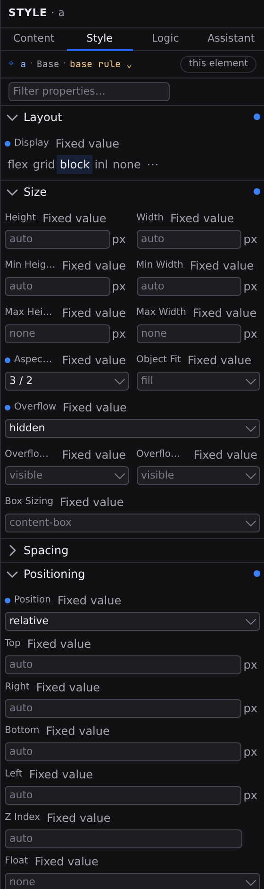

# Style inspector

The Style inspector is the **Style** tab of the Inspector, a full set of visual CSS controls for what you have selected. Select an element in Design mode and click **Style** (or press :kbd[⌘⇧2]); edits apply to the live canvas as you make them. The dock's header names the tab and what it is pointed at: the element's tag, `6 elements` when several are selected, or the document's name when nothing is.

With no file open the tab offers **Open a page…**; with a file open and nothing selected it asks you to click anything on the canvas to style it, in the same words the **Content** and **Logic** tabs use.



## The Target Line

A style edit is addressed by several things at once (which element, which breakpoint, which colour scheme, which state), and the line at the top of the tab states all of them before you type:

```text
⌖  h1 · @Tablet · :hover                               [ this element ]
```

Every segment is a control, and the sentence always reads in the same order: element, breakpoint, colour scheme, state. A glance tells you what changed since you last looked:

- **The element**: the tag these edits are pointed at. Click it to open the **[Outline](/docs/studio/design/layers)** and find the element there.
- **The breakpoint**: **Base**, or `@Tablet` when a breakpoint is active. You choose it on the pane's **Context** control (or by clicking a canvas panel's header); clicking the segment opens **Settings › Contexts**, where breakpoints are defined. See **[Breakpoints](/docs/studio/design/breakpoints)**.
- **The colour scheme**: a `Dark variant` segment joins the line while the Context control forces a scheme your project declares, because edits then land in that scheme's overrides: `⌖ h1 · Base · Dark variant · :hover`. It appears at **Base** only (a breakpoint is always breakpoint-scoped), and setting the control back to **Auto** returns you to base styles.
- **The selector**: the last segment, reading **base rule** for the element's normal look. It is the one segment with a menu of its own: `:hover`, `:focus`, or a selector you write. See **[Hover states and selectors](/docs/studio/design/states-and-selectors)**.

## The scope chip

At the end of the line, a chip states the blast radius of the next keystroke:

| Chip                            | What an edit changes                                                                                 |
| ------------------------------- | ---------------------------------------------------------------------------------------------------- |
| **this element**                | the one element you selected, and nothing else                                                       |
| **all `<h1>` in this document** | every `h1` on this page, so you're editing an element default                                        |
| **all `<h1>` in this project**  | every `h1` in the project, so you're editing a layout's defaults and the pages using it inherit them |

The project case adds a warning band under the line: it names how many elements in how many files the edit reaches, and **Show affected** lists the files with a count each. While the count is still being worked out the band says so; where the project can't be searched it says the number is **unknown**, never a confident zero.

## Where each value came from

Every field label carries a chip that answers one question: _why does this box say what it says?_

| Chip                       | Meaning                                                                              | Click                                                    |
| -------------------------- | ------------------------------------------------------------------------------------ | -------------------------------------------------------- |
| **accent dot**             | set here: this value lives on this element, at this coordinate                       | clears it                                                |
| **from Base** (amber)      | inherited, and the chip names the donor: another breakpoint, or **from site tokens** | jumps to the donor                                       |
| _nothing_                  | not set; the property falls back to the browser default                              | —                                                        |
| **a signal name** (violet) | bound: the value is a `${…}` expression reading that signal                          | opens the signal in **[State](/docs/studio/logic/data)** |
| **mixed (6)**              | the selected elements disagree about this property                                   | clears it on all of them                                 |

An inherited chip always names where the value came from, so "something is showing through" becomes "Base sets this to 16px; go and look". The value itself still shows as a dimmed placeholder in the field, so you can see what you'd be overriding. The one inherited chip that doesn't take you anywhere is **from site tokens**: that value lives in the project's site-wide style rather than in the open file, and the Style tab has no page to open for it. Edit it in **[Design tokens](/docs/studio/design/tokens)** instead.

Collapsed section headers carry the same states as a tally: a heading with dots has something set, inherited, or bound inside it, and hovering reads it out as **3 set here · 2 inherited**. So finding your own overrides is a glance down the closed headings rather than a filter that hides two thirds of the panel to answer the same question.

## Sections and the filter

Properties are grouped into accordion sections: **Layout**, **Size**, **Spacing**, **Positioning**, **Typography**, **Background**, **Border**, and **Effects**. A section that already has values in it opens by itself the first time you meet it, and a section you close stays closed while you work. The filter box narrows the list. Type part of a property's name or label, and every matching section stays open while you filter.

Clicking the accent dot on a section header clears everything set in that section.

Some rows appear only when they're relevant: alignment and gap controls show once the element's display makes them meaningful, for example. A row whose value no longer applies is flagged so you can spot leftovers.

## The inputs

Each property gets a control built for it:

- **Number + unit**: type the number, pick the unit (`px`, `rem`, `%`, `vw`, and friends) or a keyword like `auto` from the attached menu.
- **Color**: a swatch beside the value, and behind the swatch a picker holding a saturation square, a hue track, an opacity track and your project's color tokens. Picking a token writes the reference, so the value reads `var(--color-primary-blue)` and follows the token wherever you take it; moving any of the tracks replaces it with a literal, because that is what moving a picker means. The value box takes anything CSS can read, a named color or a `color-mix()` included, and keeps it as you wrote it. See **[Design tokens](/docs/studio/design/tokens)**.
- **Font family**: type a font stack, or take one from the attached menu, which lists your font tokens first and then a set of ready-made stacks. Picking a ready-made stack saves it as a font token automatically, so the next element that wants it points at the token rather than repeating the stack.
- **Keyword menus**: a property with a known set of values offers them from an attached menu. The field stays typable, because a CSS keyword list is a set of suggestions rather than a closed one: a value the menu does not offer is still a value you can write.

Shorthand rows like **Padding** and **Margin** take a combined value, or expand with their chevron into per-side fields; border rows expand into width, style, and color. Studio recombines the sides into the shortest form when it writes the value. A shorthand's chip answers for the whole family. It reads **set here** when the shorthand or any one side is set, and clicking it clears all five at once.

## The value source

Beside each property's label sits a **value source** control naming how that value is produced. For a CSS declaration there are two rungs, because two is what the style format accepts:

- **Fixed value**: the value you type, the same every time.
- **Mixed text**: text with `${…}` placeholders that fill in from your signals, so a property can follow your data. See **[Logic](/docs/studio/logic)**.

Click it and a picker opens listing both, each with a line explaining it, and one click puts you on either. There is no cycle to walk through. The same control, with the same words, appears on every bindable field in the Inspector, and each field offers exactly the rungs the document format allows there, which is why fields on the **[Content](/docs/studio/design/properties)** tab also offer **From data…**. Switching back remembers what you had on the rung you left, so a detour costs you nothing.

## Several elements at once

Select more than one element in the **[Outline](/docs/studio/design/layers)** and the Style tab edits them together: :kbd[Shift] for a range, :kbd[⌘] (:kbd[Ctrl] on Windows) to add one at a time. Fields the selection agrees on show the shared value; where they disagree the chip reads **Mixed** with the count. Typing into a Mixed field sets every selected element in one go, and the whole batch is a single undo step.

## Custom and relative styling

Two sections close the list:

- **Custom** takes any CSS property by name. Type the property, press :kbd[Enter], and fill in its value; each row shows the property's browser default as a placeholder. Renaming a property carries each selected element's own value across to the new name.
- **Relative Styling** lists the nested rules this element already carries: states you have styled, and rules for elements _inside_ it (the rows inside a table, the links inside a nav). Click a rule to drill into it and edit it with the full inspector; **+ Add** opens a dialog where you type a selector to nest under the current rule (`th`, `:hover`, `.active`) and click **Add**. The section appears once there is at least one nested rule to list. The first one comes from the Target Line's selector menu.

:::doc-note
Everything here writes plain CSS into the element's `style` object in the open file, the same nested format documented in **[Styling](/docs/framework/concepts/styling)**.
:::

## Next

- Set element-wide defaults instead of styling one element at a time, with **[Project Styles](/docs/studio/design/stylebook)**.
- Name your colors, fonts, and sizes in **[Design tokens](/docs/studio/design/tokens)**.
