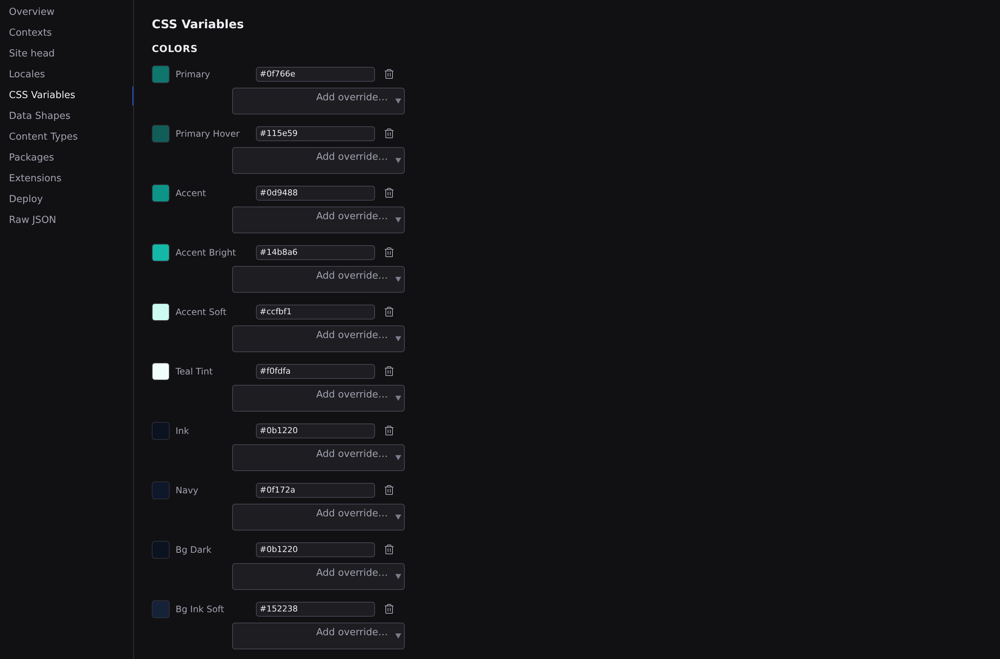

# Design tokens

A design token is a named value: **Primary Blue** instead of `#3b82f6`, **Body Serif** instead of a font list. Define it once for the site and reference it everywhere; change it once and everywhere updates. Tokens are what keep a growing site on one palette instead of thirty slightly different blues.

## Define tokens

1. Open **[Project settings](/docs/studio/projects/settings)** from the **Settings** menu at the foot of the rail, by pressing :kbd[⌘K] and running **Open Project Settings**, or from the **⬢ menu** in the Command Bar.
2. Open the **CSS Variables** section.

Tokens are grouped by what they name:

- **Colors**: each row has a color swatch (click it for a native picker), the token's name, and its value. Edits appear on the canvas immediately.
- **Fonts**: each font renders a preview sentence in its own face below the row.
- **Sizes & Spacing**: widths, gaps, and radii.
- **Other**: anything that doesn't fit the groups above. It appears only once something lands in it.

To add a token, type a friendly name and a value in the group's empty row and click **Add**. Studio derives the stored variable name from the group and your name, so "Primary Blue" in Colors becomes `--color-primary-blue`. The trash button removes a token; anything still referencing it falls back to nothing, so remove with care.

A token can be built from another one: give it the value `var(--color-brand)` and the row grows a chip naming **Brand**, with the color that reference ends up at. Studio follows the chain to its end, so an alias of an alias still shows a color rather than more syntax.

:::doc-tip
Settings is a document, so tokens get the document verbs: :kbd[⌘Z] takes back the last change, and a value that could not be written to `project.json` is raised on **[Problems](/docs/studio/interface/problems-and-progress)** rather than quietly dropped. See **[Project settings](/docs/studio/projects/settings)**.
:::

## One token, several values

A token can hold a different value in any rendering context the project declares, like a color that darkens in the dark scheme or spacing that tightens on phones:

- Every color token carries a row per declared **[color scheme](/docs/framework/concepts/color-schemes)**, whether or not it has a value there, because "what is this color in dark mode" is a question a palette is always answering. Leave the row empty to inherit the base value.
- Any token can be given a value in any other declared context from the **Add override…** picker under its row: a breakpoint, a scheme, or a feature query. The picker offers only the contexts that token has no row for yet.
- Clearing an override's field removes it, and the token goes back to inheriting its base value.

Contexts are declared in one place, **Settings › Contexts**, described in **[Breakpoints](/docs/studio/design/breakpoints)**. A project with no color scheme yet gets a **Manage contexts…** button under the Colors group that takes you straight there.

## Use tokens while styling

Tokens surface right inside the [Style inspector](/docs/studio/design/style-inspector)'s controls:

- The **color picker** lists your color tokens under its sliders, each by the name you gave it. Pick one and the field holds the reference, `var(--color-primary-blue)`, with that swatch marked as the chosen one.
- The **font family** box lists your font tokens first, each previewed in its own face. Picking one of the ready-made presets creates a matching font token automatically, so even your first font choice becomes reusable.
- Any field accepts a token typed directly as `var(--color-primary-blue)`, useful for the occasional property without a picker.

A field holding a token reference is _following_ the token: edit the token in Settings and every element using it updates. The edit lands in place on every live canvas, the page you had open and the **[Project Styles](/docs/studio/design/stylebook)** catalog alike, so tuning a token shows the design changing rather than describing it.

In **[Project Styles](/docs/studio/design/stylebook)**, a value that arrives from your project's site-wide style rather than from the open file wears an inherited chip reading **from site tokens**, so an element default that comes with the project is never mistaken for one written in this file.

Studio also nudges toward tokens in the other direction: when its AI assistant writes styles, hard-coded values that duplicate an existing token are flagged with the token to use instead.

:::doc-note
Tokens are CSS custom properties in your project's site-wide `style` (in `project.json`), inherited by every page and component. A per-context value is stored beside the token in an `@` block named for that context. The format is described in **[Styling](/docs/framework/concepts/styling)**.
:::

## Next

- Pair tokens with element defaults in **[Project Styles](/docs/studio/design/stylebook)**.
- Make size tokens shift per screen with **[Breakpoints](/docs/studio/design/breakpoints)**.
