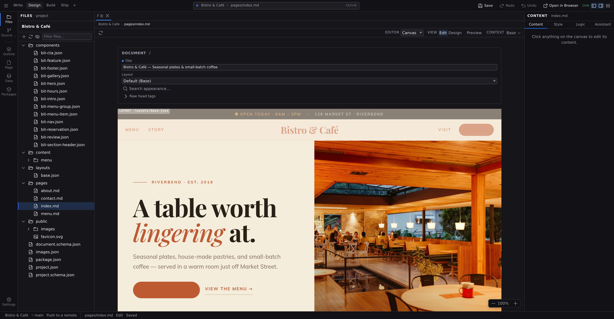

# Edit mode

Edit is for writing. Open a content page and the canvas becomes the page itself. Click any text and type, right where it renders. It feels like working in a doc editor; it saves as clean Markdown.

Markdown pages open in Edit automatically. For anything else, pick **Edit** in the **View** control on the context bar; see **[Modes and views](/docs/studio/interface/modes)**.

The column isn't a fixed width. Drag the handle on either side and the page resizes from its centre, with the [breakpoint](/docs/studio/design/breakpoints) following the width, so you can write at any size your readers might have rather than only the ones the project declares.

## What lives here

- **[Writing and formatting](/docs/studio/editing/writing)**: typing on the page, paragraphs, the inline formatting toolbar, links, pasting, and editing text inside components.
- **[Slash commands](/docs/studio/editing/slash-commands)**: type `/` to insert headings, lists, images, tables, and more without leaving the keyboard.
- **[Frontmatter and page metadata](/docs/studio/editing/frontmatter)**: the **Page** panel's forms for titles, descriptions, social-share cards, and your content type's fields.
- **[Grid mode](/docs/studio/editing/grid)**: a spreadsheet view for whole collections, CSV files, and page metadata, with one batched Save.

## It's just Markdown

Everything you write saves as standard Markdown with your metadata on top. Open the file in any editor, diff it in git, or hand it to an AI. It's plain text, and it's yours. Switch the canvas to **Code** any time to see exactly what Studio wrote.

## Next

- Structure and style the page in **[Design mode](/docs/studio/design)**
- Organize the content files themselves in **[the Library](/docs/studio/projects/browse)**
