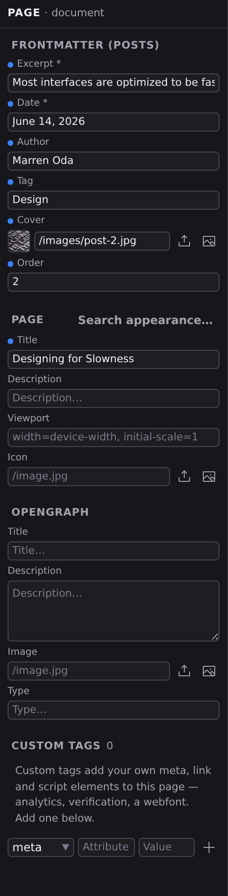
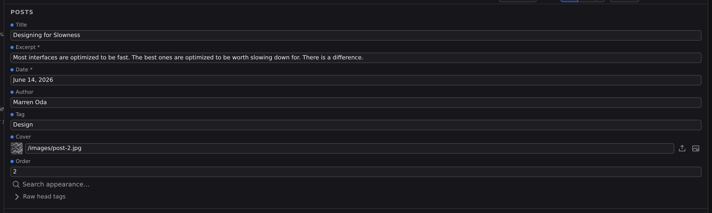
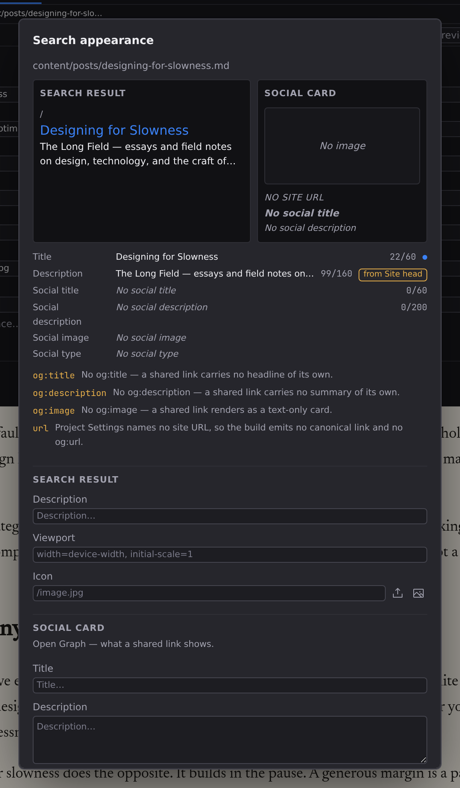

# Frontmatter and page metadata

Every page carries information that isn't part of its visible text: a title, a description for search engines, an image for social shares. Content like a blog post adds fields such as a date, an author, or tags. This is the page's _frontmatter_, and Studio edits all of it as plain forms.

Two surfaces show these fields: the **Page** panel in the Navigator, and the **Document Header** card on the page itself.

## The Page panel

Click **Page** in the **Document** group of the Navigator rail, or press :kbd[⌘5]. Its header reads **PAGE · document**, and its sections, top to bottom, depend on the file you have open:

### Frontmatter

For a content page that belongs to a collection (a blog post, a product, a listing), this section lists the collection's fields, with required ones marked `*`. Each field gets a control that fits its type:

- Text fields, number fields, and date fields (dates as `YYYY-MM-DD`)
- On/off checkboxes
- A dropdown for fields with a fixed set of choices
- A media picker for image fields
- Comma-separated entry for list fields
- An entry picker for a field that points at another collection, so you choose an existing entry instead of typing its id from memory

Any extra field already present in the file appears too, even if the collection doesn't define it. Clearing a field removes it from the file entirely. Collections and their fields are defined in **[Content types](/docs/studio/projects/content-types)**.

### Layout

Site pages also get a **Layout** picker: keep the project default, choose a specific layout, or pick **None**; see **[Pages, layouts, components](/docs/studio/projects/pages-layouts-components)**.

### Page

The basics every page should have:

- **Title**: the browser-tab and search-result title.
- **Description**: the summary search engines show under the title.
- **Viewport**: leave the suggested default unless you have a specific reason not to.
- **Icon**: the small icon in the browser tab, picked from your media.

### OpenGraph

The card shown when the page is shared on social platforms: **Title**, **Description**, **Image**, and **Type**. If you fill in nothing else, fill in these and the Page section, because they're what links to your site look like elsewhere.

### Custom Tags

The escape hatch for everything else that can live in a page's head: analytics, a verification token, a webfont. Pick a tag (`meta`, `link`, or `script`), type its attribute and value, and click the add button or press :kbd[Enter] in either field. Existing custom entries are listed with a remove button each; before you add the first one the section says what it's for, with the add form right beneath. Most sites never need this section.

## The Document Header card

Every page with frontmatter or head tags carries a **Document Header** card, and it sits on the page rather than in a panel: in Edit view it's the first block of the document itself, above your first paragraph, and it scrolls with the page. In Design view it's pinned above the artboards, at normal size, so the fields stay usable however far you've zoomed out.

Its bar names what the document is: the collection it belongs to, or **Document** when it belongs to none. For a page it also prints the route it will be published at. Underneath sit the **Title** field, the layout picker for site pages, and the collection's own fields: the same set as the Page panel's Frontmatter section. There's no control to summon or dismiss the card; a document that has a header shows one.

Closing the card are a **Search appearance…** button and one disclosure, **Raw head tags**: every head entry no form owns, listed read-only, so a tag you can't see can't surprise you. The Page panel remains the place to add and remove those.

## Search appearance

**Search appearance** is a window of its own, and there are three ways in: the button at the foot of the Document Header card, the one beside the Page panel's **Page** heading, and the command palette. All three open the same thing over the document you're working on.

The first thing it shows is not a form but two pictures of the finished page: a **Search result** preview (breadcrumb, title, description) and a **Social card** preview with its image, domain, headline and summary. Below them is the resolved-field list, then the warnings, and only then the controls that change any of it.

Every field commits as you type, and the previews above redraw with it. That is the reason it is a window rather than a panel: the previews want the width, and a search result rendered a third of a column wide is not a preview of anything.

:::doc-note
**The previews show the merged head, not just what this page declares.** A page's metadata is layered: the project's own `$head`, then the layout's, then the page's, with the later layer winning key by key. The title follows the same idea: the page's own title, or the project name, or `Jx Site` if nothing supplies one. What the previews draw is the result, which is what a search engine or a chat app will actually see.
:::

### The resolved fields

One row per value that reaches the browser: Title, Description, Social title, Social description, Social image, Social type. Each row shows the merged value, a character count against the length at which that field gets cut (`47/160`), and a chip saying where the value came from.

The count is of **characters as you see them**: an emoji counts as one, a flag counts as one, and an accented letter counts as one however it was typed. That is not what `length` gives you in most tools: it counts a rocket as two and a flag as four, so a headline with three emoji used to report six characters of budget it had not spent. The count is not a measure of _width_, and deliberately so: a search result truncates on pixels, in a font the engine picks at a size it picks, and any number here claiming to predict that would be a guess wearing a measurement's clothes.

A value this page sets shows the ordinary set dot. A value it inherits is marked **inherited** and names its donor: _from Base_ for a layout, _from Site head_ or _from Site name_ for the project, _from the build_ for a value the build supplies on your behalf. The two chips that lead somewhere are clickable and open the setting in Project Settings; the layout and build chips are plain text, because the card has no verb for them.

That marking is the whole point. A page inheriting its description from the site is not a page missing a description, and until the preview said which was which, the two looked identical.

### The warnings

A named list, in plain language, of things that are wrong or absent. It is decided on the **merged** value, so a page that inherits a description is never told it has none. Among them:

- Nothing names a title, so the build ships `Jx Site`.
- No description reaches this page from the site, its layout, or the page itself, so a result row will show whatever text the engine picks instead.
- No `og:title`, `og:description`, or `og:image`: a shared link with no headline, no summary, or a text-only card.
- A field is longer than its budget, with the actual length: _Description is 187 characters; summaries are cut near 160._
- Project Settings names no site URL, so the build emits no canonical link and no `og:url`.

:::doc-note
**These warnings also appear in Problems**, in the Bottom dock, filed the moment you open this window. A page shipped with no description is worth knowing about whether or not you thought to look here, and Problems is where Studio keeps the things that are still waiting to be fixed. Each row opens this window again.

There is a companion check for accessibility: **Check Accessibility** in the command palette reads the open document and files a Problem for each thing an author can fix, such as an image with no alt text, a control with no label, a skipped heading level, a link that reads "click here", a duplicate id. Every row names the WCAG criterion it comes from. It also always files two rows saying what it could **not** check: colour contrast and target size are properties of the built page in a browser, not of the document, so a report that stayed silent about them would read as a clean bill it has no way to give.
:::

- A `<title>` element inside `$head` is discarded, because the build writes the title from the document's own title property.

When there is nothing to say, it says that too: _Nothing to flag — every previewed field resolves to a value._

:::doc-tip
**There is no score.** Counters and named warnings only. A single number out of a hundred adds unrelated facts together into a verdict, and the verdict is what ends up being optimized; a count beside a limit and a named consequence tell you the same thing without ranking anything.
:::

### The fields themselves

Under the warnings are the controls, in two groups named after the preview each one feeds. **Search result** holds **Description**, **Viewport** and the **Icon** picker; **Social card** holds the four OpenGraph fields. They're grouped because they collide: Open Graph has its own Title, Description and Image, and in one flat column "Description" named two different fields.

These edit exactly what the Page panel's Page and OpenGraph sections edit: the same values, from wherever you happen to be working.

:::doc-note
On disk, all of this lives at the top of the page's own file, in a small labeled block above the content: the frontmatter. That's why metadata travels with the page: copy the file and everything comes along, and any text editor can read it.
:::

## Next

- Edit a whole collection's frontmatter at once in **[Grid mode](/docs/studio/editing/grid)**
- Define collections and their fields in **[Content types](/docs/studio/projects/content-types)**
- How the three layers merge, and what the build adds, in **[SEO and metadata](/docs/framework/site/seo)**
  - packages/studio/src/surfaces/doc-header.ts
  - packages/studio/src/surfaces/seo.ts
