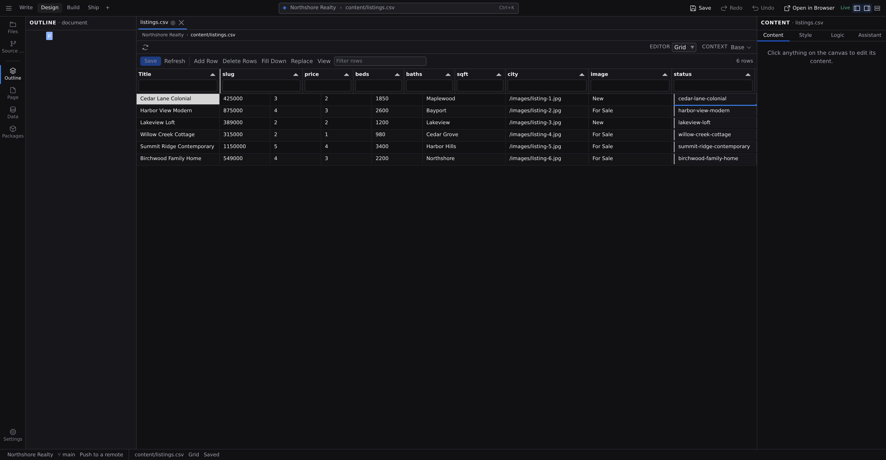

# Grid mode

Grid turns tabular content into a spreadsheet on the canvas: rows and columns, range selection, copy and paste, and a single **Save** that writes every pending change at once. Reach for it when editing entries one file at a time is too slow: renaming a category across fifty posts, or fixing prices in a product sheet.

## Open a grid

- **A CSV file**: open it from **Files** (or Quick Access); spreadsheet files open straight into Grid.
- **A content collection**: right-click the collection's folder in **Files** and choose **Edit Collection in Grid**.
- **All pages**: right-click the `pages` folder and choose **Edit Pages in Grid**.
- **The redirect table**: press :kbd[⌘K] and run **Edit Redirects**. Your site's redirect rules are a table, so they open as one; everything on this page applies to them. The rules themselves are described in **[Project settings](/docs/studio/projects/settings)**.
- **From Project settings**: the **Open Data Grid** button in the data sections opens a picker that lists pages, every collection, and connected database tables in one place.

## Edit cells

Double-click a cell to edit it. Columns are typed, so each kind gets the right control:

- Text and number cells: type into them, and number cells clean up currency symbols and commas for you.
- On/off cells get a checkbox, choice cells a dropdown, date cells a date field.
- List cells hold chips: :kbd[Enter] or a comma adds one, :kbd[Backspace] removes the last, and each chip has its own remove button.
- Image cells open the media picker, and relationship cells (a field that points at another collection) open a picker of that collection's entries, with a box beneath it for an id that isn't in the list.

Edited cells are highlighted, and nothing touches your files yet. Everything waits for **Save**. Undo and redo (:kbd[⌘Z] / :kbd[Ctrl+Z]) work on grid edits like anywhere else.

## Work in ranges

- Drag across cells to select a range. Copy and paste work on ranges, including pasting rows copied from a real spreadsheet.
- :kbd[Delete] or :kbd[Backspace] clears the selected cells, as one undoable step.
- **Fill Down** copies the range's first row into every row below it (:kbd[⌘D] / :kbd[Ctrl+D]).
- **Replace** opens find & replace across all text cells; **Replace All** buffers the whole replacement as one undoable change; save to apply it.
- **Filter rows** searches across every column, including ones you've hidden, because the rows still carry those values.
- Each column header has its own filter box, and clicking a header re-sorts what's on screen. Those are quick looks, not part of the arrangement Studio remembers.
- Drag column headers to reorder them and drag their edges to resize. Those do stick, along with everything in the next section.

## Arrange the table

The **View** button in the toolbar holds everything about how the table is arranged. Each choice takes effect as you make it. There's no Apply step, so the panel never shows something the grid isn't already doing. Pressing **View** again closes it.

- **Columns**: tick a column to show it, untick it to hide it. A hidden column isn't drawn, but its values are still loaded and still searched by **Filter rows**.
- **Sort**: choose a column and a direction, or **Source order** for none. Empty cells sort last in both directions, and a row you just added stays at the bottom where you added it until you save. Source order is the source's own: a collection lists its entry files by path, a CSV keeps its file's row order, and a table keeps what the query returned, so it is the same order every time you open the grid.
- **Group by**: choose a column and rows sharing a value are gathered together, in the order those values first appear. The toolbar then reads "Grouped by Status · 3 groups", because grouping is a row order and the rows themselves don't announce it.

Studio remembers all of this per grid, along with your column widths and order and the **Filter rows** text, so a table looks the way you left it when you come back to it, whether or not you ever name the arrangement.

## Saved views

Name an arrangement and it becomes a **saved view** you can return to:

1. Arrange the table, then click **View** and **Save view…** (it reads **Save as…** once a view is applied).
2. Give it a name, say "Recent drafts" or "Price check". A blank name is refused in the field, and reusing a name updates that view.
3. The name appears in the panel's **Saved views** list. Click it to apply it; the ✕ beside it deletes it, after a confirmation that says the table keeps whatever it is currently showing.

A view holds all six facets at once: which columns are shown, their order, their widths, the sort, the group-by column, and the filter text.

The **View** button shows the applied view's name, with a dot after it (`Recent drafts •`), as soon as you change something the view doesn't hold. Saving under that same name folds the change in; applying the view again goes back to it. **Reset** puts columns, sort, grouping and filter back to how the grid comes, and keeps every named view.

:::doc-note
Views belong to the table they were saved on: each collection, each CSV file, each database table and the redirect table keep their own list. They're remembered by Studio on this computer rather than written into your project, so they don't travel with a commit and a teammate opening the same collection starts from its defaults.
:::

:::doc-tip
The same four verbs are in the Command Bar (:kbd[⌘K]) whenever a grid is on screen: **Save Grid View…**, **Apply Grid View**, **Delete Grid View** and **Reset Grid View**. **Apply Grid View** takes the name, and naming one that doesn't exist tells you which views the table does have. You can also ask the assistant to save the current arrangement, or to apply a view by name.
:::

## Add and remove rows

- **Add Row** appends a pending row. In a collection or pages grid, fill in its **Path** cell, the file the new entry will become.
- **Delete Rows** marks the selected rows for deletion; they're removed when you save, after a confirmation.
- Added and marked rows are tinted until you save.

## Save, in one batch

Nothing writes until you click **Save**, and the button counts your pending changes (:kbd[⌘S] / :kbd[Ctrl+S] does the same). On save, Studio checks required cells, confirms any deletions, writes everything, and reports what saved. If a change can't be written, that cell stays pending with the reason attached; fix it and save again.

Studio also protects you from crossed wires:

- A row whose file is open in a tab with unsaved changes won't save, so save or close that tab first.
- If a file changed on disk after the grid loaded (a teammate's edit, for example), its row is marked stale and skipped rather than overwritten. **Refresh** reloads from disk, asking first if you have pending edits.

:::doc-warning
Saving with rows marked for deletion permanently deletes those entry files. Studio asks for confirmation before it does.
:::

## Collection and pages grids

A collection grid shows one row per entry file and one column per field of the collection's content type, plus any extra fields found in the entries. The **Path** column stays pinned at the left. The pages grid does the same for every Markdown page under `pages/`, with title and description first. Editing a cell edits that entry's **[frontmatter](/docs/studio/editing/frontmatter)**; collections themselves are defined in **[Content types](/docs/studio/projects/content-types)**.

:::doc-note
Saving a collection or pages row rewrites that file's frontmatter block from scratch, so hand-written comments and key order inside it aren't preserved. The "rewrites frontmatter" note in the grid toolbar is the reminder.
:::

## CSV grids

A CSV file opens as a grid tab with **Code** as its raw-text alternate, and saves as one atomic step: if the file changed on disk underneath you, the save stops instead of overwriting it. Only the cells you actually edited are rewritten. Untouched cells keep their exact original text, so a one-cell fix produces a one-cell diff.

## The redirect table

Redirects open as a grid over three columns (**Source**, **Destination**, **Status**) and inherit the whole surface: inline editing, **Add Row** and **Delete Rows**, find & replace, undo, one batched **Save**, and views you can save. Saving writes the rules into `project.json` all together, or refuses the batch and says why, so the site never ends up with half its old URLs working. **[Project settings](/docs/studio/projects/settings)** covers what the rules mean and how they're checked.

## Next

- The keys the grid claims for itself, and the ones that stay global: **[Keyboard shortcuts](/docs/studio/interface/shortcuts)**
- Bulk-edit the fields behind your content: **[Frontmatter and page metadata](/docs/studio/editing/frontmatter)**
