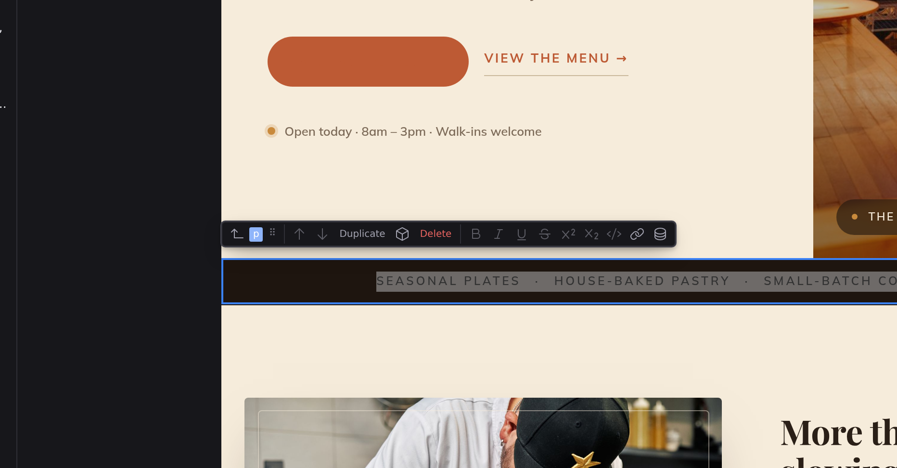

# Writing and formatting

In Edit mode you write on the real page: click any text (a heading, a paragraph, a list item, a table cell) and the cursor lands exactly where you clicked, ready to type. There is no separate preview to keep in sync; the page you're editing is the page.

## Moving around

There is nothing to start or stop. The cursor is simply on the page, the way it is in a document editor:

- **Click** any text to put the cursor there.
- **Arrow keys** move it through the whole page, from the end of one block into the next.
- :kbd[Home] / :kbd[End], word motion, and :kbd[Page Up] / :kbd[Page Down] all work as they do anywhere else.
- :kbd[⌘A] / :kbd[Ctrl+A] selects the text of the block you are in. With no cursor (a block selected from the Outline, say), the same keys select every element beside it instead.
- **Drag** to select, including across several blocks at once; holding :kbd[Shift] and moving does the same.
- :kbd[Esc] puts the cursor away.

Placing the cursor also selects the block it lands in, and only that one. So clicking into a paragraph while [several elements are selected](/docs/studio/design/layers#select-several-at-once) narrows the selection back to that paragraph, and the toolbar above it is that paragraph's. To add a block to a selection instead of replacing it, hold :kbd[⌘] (macOS) / :kbd[Ctrl] (Windows/Linux) as you click.

Your writing is saved into the document as you pause, so :kbd[⌘S] (macOS) / :kbd[Ctrl+S] (Windows/Linux) always writes what is on screen, mid-sentence or not.

## What you can click into

Anything that holds text: headings, paragraphs, list items, table cells, captions, definition lists, a disclosure's summary. Which ones those are comes from the page's own format rather than a fixed list, so a Markdown page and a component page each get the right answer.

Two cases where the cursor lands somewhere you might not expect, and both are deliberate:

- **A block quote** holds paragraphs, so clicking one puts the cursor in the paragraph inside it, which is the thing you actually want to type in.
- **A link** is part of a paragraph, not a block of its own. Clicking one puts the cursor in the paragraph, so you can type through and around the link and it stays intact.

Code blocks are not editable this way; their whitespace is significant, so they are left alone.

## Paragraphs

Press :kbd[Enter] to end the paragraph and start a new one. Split a paragraph in the middle and everything after the cursor moves into the new one, with your cursor following, so you just keep typing. :kbd[Shift+Enter] stays in the same paragraph instead of starting a new block.

:kbd[Backspace] at the very start of a block joins it onto the one above, and :kbd[Delete] at the very end pulls the next one up. The cursor lands where the two met. Deleting a selection that spans blocks does the same thing: what is left of the first and last block joins together.

To make the next block a heading, a list, an image, or anything else that isn't a paragraph, type :kbd[/] and pick from the menu: **[Slash commands](/docs/studio/editing/slash-commands)**.

## The formatting toolbar

The floating toolbar above the block carries the formatting buttons (the same bar described in **[The canvas](/docs/studio/interface/canvas)**). Select some text first, then click a button to format it; click again to remove the format:

- Paragraphs, list items, and table cells offer **Bold**, **Italic**, **Underline**, **Strikethrough**, **Superscript**, **Subscript**, **Code**, and **Link**.
- Headings offer the shorter set: **Bold**, **Italic**, **Code**, and **Link**.

With nothing selected the format buttons are disabled, because they act on a range, and only **Link** stays clickable. Every button also has a name and a shortcut of its own: :kbd[⌘B] / :kbd[Ctrl+B] for bold, :kbd[⌘I] / :kbd[Ctrl+I] for italic, :kbd[⌘U] / :kbd[Ctrl+U] for underline, and :kbd[⌘`] / :kbd[Ctrl+`] for code. Each one is also in the command palette under **Edit**, and each can be rebound in **[Preferences › Keyboard](/docs/studio/interface/preferences)**. The button's tooltip prints whatever it is bound to on your machine, so it stays true if you change it.

## Links

1. Select the text to link.
2. Click the **Link** button, or press :kbd[⌘K] / :kbd[Ctrl+K].
3. Type the address and press :kbd[Enter] (or click **Apply**).

Put the cursor inside an existing link and open the same popover to see its address. **Update** changes it, and **Remove** unlinks the text while keeping the words.

## Insert data

The **Insert data** button beside the format group opens a searchable list of the data available on your page. Pick an entry and Studio drops a live placeholder into your sentence, and it shows the real value when the page renders. Inside a repeating list you also get the current item's fields and its position. Where that data comes from is covered in **[Logic](/docs/studio/logic)**.

## Pasting

Paste is always plain text: copy from a website or a Word document and you get the words, never the fonts, colors, or stray markup they were wrapped in. Add your own formatting after pasting.

## Text inside components

Click text inside a component instance (a card title, a button label) and you edit that one instance's text in place. It's a single plain value rather than free-form content, so the rules tighten:

- :kbd[Enter] finishes and keeps the change; :kbd[Esc] cancels it.
- Formatting, slash commands, and paragraph splits are off.
- The toolbar's name badge shows which component option you're editing (for example `product-card · title`).

Text that a component fills from data can't be edited this way, because typing over it would break its connection to the data. Change the source data instead, or click **Edit Component** in the toolbar to open the component itself.

The same goes for an option that holds a **number or a yes/no value** rather than text: it shows as text on the page, but editing it here would turn it into text and break anything that counts or compares it. Use the properties sidebar, which knows what kind of value the option takes.

Sometimes the page already sets an option some other way: as a plain attribute, or straight on the component tag rather than in its options. Those are left to the Inspector's **Content** tab too. Editing it here would quietly create a second copy of the same value: sometimes the page keeps showing the first one and your change appears to do nothing, and otherwise the old copy sits there unused and comes back the day the option is cleared.

Clicking a component's text and clicking away again changes nothing, because an option only gets set on that instance when you actually edit it. :kbd[Esc] is a real cancel, including after Studio has already saved a pause mid-edit.

:::doc-note
Behind the scenes, Studio keeps the markup tidy as you type: adjacent formats merge, and empty leftovers are removed. It saves the result as plain Markdown in the page's file, so bold is just `**bold**` on disk.
:::

## Typing in other scripts

Japanese, Chinese, Korean, Vietnamese and other input methods that compose characters from several keystrokes work the way they do anywhere else on the page. Studio leaves your composition alone until you accept it, then records the finished text as one edit. Nothing is saved mid-composition, and a co-author's change never lands on top of what you are still typing.

## Next

- Insert whole blocks from the keyboard with **[Slash commands](/docs/studio/editing/slash-commands)**
- All the keys in one place: **[Keyboard shortcuts](/docs/studio/interface/shortcuts)**
