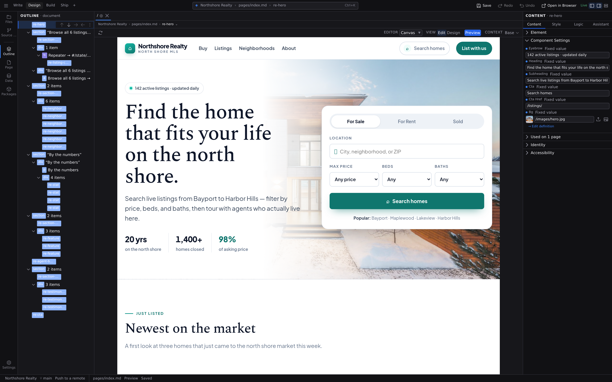

# The workspace

The Jx Studio window is one workspace with a fixed set of regions: the **Command Bar** across the top, the **Navigator** (a labelled rail and the panel it opens) on the left, the **pane grid** in the middle with the canvas in it and the **jump bar** naming where you are above it, the **Inspector** on the right, the **Bottom dock** under the panes, and the **status bar** along the bottom. This page walks through each one. For a quicker orientation, start with **[A tour of Jx Studio](/docs/start/studio-tour)**.

## Command Bar

The bar across the top of the window. Everything in it is a command, so what you see here, what the [command palette](/docs/studio/interface/quick-access) offers and what a keyboard shortcut does can never disagree.

From left to right:

- The **Studio menu** (the ≡ button at the left edge) holds the commands that don't need a permanent button, each with its own keyboard shortcut printed beside it: **Open Project…**, **Open Recent…**, **New Project…**, **Open Library**, **Preferences…**, **Zen Mode**, and the rest.
- The **layout tabs** (**Write · Design · Build · Ship**) are named arrangements of the workspace. Clicking one sets the Navigator panel, the dock widths, the Inspector tab and the Bottom dock in a single step. Double-click a tab to rename it, and press **+** to save whatever is on screen now as a layout of your own. Layouts are remembered per project.
- The **Command Center pill** sits in the middle: `◈ project › document › selection`, with :kbd[⌘K] at its right end. It names the project you're in, the document you're editing and the element you have selected, and each segment is a button that opens the palette already scoped to that level. Click the pill's empty space to open the palette with nothing pre-picked. The pill is where you go to _search_ for a place; the [jump bar](#the-jump-bar) over the pane is where you _step_ to one.
- The **verb cluster** on the right holds the four actions worth a permanent button: **Save**, **Open in Browser**, **Undo** and **Redo**. A greyed-out one tells you in its tooltip what it is waiting for.
- **Dock toggles** for the Navigator (:kbd[⌘B]), the Inspector (:kbd[⌘⌥B]) and the Bottom dock (:kbd[⌘J]).

In the desktop app, the window's minimize, maximize and close controls also live in this row.

**Open in Browser** (:kbd[⇧⌘O] on macOS, :kbd[Ctrl+Shift+O] on Windows/Linux) opens the page you're editing in your own browser, the fastest way to check the actual page instead of the canvas's approximation of it. It opens **at the route it will be published at**, on a local address of its own, so styles, scripts and images load the way they will in production and every link goes where it will go once the site is live. You can click through the whole thing.

Nothing is compiled on the way there. Your project's own files are served as a site and each page is assembled as it's asked for, which is why it appears at once, and why it shows **the work in progress rather than the last save**. Keep typing and the page reloads as you go, including edits to a layout or a component you have open in another tab. Save, and it reloads once more against the file you just wrote.

Press it again and you get **the same tab**, moved to whatever page you're on now. One project, one preview tab, however many times you press it. Your browser won't come forward on its own when that happens, because a page can't raise a tab you're not looking at, so Studio tells you which page it moved to and you switch over when you're ready. Close the tab and the next press opens a fresh one.

It is always there. When the open file has no route it's disabled and its tooltip says why: a component isn't a page, a `[slug]` route needs a value picked in the pane context bar's **resolving with** popover first, and a project that doesn't build a site has nothing to serve.

**Build Site** is the other half, and it answers a different question: not "what does this page look like?" but "does my site build?" It's in the Studio menu and the Command Center. It runs the real compiler (bundling, image variants, the sitemap and the rest) and reports what it produced. That's the one to reach for before you publish; Open in Browser is the one for everything else.

:::doc-tip
A layout reconfigures the workspace; it never takes anything away. Every panel stays on the rail, on its shortcut and in the palette after any layout is applied.
:::

## Navigator rail

The vertical strip on the far left. Every button carries a **text label under its icon**, and the buttons are split into two labelled groups, because a panel is either about your whole project or about the one document in front of you:

**Project**

- **Files** (:kbd[⌘1]): the project file tree. Open, rename, convert and organize the files in your project folder. **New File…** (from the panel's toolbar, or from a folder's right-click menu) opens the [creation dialog](#creating-a-file), which asks for a name and offers a **Format** picker beside it. Studio picks the starting content from the format you choose. The tree leaves out whatever your project ignores; see [Files the tree hides](#files-the-tree-hides). Drag files in from your desktop and they upload into whichever folder you drop them on; see [Media](/docs/studio/projects/media). On a [multilingual project](/docs/studio/interface/languages), a file under a language's directory carries that language's name beside it: _français_, not _French_.
- **Source Control** (:kbd[⌘3]): the built-in git client. A badge counts changed files. See [Publish](/docs/studio/publish).

**Document**

- **Outline** (:kbd[⌘4]): the element structure of the open page or component, as a tree you can select and reorder. In **Project Styles** it lists the style targets instead.
- **Page** (:kbd[⌘5]): the page's title, description and social preview.
- **Data** (:kbd[⌘6]): the values, data sources and functions the document knows about, with what each one currently resolves to. See [Logic](/docs/studio/logic).
- **Packages** (:kbd[⌘7]): the components and packages the open document pulls in.

Clicking the button of the panel that's already open collapses the Navigator; clicking any button brings it back. A document-level panel with no document open says what it needs.

**Insert**, the palette of elements and components you can add to a page, is not on the rail, because you reach for it at the moment you're placing something, and it is not a view you sit in. Run **Show Insert** from the palette (:kbd[⌘K]) to open it in the Navigator.

At the foot of the rail is one button, **Settings**, and it opens a menu rather than a panel:

- **Preferences…** (:kbd[⌘,]) holds the settings that belong to Studio itself and follow you between projects: the theme, the AI provider, your accounts, the keyboard sheet. Its submenu jumps straight to one of those four. See **[Preferences](/docs/studio/interface/preferences)**.
- **Open Project Settings** (:kbd[⌘⇧,]) holds this project's configuration, from the site name through contexts, data shapes and packages to the deploy target. Its submenu lists every section, so you can land on the one you want instead of arriving at Overview and hunting. See **[Project settings](/docs/studio/projects/settings)**.
- **Open Project Styles** holds the design tokens and element defaults, over that same project file. See **[Project Styles](/docs/studio/design/stylebook)**.

Clicking a heading opens that surface where you last left it; following its submenu opens it on the section you picked. A divider separates what belongs to the app from what belongs to the project. With no project open the two project entries are still listed, greyed, saying what they need, so the menu tells you what Studio can do before you have opened anything.

## Navigator dock

The dock to the right of the rail shows one panel at a time, under a header naming the panel and the level it works at: `FILES · project`, `OUTLINE · document`. That header is how you always know which panel you're looking at and whether closing the last document would empty it.

Drag the dock's inner edge to resize it (up to half the window), and double-click that edge to snap back to the default width.

Both trees in the dock, **Files** and **[Outline](/docs/studio/design/layers)**, answer the same keys. :kbd[Tab] enters the tree at the row you were last on, :kbd[↑] and :kbd[↓] walk the rows, :kbd[→] opens a folder or steps into it, :kbd[←] closes it or steps out to the one it sits in, and :kbd[Home] / :kbd[End] jump to the ends of the whole tree rather than to the ends of what is on screen. Typing a letter jumps to the next row whose name starts with it. Everything the tree does not use reaches your commands untouched, so cut, paste and delete still work on the row you are standing on.

## Creating a file

There is one creation flow, and every surface that makes a file uses it: **New File…** in the Files tree, **New** in the [Library](/docs/studio/projects/browse), and **New Entry** for a content collection. Wherever you start from, the dialog behaves the same way:

- **It says where the file is going**, above the field: `Creating in content/blog/`, or _Creating in the project root_. The destination is part of the gesture you made, never guessed from a filter or a fallback.
- **A name that folder already has is refused at the field.** The dialog stays open and tells you `about.md already exists in content/blog/.`, so nothing is overwritten and there is nothing to undo. A blank name, or one with no letters or digits left in it, is refused the same way.
- **You choose the format; you don't type the extension.** The **Format** picker lists `JSON` and every format your project's extensions provide (`Markdown`, if you have the [content extension](/docs/extending/extensions/formats) installed), and the file gets that extension. The name is taken exactly as you type it, so `[slug]` stays `[slug]`.

Switching the picker re-checks the name against the folder, so a name that is free as a `.json` and taken as a `.md` tells you the moment you switch, rather than after you press **Create**.

### Creating something that isn't a document

The last row of the picker is **Other…**, and it hands the field back to you whole: type `styles/main.css`, `public/robots.txt` or `.gitignore` and that is exactly what you get. Folders in the path are created for you, so **Other…** is also how you make a new folder from the tree.

### Creating inside a content collection

A [content type](/docs/studio/projects/content-types) already fixes the format of its entries, so the dialog does not ask twice:

- In the collection's **own folder**, **New File…** _is_ **New Entry**: the extension is the collection's, the fields are seeded from its schema, and the file opens in the entry form.
- In a **subfolder** of it, the picker is locked to the collection's format, because a document there is still one of its entries. **Other…** stays available for the images and notes you keep beside them. What **Other…** will not accept there is a document of a _different_ format, which would be discovered as an entry the collection cannot read.

The new file is written with the starting content its type calls for: a content entry is seeded from its content type's fields, so it is valid the moment it exists. Creating from the Library or from a collection opens the new file for you as well.

## Converting a file to another format

Right-click a page or component in the Files tree and choose **Convert Format…** to move it between formats: a Markdown page to JSON, or back. The file keeps its name and takes the new extension, and every `$ref` in your project that pointed at it is rewritten to match. The tab you had open follows.

Studio offers the action only where it means something. Files outside `pages/` and `components/` are not offered it, nor are layouts (which are always JSON), nor anything inside a content collection: converting an entry would quietly remove it from its collection, and converting a file that merely sits beside the entries would quietly add it.

Before the button, the dialog tells you what is about to happen: how many references will be rewritten, whether the result reads back identically, and that the original is not kept. Afterwards, a reference the refactor could not rewrite is [reported as a warning naming the file](/docs/studio/projects/pages-layouts-components#before-you-delete-rename-or-convert) rather than as a plain success. If the file is open with unsaved changes, the conversion is refused until you save or discard them.

:::doc-note
There is no undo for a conversion. The file has moved and its references have moved with it. That is why the count is on screen before you confirm, rather than in a toast afterwards.
:::

:::doc-note
If the write itself fails, the reason arrives as a **Problem** in the [Bottom dock](#bottom-dock) carrying the path. A toast would scroll away, and the thing you have to do next is about that path.
:::

## Files the tree hides

The Files tree draws the files you write, not the files your tools write for you. Anything your project's `.gitignore` covers (`node_modules`, `dist`, `build`, `coverage`, `.next`) is left out, so a project of forty documents opens as a list of forty rows rather than tens of thousands.

Studio reads the same `.gitignore` files git reads, at every level of the project: the one in the project folder, and one in any folder below it. The rules mean what they mean in git: a later line beats an earlier one, a `.gitignore` further down the tree beats one above it, and a `!` line puts something back. Folders don't list dotfiles at all, so `.gitignore` itself isn't a row either.

To see what's hidden, click **Show ignored files** in the Files toolbar, beside **New File** and **Refresh**. The tree redraws with everything in it and the button becomes **Hide ignored files**. Studio starts out hiding, and the choice is yours rather than the project's; it follows you into every project and every window.

Change a `.gitignore` and the tree catches up as soon as the file is saved, whether the change came from Studio or from another editor. **Refresh** re-reads the rules as well.

:::doc-note
A project with no `.gitignore` is unaffected: nothing is hidden, and the toggle has nothing to change. Studio only reads `.gitignore` files that live inside the project folder; the ignore rules git keeps outside it (`.git/info/exclude`, and a global excludes file) are not consulted. So anything missing from the tree is always named by a `.gitignore` you can open.
:::

## Panes and the canvas

The middle of the window is the **pane grid**: one editor pane, or two side by side with a divider you can drag (:kbd[⌘\] splits, :kbd[⌘⌥0] focuses the second one). A pane renders one document in one editor: **Canvas**, **Code**, **Grid**, **Diff**, **Entry**, **Library** or **Project Styles**. It carries its own strip of open documents, its own jump bar and its own context bar, so everything around a document describes the pane it is in. Both panes can be a live canvas, and clicking into one is what points the Inspector, the Outline and the keyboard at it. See **[Documents and panes](/docs/studio/interface/tabs)**.

A Diff pane compares one file against your last commit and carries its own change stepper, so two panes can be reviewing two different files at once. See **[Source control](/docs/studio/publish/source-control#read-a-change)**.

A Canvas pane renders the open file live. Panning, zooming, selection and direct manipulation are covered in **[The canvas](/docs/studio/interface/canvas)**. A page's **Document Header** (title, route, layout picker and the way in to Search appearance) is drawn at the top of the artefact itself, inside the stage, because it is part of the document rather than a view of it.

## The jump bar

Between a pane's strip of documents and its context bar, one line names **where you are**, from the outside in. It prints the project, the file, and the chain of elements down to the one you have selected:

`◈ Portfolio › pages/blog/[slug].json › Repeater › article › h1 — Latest posts`

The last segment is where you are, named the way the [Outline](/docs/studio/design/layers) names it; the ones above it print their tag, so a deep address still fits on one line.

- **Every segment is a button**, and each one runs a real Studio command, so the tooltip carries that command's own name and shortcut. The project opens your recents, the file opens file search, an element segment selects that element.
- **A segment with siblings carries a ⌄.** It lists the other children of the same parent, under their Outline names, with the one you're on marked. A step whose parent has only one child shows no chevron: one alternative is not a choice.
- **A step you can't take stays on the bar as plain text.** An address with a hole in it would be a lie about what contains what.
- With a formula or a function open in the Bottom dock's **Logic** tab, the address ends there (`fx total`, `ƒ onSubmit`) because a definition has no element under it.

The bar names the **primary** selection. Select several elements and the count is in the status bar; the bar keeps naming the one the Inspector is pointed at.

## Inspector

The dock on the right inspects whatever is selected, in four tabs:

- **Content** (:kbd[⌘⇧1]): the selected element's settings, including its text, links, images and component options.
- **Style** (:kbd[⌘⇧2]): the visual inspector for spacing, typography, color, layout and more. See [Design mode](/docs/studio/design).
- **Logic** (:kbd[⌘⇧3]): what the element does on click, input, submit and other interactions. See [Logic](/docs/studio/logic).
- **Assistant** (:kbd[⌘⇧4]): the [AI assistant](/docs/studio/ai), which lives in this dock as a tab, so showing it never narrows the canvas.

Every tab renders under a header naming the tab and what it is pointed at: the selected element, or the open document when nothing is selected. Resize the dock by dragging its inner edge, or collapse it with :kbd[⌘⌥B].

:::doc-note
Studio remembers your layout: dock widths and which docks are collapsed carry over to your next session, per project.
:::

## Bottom dock

Press :kbd[⌘J] for the dock under the pane grid. It sits in the panes' column only, so opening it never narrows the Navigator or the Inspector, and it opens **collapsed**, because an empty list shouldn't spend canvas to say nothing.

- **Problems**: everything Studio is waiting for you to fix, grouped by where it came from. A row can carry the file it happened in (click it to open the file) and a disclosure with the captured log. When there is something to do about it, the row shows the button for it. That button is the real command, with its own name, its shortcut, and its reason when it isn't available yet. Dismiss a row you've dealt with, or clear the list.
- **Logic**: the [formula workspace](/docs/studio/logic/formula-workspace) and the [function editor](/docs/studio/logic/code). It joins the strip when you open a formula or a function body and leaves it when you close one, so the tab exists exactly while there is something in it. Opening one reveals the dock on it; close the dock over an open formula and it stays closed until you open another.
- **Activity**: one entry per long operation, with a title, a status line, the steps it's working through, a streaming log, and **Cancel** when the operation can be cancelled. An entry outlives the run, so you can read what a publish or an import actually did after it finished. A failure leaves both the entry and a Problem carrying its log.

Because the dock sits under the stage rather than over it, **the page keeps rendering while you edit its logic**. You can watch a value change on the canvas as you edit the formula that computes it.

Drag the dock's top edge to resize it, or close it with the **×** in its tab strip.

:::doc-note
Almost nothing in Studio blocks the whole app any more. Installing dependencies is the exception, and even there the progress dialog offers **Run in the background** and leaves its Activity entry behind either way.
:::

## Status bar

The strip along the bottom carries **ambient state only** (things that are true until something changes them) in three fields, in the same order as the levels above them:

- **Project** shows the project name, the git branch with its ahead/behind counts, a count of open problems, and who else is in the document with you.
- **Document** shows the document's path, the pane's effective view (`Edit`, `Design`, `Preview`, `Code`, `Grid`, `Library`…) in the same words the [pane context bar](/docs/studio/interface/tabs#the-pane-context-bar) uses, and the save state in words: **Unsaved changes**, **Saved**, **Saved 2 minutes ago**, or **Read-only** when a collaborator holds the file.
- **Selection** shows what the address above can't say: **3 selected** when more than one element is picked, or the style rule the Style panel is editing in Project Styles. The element itself, and the chain above it, are on the [jump bar](#the-jump-bar), which states them permanently.

Nearly every item is a button that runs the command behind it: the project name opens your recents, the branch reveals Source Control, the problem count opens the Bottom dock, **Unsaved changes** saves.

:::doc-note
Outcomes don't appear here. Something that happened at a moment and is reversible appears as a **toast** that retires itself; something that must be fixed becomes a **Problem** in the Bottom dock; something wrong with a value you just typed is shown at the field you typed it in.
:::

## Next

- Work with several documents at once in **[Documents and panes](/docs/studio/interface/tabs)**
- Meet the editors and views in **[Modes and views](/docs/studio/interface/modes)**
- Work directly on the page in **[The canvas](/docs/studio/interface/canvas)**
- Learn the **[keyboard shortcuts](/docs/studio/interface/shortcuts)**
