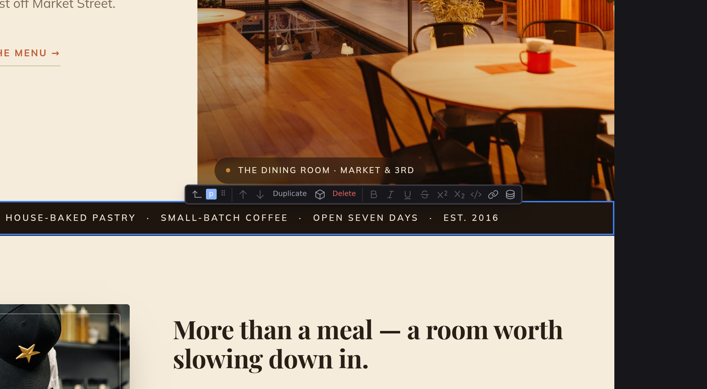

# The canvas

The canvas is the center of the workspace, where your page renders live. It is the real thing, not a mock-up, and you work on it directly: click to put the cursor in the text and select the block, drag the block bar's handle to rearrange. How it behaves depends on the current [mode](/docs/studio/interface/modes); this page covers the interactions shared by the visual modes.

## Resizing the page

In **Edit** the canvas is a single centred column with a drag handle on each side. Dragging either one resizes the page symmetrically, and the [breakpoint](/docs/studio/design/breakpoints) follows the width. Design has no handles, because it already draws every breakpoint side by side.

## Pan and zoom

In **Design** and **Project Styles** the canvas is an open surface you move around:

- **Pan** with the mouse wheel or trackpad. Hold :kbd[Shift] while scrolling to pan sideways, or drag with the middle mouse button.
- **Zoom** by holding :kbd[⌘] (macOS) or :kbd[Ctrl] (Windows/Linux) and scrolling; the canvas zooms toward your cursor. :kbd[⌘=] / :kbd[Ctrl+=] zooms in, :kbd[⌘-] / :kbd[Ctrl+-] zooms out, and :kbd[⌘0] / :kbd[Ctrl+0] resets to 100%.
- The zoom pod floating at the canvas's bottom-right does the same, plus a **fit** picker offering **Fit page**, **Fit width** and **Actual size**, remembered per document.

**Design opens already fitted.** Switching into Design or Project Styles scales the canvas down so the whole thing is in view, so a wide layout never lands cut off at the edge of the panel. It never scales _up_ past 100%, and it never overrides you: once you have set a zoom yourself (with the controls, :kbd[Ctrl]-scroll or the chords), that file keeps your zoom for the rest of the session.

In **Edit** mode the page scrolls like a normal browser page instead of panning, and :kbd[Ctrl]-scrolling zooms the content itself, so the text reflows at the new size, like browser page zoom. In **Preview** the page scrolls too, and there is nothing to pan or zoom. See **[Modes](/docs/studio/interface/modes)**. The same goes for every editor that isn't a canvas: **Code**, the **Grid**, the **Library**, an **entry form** and **[Project Settings](/docs/studio/projects/settings)** all scroll under the wheel exactly like an ordinary page, including the boxes inside them, the Raw JSON view of `project.json` for one. What none of them does is zoom: :kbd[Ctrl]-scroll and a trackpad pinch do nothing there, the same as anywhere else in Studio outside the canvas, so a stray pinch never rescales the whole window.

## Selecting elements

Click any element to select it. Studio outlines it, the Inspector inspects it, and the status bar shows its position in the page structure, a clickable trail of its ancestors.

That includes the parts of the page that come from its **[layout](/docs/studio/projects/pages-layouts-components)**. The header and footer render dimmed, under a `LAYOUT · layouts/base.json` chip, and clicking one selects it and offers **Open Layout →** in the Inspector. They can't be typed into from here, because they belong to every page that uses that layout; see **[Layout elements](/docs/studio/design/properties#layout-elements)**.

:kbd[⌘]-click (macOS) / :kbd[Ctrl]-click (Windows/Linux) adds an element to the selection or takes it out again. Every selected element keeps a box on the canvas, while the block action bar, the Inspector's single-element controls and the status trail address the one you clicked most recently; the status bar says **N selected** in front of the trail so the trail is never mistaken for the whole set. Ranges are drawn in the **[Outline](/docs/studio/design/layers#select-several-at-once)**, where a :kbd[Shift]-click covers everything between two rows. The canvas has no rubber-band selection.

You can also move the selection from the keyboard: :kbd[↑] and :kbd[↓] step between siblings, :kbd[→] steps into the first child, and :kbd[←] or :kbd[Esc] steps out to the parent. Pressed on the outermost element, :kbd[Esc] clears the selection instead. With nothing selected at all, :kbd[↑] or :kbd[↓] selects the outermost element, so the first key press always lands somewhere. The full list is in the **[shortcut reference](/docs/studio/interface/shortcuts)**.

## Popovers

A [popover](/docs/framework/concepts/overlays) is hidden until something opens it: a mobile menu, a dropdown, a search palette. On the canvas that stays true, so a closed one is invisible, exactly as on the page.

**Selecting it opens it.** Click the panel in the Outline, jump to a Problem inside it, or click its trigger button on the canvas, and the panel opens and the artboard grows to make room. Its contents are then ordinary elements: click a link inside it and edit the text, drag a block into it, style it in the Inspector.

It opens **in place** rather than floating over the page, marked with a dashed outline and a **POPOVER · SHOWN IN PLACE** label. That is a deliberate trade. On a real page a popover floats above everything in the browser's top layer, and that layer is one the editor cannot measure, cannot grow the canvas for, and cannot reliably put a selection box around. Shown in place, every editing tool works on it normally.

Two things are therefore **Preview only**: the backdrop behind the panel, and the way it stacks above the rest of the page. Switch to Preview to see the popover exactly as a visitor will, animation and all.

Selecting something outside the popover does not close it. Otherwise reaching for a colour in the Inspector would shut the panel you were styling. Close it from the block action bar, or by clicking its trigger again.

A `<dialog>` works the same way. Select it, or anything inside it, and it opens in place with a **DIALOG · SHOWN IN PLACE** mark; a `command="show-modal"` button opens it too, and a `close` button closes it. On the canvas nothing goes modal and nothing goes inert, so the rest of the page stays editable while the dialog is up. Preview shows the dialog as a visitor sees it: modal, over a backdrop, with the page behind it locked. A region you marked `inert` is editable on the canvas for the same reason, and inert again in Preview and on the built page. A style rule you wrote for `[inert]` still applies while you edit, so the region looks the way it will on the page.

:::doc-note
A popover that lives inside a component stays closed while you are on a page that uses the component. Open the component's own file to edit it, the same rule that makes layout chrome read-only on a page.
:::

## The block action bar

A small floating toolbar appears above the selected element:

- A **back arrow** selects the parent element.
- The **name badge** shows what's selected: the element's type or its name. When the element can become something else (a paragraph into a heading, for example), clicking the badge lists the conversions. On a component instance or a repeater, where there is nothing to convert to, the badge is greyed rather than gone.
- Drag the **⠿ drag handle** to move the element somewhere else on the page.
- **Move up** and **Move down** arrows swap the element with its neighbors.
- For a component instance, **Edit Component** opens the component itself; for anything else, **Convert to Component** turns the selection into a reusable component.
- While you're editing text, formatting buttons (bold, italic, and friends) and an **Insert data** button join the bar. See [Edit mode](/docs/studio/editing).

The bar steps aside when you leave the canvas. Click into the Inspector, a panel or the document header and it disappears, so it is never sitting over the control you were reaching for. **Your selection stays exactly as it was**, which is what the Inspector is editing. It comes back the moment the canvas is in play again: click the element on the canvas, or select anything from the Outline, and the bar is there for it. Panning or zooming the canvas leaves it alone, and so do the bar's own pieces: its `⋮` menu, the link popover and the slash menu.

:::doc-tip
The bar keeps one shape. An action that cannot apply to the current selection, like moving the first child up or deleting the document root, is shown greyed with a tooltip saying what it needs, rather than disappearing. Buttons never move under your cursor.
:::

The bar also carries the structural verbs **Duplicate** and **Delete**. It shows a fixed run of them and keeps any further verb, with its name and its shortcut, behind a **More block actions** button rather than dropping it.

With several elements selected the bar sits on the last one you clicked and names it. **Duplicate** and **Delete** act on everything selected, in one undo step; the move arrows act on that one element, because moving several elements one slot along has no single meaning. See **[Select several at once](/docs/studio/design/layers#select-several-at-once)**.

## Inserting elements

Three ways to add something to the page:

- **The + affordance.** Move the pointer between two elements and a **+** appears at the insertion point. Click it and pick an element from the menu; the new element lands right there, selected.
- **The slash menu.** While editing text, type `/` at the start of a line to insert headings, lists, images, buttons, and more without leaving the keyboard. See [Edit mode](/docs/studio/editing).
- **The Insert panel.** Run **Show Insert** from the command palette (:kbd[⌘K] / :kbd[Ctrl+K]) and drag an element or component card onto the canvas.

## Drag and drop

You can drag onto and around the canvas from almost anywhere: cards from the **Insert** panel, rows in the **Outline** panel, and the **⠿** handle on the block action bar. While you drag, an indicator line shows exactly where the element will land: before, after, or inside the element under the cursor. Drop to commit, or press :kbd[Esc] to cancel the drag with nothing changed.

Files from your desktop work too. Drop an image on empty space and Studio uploads it and inserts it there; drop it on a picture that's already on the page and it swaps that picture's source instead. The target highlights so you can tell the two apart before you let go. An upload that fails says so and stays said, on the **[Problems](/docs/studio/interface/problems-and-progress)** list, naming the file it couldn't write. See **[Media](/docs/studio/projects/media)**.

## The right-click context menu

Right-click any element for the full action list: **Copy**, **Cut**, **Duplicate**, **Copy styles** and **Paste styles**, **Insert before** and **Insert after**, **Wrap in Div**, **Repeat...** (turn the element into a repeating list), **Set Title**, **Edit Component** or **Convert to Component**, and **Delete**. With something on the clipboard, **Paste inside** and **Paste after** appear too.

Right-clicking an element that is already part of a [multiple selection](/docs/studio/design/layers#select-several-at-once) keeps that selection rather than collapsing it to the element you aimed at; right-clicking anything else selects it alone. **Cut** then removes the whole selection in one undo step, putting the element you aimed at on the clipboard. The other rows address that one element: to duplicate or delete a whole selection, use :kbd[⌘D] and :kbd[Delete], or the block action bar.

**Every** row is a command as well as a menu item, so all of them can be run by name from the [command palette](/docs/studio/interface/quick-access), with the same wording and the same reason when they are unavailable. A row that can't apply to what you have selected is greyed with that reason rather than hidden: **Cut** on the page root says it needs an element that isn't the root. See **[Commands](/docs/studio/interface/commands)**.

Right-clicking **empty space** around the page gives you the browser's own menu, not this one. There is nothing there to act on, and that margin is where you reach for View Source or Inspect.

## Editing text

Click any text to put the cursor there and start typing. Everything about writing on the canvas is covered in **[Edit mode](/docs/studio/editing)**: formatting, the slash menu, links.

## Next

- Style what you select in **[Design mode](/docs/studio/design)**
- Wire up behavior in **[Logic](/docs/studio/logic)**
- Keep your hands on the keys with the **[shortcut reference](/docs/studio/interface/shortcuts)**
