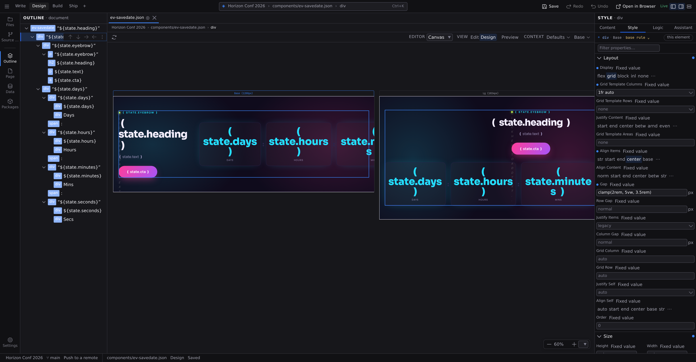
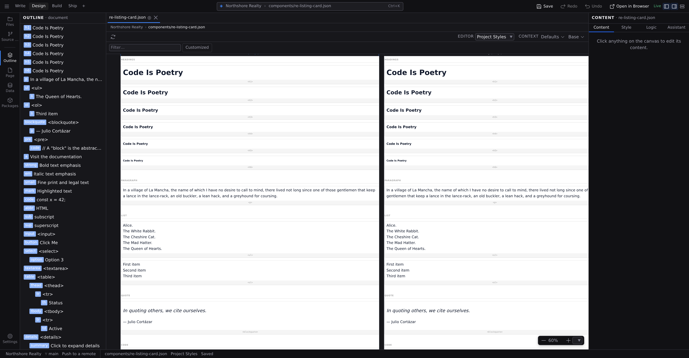

# Editors and views

Two controls on the [context bar](/docs/studio/interface/tabs) decide how the open file is presented, and they answer different questions. **Editor** is _which editor_: **Canvas**, **Grid**, **Code**, **Diff**, **Entry**, **Library** or **Project Styles**. It lists only the editors this file supports, so there is nothing in it to be disabled. **View** is _which view of the canvas_: **Edit** or **Design**, with **Preview** as a toggle beside them. It appears only while the Canvas editor is open. A view is a lens rather than a different app, showing the same file underneath in the way that suits the job. Every open file remembers both as you switch between tabs.

Those seven names come from one list in Studio, which is why the pane's context bar and the status bar can never print different words for the same editor.

## Edit

Edit is for writing. The canvas becomes the page itself: click any text and type, press `/` for blocks, fill in the page's metadata alongside. It reads like the finished page because it is the finished page. The context bar's **Size** control works here too: pick a [breakpoint](/docs/studio/design/breakpoints) and the column narrows to it, so you can write against the width your readers will have. Or drag the handle on either side of the column, and the width becomes anything you like with the breakpoint following it. Full guide: **[Edit mode](/docs/studio/editing)**.

## Design

Design is for structure and style. The canvas shows a live panel per breakpoint, phone and tablet and desktop side by side, and the **Style** tab of the Inspector becomes a full visual inspector for the selected element. Full guide: **[Design mode](/docs/studio/design)**.

## Grid

Grid is for tabular data. Files like CSV spreadsheets open as an editable table: click a cell to change it, and use the familiar copy, paste, and selection keys, which work on the table's rows and cells rather than on the page. Cell edits collect in the tab until you **Save**, which writes them all back to the file at once.

## Entry

A file that belongs to a content collection can open as a form built from that collection's schema: a date picker for a date, a toggle for a boolean, a tag input for a list, and a picker of real entries for a field that references another collection. **Open Entry Form** in the palette opens it, and the body of the same file stays one :kbd[⌘Z] history away in the Canvas editor. Full guide: **[Frontmatter and page metadata](/docs/studio/editing/frontmatter)**.

## Library

Library is the project's browser: every page, layout, component, content entry and media file, filtered by category and searchable, in whichever layout suits what you are looking at (**Table**, **Cards**, **Media**, **Calendar** or **Board**). **Open Library**, from the **⬢ menu** or the palette, opens it as a document in a pane. It sits in the strip alongside your files rather than over the top of them, and you can keep it beside a page in a [split](/docs/studio/interface/tabs#two-panes). Full guide: **[The Library](/docs/studio/projects/browse)**.

## Media

An image, video, audio file, font or PDF opens in a viewer rather than an editor. It shows the file itself (the picture at full size, media with playback controls, a font set as a specimen) plus what Studio knows about it, the URL a document references it by, and which documents use it. Clicking a file in the Files panel or a tile in the Library is all it takes. Full guide: **[Media](/docs/studio/projects/media#open-a-media-file)**.

## Code

Code shows the file as raw source in a full code editor with syntax highlighting, the same editor VS Code uses. It is the escape hatch when you want to see exactly what Studio wrote, and the **Export** button at the right of the context bar saves a copy of the file elsewhere. Everything you can do here you can also do visually; see **[Logic](/docs/studio/logic)** for where code fits in Studio.

Switching away from Code, to another editor or another view or another document, carries your last keystrokes with you rather than leaving them behind in a buffer you can no longer see. See **[Code editing](/docs/studio/logic/code#the-code-editor-the-whole-file-as-source)**.

## Diff

Diff compares the open file against your last commit. You reach it from the [Source Control](/docs/studio/publish/source-control) panel by clicking a changed file, or from the **Editor** control on a file that has changes.

It has two halves and a switch above them. **Visual** draws the page twice, side by side, with added blocks marked in green, removed blocks in red, and edited ones marked on both sides. **Code** shows the file's text with changed lines highlighted instead. A file with no visual form, such as a stylesheet or a script, offers only Code.

**Next change** and **Previous change**, or :kbd[F7] and :kbd[⇧F7], walk the changes in order, and both sides move together so the block you are reading stays lined up.

The full guide is **[Source control](/docs/studio/publish/source-control#read-a-change)**.

## Project Styles

Project Styles is the catalog of your project's element defaults: every heading, button, and link rendered with its base style, so you set the look of each element type once for the whole site. Selecting it switches the Inspector to the **Style** tab automatically. See **[Design mode](/docs/studio/design)** for how it fits into styling.

## Project Settings

Your project's configuration, `project.json`, opens as a document too, and **Open Project Settings** shows it in its own editor: the sections down the left (Overview, Contexts, Site head, Locales, CSS Variables, Data Shapes, Content types, Packages, Extensions, Deploy, Raw JSON, plus any an extension adds), the section you picked filling the rest of the pane. Because it is a document, :kbd[⌘Z], the unsaved dot and :kbd[⌘S] mean here exactly what they mean in a page.

The pane's context bar steps aside for it. A settings form has no canvas view to choose, no rendering context to resolve against, and the place contexts are _defined_ is a section of the very document on screen. So the editor takes the whole pane instead of sitting under a row of controls with nothing to say. Full guide: **[Project settings](/docs/studio/projects/settings)**.

**Project Styles** and **Code** are two more editors over that same file, so switching between them keeps one undo history and one unsaved dot. **Edit Global Styles**, in the Overview section, is the way across to Project Styles.

## Which files offer what

Every file opens in its natural editor and view, and the two controls offer only what that file supports:

| File                               | Opens in           | Editor also offers           | View also offers        |
| ---------------------------------- | ------------------ | ---------------------------- | ----------------------- |
| Markdown pages and content (`.md`) | **Canvas** · Edit  | **Code**                     | **Design**, **Preview** |
| Components and pages (`.json`)     | **Canvas** · Edit  | **Code**, **Project Styles** | **Design**, **Preview** |
| Spreadsheets (`.csv`)              | **Grid**           | **Code**                     | —                       |
| Images, video, audio, fonts, PDFs  | **Media**          | —                            | —                       |
| Vector images (`.svg`)             | **Media**          | **Code**                     | —                       |
| The project file (`project.json`)  | **Project Styles** | **Code**                     | —                       |

Any file with uncommitted changes also offers **Diff**, including files that have no other editor at all. Opening one of those from the Files tree still says Studio has no editor for it; Source Control asks the narrower question of what changed, and answers it.

Opening `project.json` from the Files tree lands on **Project Styles**; **Open Project Settings** puts that same document into its settings editor, and **Open Project Styles** puts it back. All three are in the **Settings** menu at the foot of the rail.

A file that belongs to a content collection also has an **Entry** editor. **Open Entry Form** is how you reach it, and it joins that file's **Editor** control from then on, so you can move between the form and the body without losing your place in either.

Installed format extensions can add their own file types with their own lists, so this table can grow with your project.

## Preview

**Preview** is a **toggle** beside the View control, not a third view. It applies to Edit and to Design alike: the base stays selected while you preview, so the bar always says which mode you are previewing and which one switching Preview off returns you to. Turn it on and the canvas shows the page with its real data resolved: dynamic text filled in, repeated lists expanded, exactly what a visitor gets.

What it resolves _with_ comes from the two controls beside it. The **Context** popover holds what the page renders _in_: its breakpoint, colour scheme, feature queries, and a **Show layout elements** switch for pages that use a layout. The **resolving with** popover holds what it renders _from_, one field per line:

- For pages with dynamic addresses (a product page, a blog post), a picker per URL parameter so you choose which real record to preview.
- For components, a field per component option so you can try test values.

Its button says how many you have set, so you can tell at a glance whether the canvas is showing defaults.

**Preview does not edit.** While it is on, clicking the page selects nothing, no outlines are drawn, the insertion **+** and the canvas menu give way to your browser's own, nothing can be dropped in, and the keys that change the document do nothing. Anything you had selected is still selected when you switch Preview back off. Save, Undo and Redo keep working throughout.

**Preview scrolls like a real page.** Instead of the open surface you pan around in Design, Preview puts one page-sized frame in the pane and lets it scroll itself, so sticky headers stick, elements that animate as they come into view actually do, and anything that reacts to scrolling behaves the way it will for a visitor. There is no zoom control in Preview for the same reason: it is showing you the page at its real size.

**And at the size you picked.** Preview is as wide as the breakpoint chosen in the **Context** popover, the same width Edit gives its column and Design gives that artboard, so the same page at `md` is the same page whichever view the toggle is over. With no breakpoint chosen it fills the pane.

Switch **Preview** off to go back to editing, in whichever view you were in.

**Clicking a link in Preview opens that page in a new browser tab**, rather than replacing the canvas. Links within the same page, the ones that jump to a heading, still scroll where you would expect.

:::doc-tip
That new tab is the best way to check a project properly: it is your real browser loading the real page, so navigation between pages, your own JavaScript, server-side data, and anything that depends on a real URL all behave exactly as they will once the site is built. The canvas is for composing; the browser tab is for confirming.
:::

## Next

- Learn the canvas itself, its panning and zooming and selection and inserting, in **[The canvas](/docs/studio/interface/canvas)**
- See how each tab remembers its editor and view in **[Documents and panes](/docs/studio/interface/tabs)**
