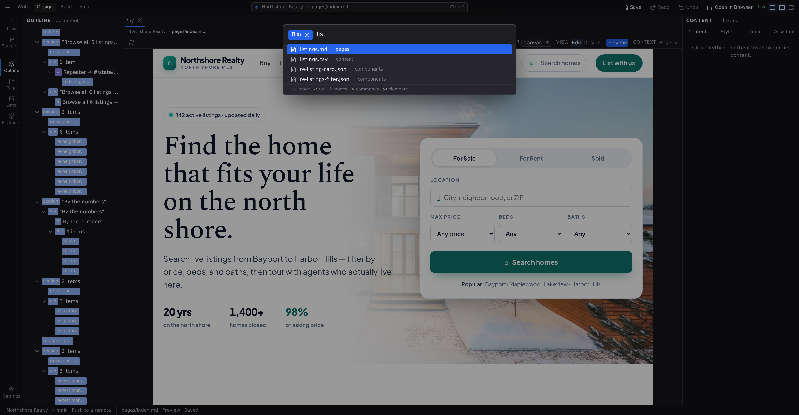

# Quick Access

Quick Access is the fastest way to open a file: a search palette that drops over the workspace, finds files by name as you type, and opens your pick on :kbd[Enter]. If you know roughly what a file is called, it beats clicking through the file tree every time.

## Open it

Arrowing through the results announces the highlighted row, so the list is usable without looking at it. The input and the list beneath it are now connected in the way a screen reader expects, which they were not before.

- Press :kbd[⌘P] (macOS) or :kbd[Ctrl+P] (Windows/Linux). It works from anywhere in Studio.
- Or click any segment of the **Command Center** pill in the middle of the Command Bar; the segment you click scopes the search to that level.

Press :kbd[Esc] or click outside the palette to dismiss it.

## What it finds

With a project open, type any part of a filename and Quick Access searches the whole project's documents: pages, components, content, and data files alike. Each result shows the filename and the folder it lives in.

Before you type anything, the palette lists your **recently opened** files, so reopening the file you just closed is :kbd[⌘P], :kbd[Enter].

With no project open, the palette lists your recent projects instead. Pick one to reopen it. It never mixes the two: with a project open you only ever see that project's files.

## Keyboard controls

- :kbd[↓] and :kbd[↑] move through the results, and the list scrolls to keep the highlighted row in view.
- :kbd[Enter] opens the highlighted result in a tab.
- :kbd[Esc] closes the palette.

The mouse works too: click any row to open it.

## Next

- See how opened files behave in **[Documents and panes](/docs/studio/interface/tabs)**
- The rest of the keyboard lives in the **[shortcut reference](/docs/studio/interface/shortcuts)**
