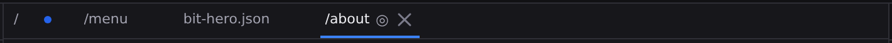

# Documents and panes

Every document you open in Jx Studio belongs to a **pane**. A pane is one editor over one document: the strip of open documents along the top, the [jump bar](/docs/studio/interface#the-jump-bar) naming where you are, and the context bar saying which editor and view you're in all describe the pane you're working in, and the document itself fills the rest. You can have one pane or two.

## Opening and switching

Open documents from the **Files** panel, the **[Library](/docs/studio/projects/browse)**, or the Command Center (:kbd[⌘K], or :kbd[⌘P] straight into file search). Click a document in the strip to switch to it; the Files tree follows along, so the strip and the tree never disagree about where you are.

Media files open too. An image, a video, a font or a PDF gets a document of its own, with the same strip, the same label rules and the same :kbd[⌘W], showing the file in the [Media viewer](/docs/studio/projects/media#open-a-media-file) rather than an editor.

- Switch back and forth with :kbd[⌃Tab] / :kbd[⌃⇧Tab], which walk your documents in most-recently-used order.
- Close one with its **×**, by middle-clicking it, or with :kbd[⌘W].
- Reopen the last one you closed with :kbd[⌘⇧T].
- Drag to reorder. When more are open than fit, scroll the mouse wheel over the strip, or use the **⌄** button at its right edge to pick from the ones currently out of view.
- Reach the strip from the keyboard with :kbd[Tab]. The whole strip is one stop, so the arrow keys then walk along it and switch as they land, :kbd[Home] and :kbd[End] jump to its ends, and :kbd[Delete] closes the document you are on, asking about unsaved changes exactly as the **×** does.

## Labels

A document is named by the shortest part of its path that tells it apart from the others, so a project full of files called `index.md` still gives you four distinguishable names, and only the ones that actually collide grow a folder in front of them.

Pages are labelled by their **route** instead (`/`, `/blog`, `/blog/[slug]`), because that is the address the page is published at, and it is what you were thinking of when you opened it.

## Preview and pinned documents

A single click from the file tree or the palette opens a document in **preview**: it shows in _italics_ and the next single click replaces it, so browsing around never leaves you with twenty things open. Anything that commits to it makes it permanent: editing it, double-clicking it, pinning it, or running **Keep Document Open**.

**Pin** a document with the ◎ button on it (◉ once pinned) to hold it at the head of the strip, where no preview open can take its slot. Dragging can never interleave pinned documents with unpinned ones.

## Studio saves only when you do

Jx Studio does **not** auto-save. Edits live in the open document until you save:

- A **●** marks unsaved changes, the status bar reads **Unsaved changes**, and the **Save** button in the Command Bar lights up.
- Save with :kbd[⌘S] or the **Save** button. The status bar then says **Saved**, and how long ago, for as long as that stays true.

Closing a document with unsaved changes asks first, and the question has three answers: **Save** writes the file and then closes, **Close Without Saving** throws the edits away, and **Cancel** leaves the tab where it was. A save that fails leaves the tab open and still unsaved, with the reason in [Problems](/docs/studio/interface/problems-and-progress). The close never outruns the write. :kbd[⌘W] and the tab's **×** ask the same question. Studio skips it only when a collaborator is still in the document, because the shared session keeps the edits.

**Text still in a code editor counts.** Closing settles whatever you have typed in a [Code view or a function body](/docs/studio/logic/code) before it decides whether to ask, so a document whose only unsaved change is the word you were halfway through still gets the question.

Undo and redo are per document as well: each keeps its own history, so :kbd[⌘Z] in one never unwinds work in another.

:::doc-note
Saving writes the file in place, in your project folder, as plain Markdown, JSON, or CSV. Nothing is held in a database; what you save is what git sees. See [Publish](/docs/studio/publish).
:::

## Each document remembers its view

A document keeps its own view state while it's open. Switch from a Markdown page in **Edit** to a component in **Design** and back, and each returns exactly as you left it:

- its [editor and view](/docs/studio/interface/modes),
- its canvas position, and the zoom, but only once you have set one yourself; until then Design keeps fitting the canvas to the pane,
- its selected element and active Inspector tab.

New documents open in their natural editor: Markdown in **Edit**, spreadsheets in **Grid**, the project file in **Project Styles**.

:::doc-note
**Your project's configuration is one of these documents.** `project.json` opens in the strip like any file, and **Open Project Settings** shows it in its settings editor. That means the settings you change there are edits: an unsaved dot, :kbd[⌘Z] to take one back, :kbd[⌘S] to write it. Reaching it from the Files tree and reaching it from **Open Project Settings** land on the same document, so there is only ever one history and one unsaved state for it.
:::

## Reopening a project

**A project comes back the way you left it.** Reopen one and the documents you had open reopen with it: in strip order, in both panes if you were split, with the one you were working on active and the keyboard where you left it. Each document returns in its own editor and view, at the zoom, breakpoint and color scheme you had chosen for it.

If a file was renamed, moved or deleted while you were away, that one is skipped and the rest still open. If none of them survive, the project opens on its home page as it always did.

Naming a document in the URL still wins: `?file=` opens that file, and Studio leaves the session alone.

## Drilling into a component

Opening a component from the canvas, the Outline tree or the Inspector's **Edit component** action gives it **its own place in the strip**. The page you came from stays open, still on the element you had selected, so you can flip between the two with a click or :kbd[⌃Tab].

The new one carries a small **↳** marker, and hovering it names the document you drilled in from.

## Two panes

:kbd[⌘\] puts the open document in a **second pane** beside the first. Both are real: each has its own strip of documents, its own jump bar, its own context bar and its own editing surface, and either can be a live canvas. Watch the JSON while you edit visually, keep a layout on screen while you edit the page it wraps, or put the same page at two breakpoints side by side.

**Any document can be split.** The tab moves across as it is, so a page you were designing arrives still in Design rather than reopening as Code, and the side pane offers every editor and every view the document supports.

- **Drag the divider** to change the split. Double-click it to go back to even; the ratio is remembered with the rest of your layout.
- **Click into a pane to work in it.** The Inspector, the Outline, the block action bar and every keyboard shortcut follow the pane you last clicked in: its canvas, its bars, its editor, anywhere. :kbd[⌘⌥0] focuses the side pane without the mouse, and **Focus Primary Pane** in the palette goes back.
- **Unsplit** collapses the split. Closing a pane never closes documents. They move back into the pane that remains, and a pane you empty collapses on its own instead of standing there empty.

The two panes are independent in everything a document owns: each keeps its own view, breakpoint, colour scheme, zoom and selection, and editing in one leaves the other exactly as it was.

## A pane that follows the other one

A second pane does not have to hold a document you picked. The **⟲** button on its context bar offers a short list of things it can be _about_ the other pane instead:

- **Code of this document**: the JSON or Markdown, live, while you edit visually.
- **Diff vs HEAD**: what you have changed, beside the page you changed it in, with its own change stepper and its own choice of Visual or Code.
- **Layout of this page**: the layout file the page uses, opened at the element you clicked if you came from **Open Layout →**.
- **Component definition of the selection**: the source of whatever component you select, following you as you select others.
- **Same page at ⟨breakpoint⟩**: one more size of the page you are already looking at.
- **Same page in ⟨language⟩**: the same page's file in another language, on a [multilingual project](/docs/studio/interface/languages). A translation is a different file, so this one _opens_ that file rather than redrawing this one; if it doesn't exist yet the pane says so and names the fix.

The pane then **follows**: switch documents in the first pane and the Code, the diff and the layout follow along; select a different component and the definition changes with it. Its strip shows what it is about (`Code · /blog`) in place of a filename, with a **✕** that ends the following.

**Pin** it (in the ⟲ menu) to stop following and keep what is on screen as an ordinary document, in an ordinary tab, with the strip and history that come with one.

A preset that this document cannot supply is not offered, and it says why: **Layout** on a page that declares none, **Diff** on a file with no changes. If a rule stops resolving while you work (you remove the page's layout, or deselect the component), the pane says so and offers to keep what it has. It does not go blank.

## The jump bar

Under the strip, one line names where you are (`◈ project › file › the element you have selected`), and every segment is a button that takes you to that step. A segment whose parent has other children carries a **⌄** listing them, so you can move to a sibling element with a click, without hunting through the Outline. The full behaviour is in **[The workspace](/docs/studio/interface#the-jump-bar)**.

## The pane context bar

Under the jump bar, a labelled row states three things about the document in that pane, and only those three:

- **Editor** is which editor is open on it: **Canvas**, **Code**, **Grid**, **Diff**, **Entry**, **Library** or **Project Styles**. It offers only the editors this file actually supports, so it never holds an entry that cannot be picked, and a document with one editor prints its name as text, with no dropdown to open. Those are the same names the [status bar](/docs/studio/interface#status-bar) prints, read from one list.
- **View**, for the Canvas editor, offers **Edit │ Design** with a **Preview** toggle beside them. See [Modes and views](/docs/studio/interface/modes).
- **Context** is what the page is being rendered _with_: the breakpoint, the color scheme, any feature queries, the rendering [language](/docs/studio/interface/languages) on a multilingual project, and whether the layout's own elements are shown. The summary reads at a glance (`Base · Auto`); open it for the full set, and for **Manage contexts…**, which takes you to where breakpoints and schemes are defined. Beside it, a second popover headed **resolving with** carries the document's own data, stacked one per line: a picker per URL parameter on a dynamic page, a small field per option on a component. Its summary counts the values you have set (`2 set`, or `Defaults` when you have set none).

Opening a formula or a function body in the Bottom dock's **[Logic](/docs/studio/logic/formula-workspace)** tab changes nothing here. The bar keeps its three controls and the zoom pod, because the document they describe is still on the stage above the dock. The only way out of the editor is the **Close** in its own header. There is one exit and one address.

**Zoom floats over the canvas**, bottom-right, rather than sitting in the bar: the zoom buttons, the percentage (click it for 100%), and a **fit** picker (**Fit page**, **Fit width**, **Actual size**, **No fit**), remembered per document, so coming back to a file frames it the way you left it. There is no zoom in **Preview**, which shows the page at its real size in a frame that scrolls itself.

Editor-specific actions sit at the right of the bar: **Export**, in the **Code** editor.

The bar is there when it has something to say. The settings editor takes the whole pane instead: a form has no canvas view to pick and no rendering context to resolve against, and contexts are _defined_ in a section of the very document it is showing.

## Next

- Find any file fast with **[Quick Access](/docs/studio/interface/quick-access)**
- Browse the whole project visually in **[the Library](/docs/studio/projects/browse)**
