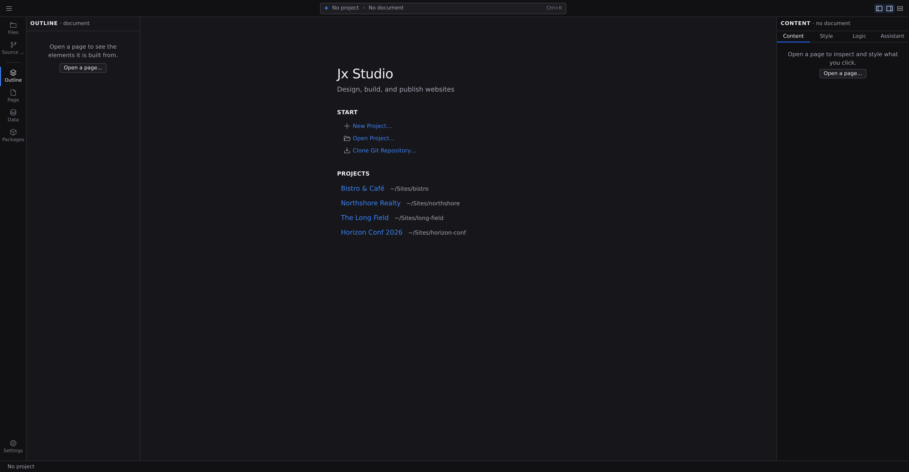

# Welcome screen

When Jx Studio starts with no project open, the canvas area shows the Start pane: a **Start** list of ways to get a project in front of you, followed by your recent projects and, on platforms that keep a catalogue, the rest of your projects. Everything on it is one or two clicks from a working canvas.

## Start a new project

1. Click **New Project…**.
2. Pick a starting point: a **starter site** from the gallery that opens first, the **Start from scratch** card at the end of it, an **Import** of an existing site, or an **Agent** prompt describing what you want.
3. Click **Next**, name the project, and choose the **Location** to create it in.
4. Click **Create Project**. Studio writes the files where you pointed it, initializes a git repository, and opens the project.

The full walkthrough is in **[Create a project](/docs/studio/projects/create)**. There is no separate "start from an example" button: the starter gallery _is_ the first step of New Project.

## Open an existing project

1. Click **Open Project…**.
2. Choose your project folder in the picker that appears.

Studio opens the project and adds it to **Recent** for next time.

On **studio.jxsuite.com**, projects live in GitHub repositories instead of local folders, so **Open Project…** opens a repository picker: it lists the GitHub repositories you have write access to (Jx projects first), with a filter field to narrow the list. Click one and Studio opens it at `/edit/owner/repo@branch`. Repositories without a `project.json` show an inline explanation instead of opening.

If a repository you expect isn't listed, the App simply hasn't been given access to it. See [Repository access](#repository-access) below.

## Clone a git repository

This entry appears when your Studio setup can run git.

1. Click **Clone Git Repository…**.
2. Paste the repository URL and click **Clone**.

Studio clones the repository and opens it as a project. See **[Source control](/docs/studio/publish/source-control)** for everything git-related in Studio.

## Add an existing repository

This entry appears when Studio is connected to your GitHub account.

1. Click **Add Existing Repository…**.
2. Type in the filter field to narrow the list of repositories your account can reach.
3. Click a repository. Studio imports it and opens it as a project.

A repository must already contain a Jx project (a `project.json` file); if it doesn't, Studio tells you why it can't be added. Connecting your account is covered in **[GitHub](/docs/studio/publish/github)**.

## Repository access

Studio only sees the repositories you have granted the **Jx Suite GitHub App** access to. There are two places to change that.

If your account is connected but Studio can't reach any repositories yet, a **Repository access** section appears on the Start pane with an **Install the Jx Suite GitHub App** link. Follow it and choose **All repositories** so Studio can create and open projects on your behalf.

Once the App is installed, the repository picker (**Open Project…** and **Add Existing Repository…**) carries the same controls in its footer, so you never have to leave the dialog to widen access:

1. Click the account name in **Missing a repository?** and GitHub opens that installation's **Repository access** settings in a new tab, where you can add repositories or switch to **All repositories**. **Another account…** installs the App on an account or organization that doesn't have it yet.
2. Save the change on GitHub, then come back to Studio.
3. Click **Refresh**. The picker re-reads your repositories and the newly granted ones appear.

## Recent and Projects

Below the Start actions:

- **Recent** lists projects you've opened, newest first. Each row is the project's name, the folder that distinguishes it from your other projects, and when you last opened it, never a raw absolute path. If two projects share a name, Studio shows as much of the path as it takes to tell them apart, and the full path is in the row's tooltip. Click a row to reopen it, use the **✕** beside it to drop that one entry, or **Clear all** to empty the list. Clearing the list empties the history and leaves the projects themselves alone.
- **Projects** lists the projects your Studio installation knows about that you haven't opened recently. Click one to open it.

:::doc-tip
You don't need the mouse: press :kbd[⌘P] (macOS) or :kbd[Ctrl+P] (Windows/Linux) on the Start pane and [Quick Access](/docs/studio/interface/quick-access) lists your recent projects to reopen.
:::

## Next

- New to Jx? Follow **[Your first project](/docs/start/first-project)** end to end
- Once a project is open, get oriented with **[A tour of Jx Studio](/docs/start/studio-tour)**
