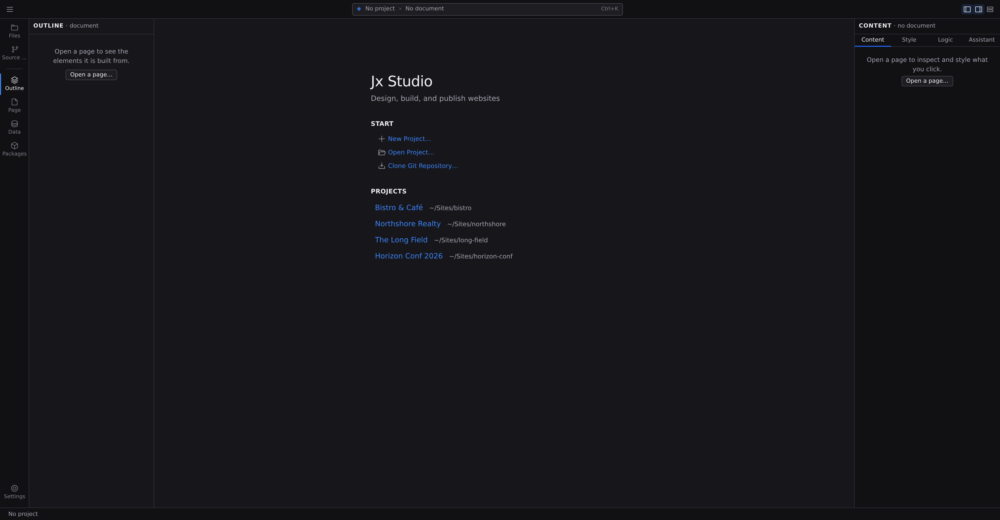
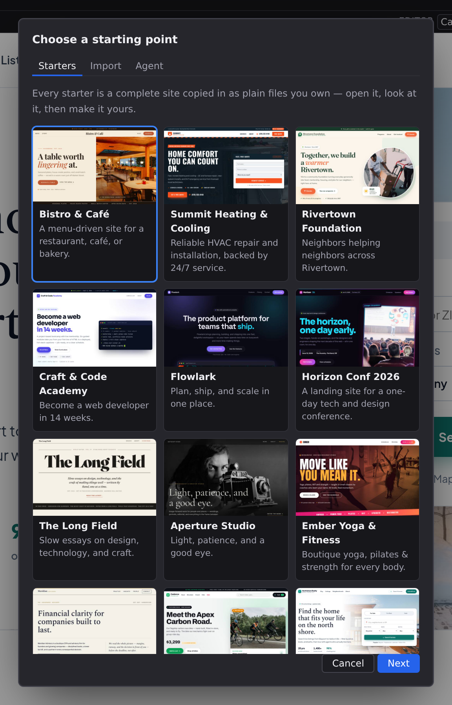

# Welcome screen

When Jx Studio starts with no project open, the canvas area shows the Start pane: a **Start** list of ways to get a project in front of you, followed by your recent projects and, on platforms that keep a catalogue, the rest of your projects. Everything on it is one or two clicks from a working canvas.

## Start a new project

1. Click **New Project…**.
2. Pick a starting point: a **starter site** from the gallery that opens first, the **Start from scratch** card at the end of it, an **Import** of an existing site, or an **Agent** prompt describing what you want.
3. Click **Next**, name the project, and choose the **Location** to create it in.
4. Click **Create Project**. Studio writes the files where you pointed it, initializes a git repository, and opens the project.

The full walkthrough is in **[Create a project](/docs/studio/projects/create)**. There is no separate "start from an example" button: the starter gallery _is_ the first step of New Project.

## Open an existing project

1. Click **Open Project…**.
2. Choose your project folder in the picker that appears.

Studio opens the project and adds it to **Recent** for next time.

On **studio.jxsuite.com**, projects live in GitHub repositories instead of local folders, so **Open Project…** opens a repository picker in two panes:

1. On the left, the GitHub repositories you have write access to, Jx projects first. Type in the filter field to narrow the list, or pick an account from the menu beside it when your repositories span several. Click a repository, or move through the list with :kbd[↑] and :kbd[↓] while the filter has focus.
2. On the right, the projects that repository holds: every folder with a `project.json`, found on its default branch. Studio picks one for you (the repository root when that is a project, otherwise the first folder listed) and shows it in the **Project Folder** field. Click another row, step through them with :kbd[↑] and :kbd[↓] in the field, or type a folder yourself.
3. Click **Open**, or press :kbd[Enter] in either field. Double-clicking a repository that holds exactly one project opens it in one step.

Studio opens a project at the repository root at `/edit/owner/repo@branch`, and a project in a subfolder at `/edit/owner/repo@branch:folder`, for example `/edit/acme/docs@main:sites/marketing`. A project in a subfolder is a project of its own: its files, Source control changes and preview are that folder's alone, and its commits land in that folder of the repository. A folder without a `project.json` shows an inline explanation instead of opening.

For a repository too large to scan in full, the projects Studio did find are listed and a note under **Project Folder** says the list may be incomplete; type the folder if yours is missing.

If a repository you expect isn't listed, the App simply hasn't been given access to it. See [Repository access](#repository-access) below.

## Clone a git repository

This entry appears when your Studio setup can run git.

1. Click **Clone Git Repository…**.
2. Paste the repository URL and click **Clone**.

Studio clones the repository and opens it as a project. See **[Source control](/docs/studio/publish/source-control)** for everything git-related in Studio.

## Add an existing repository

This entry appears when Studio is connected to your GitHub account.

1. Click **Add Existing Repository…**.
2. Type in the filter field to narrow the list of repositories your account can reach.
3. Click a repository, check the **Project Folder** Studio picked from the projects it holds, and click **Add**. Studio imports it and opens it as a project.

This is the same picker as **Open Project…** on studio.jxsuite.com, except that it also lists repositories you can only read. The folder you add must already contain a Jx project (a `project.json` file); if it doesn't, Studio tells you why it can't be added. Connecting your account is covered in **[GitHub](/docs/studio/publish/github)**.

## Notices from a hosted Studio

A hosted Studio can put notices on the Start pane: an announcement, or something it needs from you. Each notice is a section of its own, in the platform's words, with the buttons the platform offers. A notice goes away once the platform stops sending it.

A hosted Studio can also refuse something until you do something first, such as opening or saving a project. When it does, a dialog says why and offers what the platform offers. Finish in the window that opens: the dialog closes by itself once that is done, and a project that could not open is opened again. **Not now** stops the offers that come up on their own for the rest of the visit. Anything you do on purpose, such as a commit, still asks. Rows the platform adds to **[Preferences › Accounts](/docs/studio/interface/preferences#accounts)** offer their own buttons too.

## Repository access

Studio only sees the repositories you have granted the **Jx Suite GitHub App** access to. There are two places to change that.

If your account is connected but Studio can't reach any repositories yet, a **Repository access** section appears on the Start pane with an **Install the Jx Suite GitHub App** link. Follow it and choose **All repositories** so Studio can create and open projects on your behalf.

Once the App is installed, the repository picker (**Open Project…** and **Add Existing Repository…**) carries the same controls in its footer, so you never have to leave the dialog to widen access:

1. Click the account name in **Missing a repository?** and GitHub opens that installation's **Repository access** settings in a new tab, where you can add repositories or switch to **All repositories**. **Another account…** installs the App on an account or organization that doesn't have it yet.
2. Save the change on GitHub, then come back to Studio.
3. Click **Refresh**. The picker re-reads your repositories and the newly granted ones appear.

## Recent and Projects

Below the Start actions:

- **Recent** lists projects you've opened, newest first. Each row is the project's name, the folder that distinguishes it from your other projects, and when you last opened it, never a raw absolute path. If two projects share a name, Studio shows as much of the path as it takes to tell them apart, and the full path is in the row's tooltip. Click a row to reopen it, use the **✕** beside it to drop that one entry, or **Clear all** to empty the list. Clearing the list empties the history and leaves the projects themselves alone.
- **Projects** lists the projects your Studio installation knows about that you haven't opened recently. Click one to open it.

:::doc-tip
You don't need the mouse: press :kbd[⌘P] (macOS) or :kbd[Ctrl+P] (Windows/Linux) on the Start pane and [Quick Access](/docs/studio/interface/quick-access) lists your recent projects to reopen.
:::

## Next

- New to Jx? Follow **[Your first project](/docs/start/first-project)** end to end
- Once a project is open, get oriented with **[A tour of Jx Studio](/docs/start/studio-tour)**
