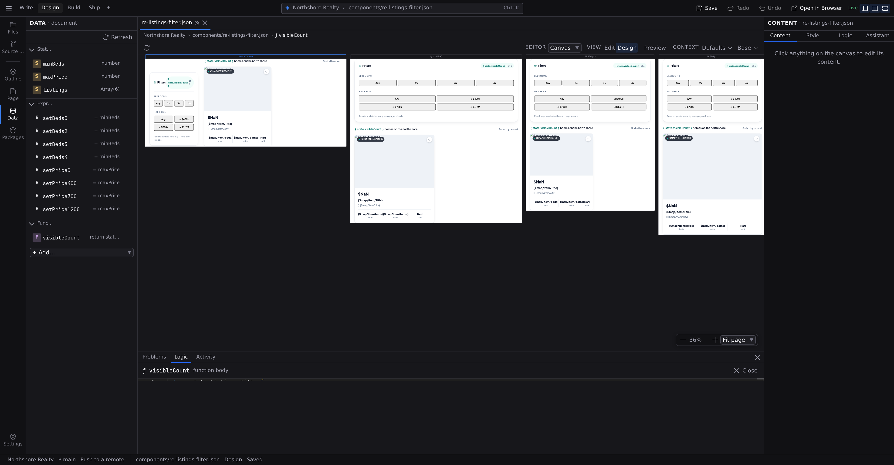

# Code editing

Everything in the Logic pages so far works without writing code. But Studio doesn't pretend code doesn't exist. When a function outgrows **[statements](/docs/studio/logic/statements)**, or you want to see exactly what a file contains, you get a real editor: Monaco, the same component that powers VS Code, with syntax highlighting, completions, and inline error checking.

:::doc-note
The editor loads the first time you open a code surface, not when Studio starts, because it is the single largest piece of the app and most sessions never need it. Expect a brief pause the first time, and none after that.
:::

Both surfaces below follow the chrome theme you chose in **[Preferences → Appearance](/docs/studio/interface/preferences#appearance)**, and switching it repaints an open editor where it stands.

There are two distinct code surfaces for writing code, and a third for reading a change.

## The function editor

A function body in **Code** mode (the **Statements**/**Code** toggle) is JavaScript. The small text field in the panel is fine for one line. For anything more, click the code icon: **Open in code editor** on a State-panel function, **Open in editor** on an inline event handler. The body opens in the **Logic** tab of the **[Bottom dock](/docs/studio/interface#bottom-dock)**, under the pane, so the page the handler belongs to stays on screen while you write it.

What you get:

- **Formatting on open**: the body is pretty-printed before you start.
- **Live linting**: problems are underlined as you type, with the message on hover.
- **Completions**: type `state.` to see every entry from the **[Data panel](/docs/studio/logic/data)** (your values, data sources, and functions), and `window.` for the standard library (`Math`, `JSON`, …). Named formulas carry their descriptions into the suggestions.
- **Automatic write-back**: edits flow into the document as you type; there is no separate apply step. Save the file as usual when you're done.
- **Your last keystrokes are never the ones that get lost.** Write-back is batched, so at any instant the editor can be a moment ahead of the document, and every way out of it settles that first. Switching to Problems, collapsing the dock, moving to another document, opening a different formula, closing the editor: each one lands what you typed. Closing the tab or quitting counts that text as unsaved and asks you about it, even when nothing else in the document has changed.

**Close**, in the editor's header, writes the body back one last time (minified) and takes the tab off the dock's strip. Until then the editor keeps its place: collapsing the dock or switching to another document and back leaves it exactly as it was. The same tab carries the **[formula workspace](/docs/studio/logic/formula-workspace)** when what you're editing is a structured expression rather than code.

Inside a body, `state` holds your entries (`state.$count += 1` is the code twin of a **Set state** statement), event handlers also receive `event`, and a function's declared parameters are available by name.

## Sidecar files

A function body normally lives inside the component's JSON. When one grows large enough to deserve its own file, it can live in a separate `.js` file instead: the function entry then shows **Source** (the file's path) and **Export** (which function to use from it) in the Data panel, in place of a body. The format is documented in **[Components](/docs/framework/concepts/components)**.

## The Code editor: the whole file as source

The **Code** entry in the context bar's **Editor** control shows the open file itself as raw source (JSON for pages and components, Markdown for content), as introduced in **[Modes and views](/docs/studio/interface/modes)**. It's the same document the visual surfaces edit, from the other side:

- Edits parse back into the document as you type, so switching back to **Edit** or **Design** shows your changes. While the source is momentarily unparseable mid-edit, Studio simply waits. It never replaces your document with a broken parse.
- The text is the file's own bytes, laid out as [a save writes them](/docs/studio/interface/tabs#studio-saves-only-when-you-do), and the layout you type here is the layout the next save keeps: open an object across several lines and it stays open, close one up and it stays closed while it fits.
- **Leaving Code view takes your typing with you.** Parsing back is batched the same way the function editor's write-back is, so switching to **Edit**, **Design** or another editor settles the last keystrokes first, and the unsaved dot appears if they changed anything. Text that could not be parsed stays in the editor and still counts as unsaved, so you are not asked to choose between a broken parse and losing the line you were writing.
- JSON files are checked against your project's own schema as you type: mistyped keys, wrong value types and missing required properties are underlined, and :kbd[Ctrl+Space] completes property names. Studio uses the `project.schema.json` and `document.schema.json` that [`jx schema`](/docs/framework/build/cli) generates from your enabled extensions, so the editor enforces exactly what `jx validate` does, including extension-contributed sections. It reads them directly, with no network access, so an offline project still gets full validation.
- **Export**, at the right of the context bar, saves a copy of the file elsewhere.

:::doc-note
You never have to generate those files yourself: Studio refreshes them whenever they are missing or out of date, so a project you have never run `jx schema` on still validates, and turning an extension on or off updates the rules without a restart. In the browser at [studio.jxsuite.com](https://studio.jxsuite.com) the rules are composed for you on the server and nothing is written to your repository at all.
:::

### The project file

Your project's configuration is a document like any other, so it has a Code editor too. In **[Project settings](/docs/studio/projects/settings)**, the **Raw JSON** section shows the whole of `project.json` as it is saved, and **Edit as code** opens that same document in Code: one undo stack, one unsaved dot, so a hand edit in the source and a change made in a settings form can never disagree about what the file says. It is schema-checked as you type like any other JSON.

`project.json` is also the one document co-editing leaves alone: it configures _your_ editor, so it is never shared with a collaborator. See **[Real-time collaboration](/docs/studio/publish/collaboration)**.

## Reading a change as code

The **Diff** editor's **Code** half is the same editor again, showing your working copy beside your last commit with changed lines highlighted. It is read-only on both sides: one of them is a committed version with nowhere on disk to be written back to. A file with no visual form, such as a stylesheet or a script, is only ever read this way. See **[Source control](/docs/studio/publish/source-control#read-a-change)**.

## When to drop down

- A handler needs a loop, error handling, or an API the structured editors don't cover.
- You're doing a bulk edit. Renaming a state entry everywhere it's referenced is a find-and-replace in the Code editor.
- You want to add parameters to a named formula, or make other edits the panels don't surface.
- You're learning the format: build something visually, then read it in the Code editor. It's the fastest way to understand what Studio writes.

:::doc-tip
Everything the visual editors do lands in the same file you see in the Code editor. There is no hidden layer. If you can express a change in either surface, the result on disk is the same kind of JSON.
:::

## Next

- The file format you're reading in the Code editor: **[Components](/docs/framework/concepts/components)** and **[Reactivity](/docs/framework/concepts/reactivity)**
- Prefer structure when it fits: **[Statements](/docs/studio/logic/statements)**
- Ship your work with **[Source control](/docs/studio/publish/source-control)**
