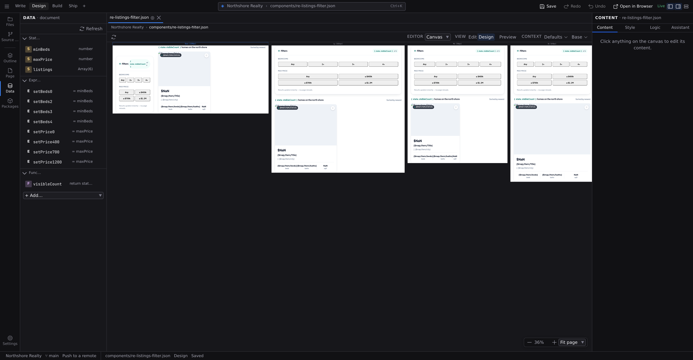
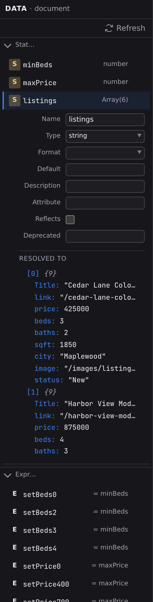

# Data panel

Data is where you declare everything the open page or component knows: the values it holds, the values it derives, the data it fetches, the functions it can run. It is also where you watch each of them resolve as the canvas runs the page.

Both halves are one list. A row tells you how an entry is **defined**; expand it and you get its editor with the value it is worth **right now** underneath.

## Open it

Click **Data** in the **Document** group of the Navigator rail, or press :kbd[⌘6].

The panel opens under a **DATA · document** header. Declaring data writes the open file, so the panel is about the document in front of you. With nothing open it says so, and asks you to open a page to give it data: values the page can read, compute or fetch.

Every entry belongs to the open file, so each page or component carries its own data, saved inside its own JSON file.

## Read the list

Entries are grouped into collapsible sections with counts: **State**, **Computed**, **Data**, **Expressions**, **Functions**. Only sections with entries appear, and each row shows:

- A colored badge for the kind of entry (**S** state, **C** computed, **E** expression, **F** function; data sources show their kind's initial).
- The entry's name.
- One summary: what the entry **resolved to** once the canvas has rendered, and how it is **defined** before that.

The resolved summary reads as `Array(12)` for a list and how many items it holds, `{5}` for an object and how many fields, `string` / `number` / `boolean` for a plain value's type, or `pending` for no value yet (a data source that hasn't finished resolving, or failed to). Before the canvas has rendered anything there is nothing to report, so the row shows the definition instead: a Request's method and URL, a storage entry's key, the first line of a function.

Functions and expressions that assign never show a value, because they don't hold one. They are things the page _does_. Those rows keep their definition summary.

Click a row to open it; click again to close it. Several rows can be open at once, because comparing two entries means seeing both, and what you left open is remembered per tab.

An open row shows the entry's editor and, under it, **Resolved to**: the live value as a tree. Long strings are shortened, and lists, objects and deep nesting are capped, but every cap ends in a **"… N more"** button. Click it to show fifty more of that list, that object, or that many levels deeper; each marker remembers its own limit, so opening one long array doesn't lengthen every other one.

A file with nothing declared yet says so and offers **Add a value**, which creates the first entry for you.

## Add an entry

1. Click the **+ Add…** picker at the bottom of the panel.
2. Choose what to add:
   - **Value**: a plain value the component holds (text, a number, a flag, a list).
   - **Computed**: a value derived from other entries, recalculated automatically.
   - **Fetch from a URL**, **LocalStorage**, **SessionStorage**, **IndexedDB**, **Cookie**, **Set**, **Map**, **FormData**: the built-in data sources, covered in **[Data sources](/docs/studio/logic/data-sources)**.
   - **From a module…**: a data source provided by a JavaScript module you point at.
   - Any sources your project imports or its extensions provide (for example **ContentCollection**) appear next.
   - **Expression**: a named formula, covered in **[Formulas and expressions](/docs/studio/logic/formulas)**.
   - **Function**: a reusable piece of behavior, covered in **[Statements](/docs/studio/logic/statements)** and **[Code editing](/docs/studio/logic/code)**.
3. The new entry appears with a placeholder name and its row open, so rename it first.

## Rename and delete

- To rename, edit the **Name** field at the top of an entry's editor. The change commits when you press :kbd[Enter] or leave the field. A name that is empty, or that the document already uses, is refused and the reason appears under the field. The document keeps the name it had. Everything that referred to the old name keeps its old reference, so rename before you wire an entry into formulas and events.
- To delete, click the trash icon on the entry's row.

## Plain values

A **Value** is the workhorse: the counter, the search text, the "menu open" flag. Its editor offers:

- **Type**: `string`, `integer`, `number`, `boolean`, `array`, or `object`. Defaults you type are converted to match.
- **Format**, for strings only: `image`, `date`, or `color`. An image-formatted value gets a media picker for its default.
- **Default**: the starting value. Array and object defaults are typed as JSON.
- **Description**: a note to your future self, also shown when the component is used elsewhere.

## Computed values

A **Computed** entry derives its value from other entries: a total from a price and a quantity, a filtered list from a search box. Type the calculation in the **Expression** field, referring to other entries by name (`$price * $qty`). Studio detects which entries the expression depends on and lists them underneath; the value recalculates whenever any of them changes.

## Functions

A **Function** entry is behavior you can bind to events or call from formulas. Its editor offers:

- **Description**: what the function does.
- **Parameters**: type a name and press :kbd[Enter] to add one as a chip; **Advanced** switches to full rows with a type, description, and optional flag per parameter.
- **Body**, with a **Statements**/**Code** toggle: build the body as visual steps, or write JavaScript. See **[Statements](/docs/studio/logic/statements)** and **[Code editing](/docs/studio/logic/code)**.

A function stored in a separate file shows **Source** and **Export** fields instead of a body. See the sidecar section of **[Code editing](/docs/studio/logic/code)**.

## Components: props, attributes, and events

When the open file is a component, its plain state entries double as the component's options, the values a page can set when it uses the component. Component files add a few fields:

- On plain values: **Attribute** (the HTML attribute that sets this value), **Reflects**, and **Deprecated**. Every entry that names an attribute is listed back on the Logic tab's **Observed Attributes** section when the component's root is selected. That section is the read-out; this panel is where you declare it.
- On functions: an **Emits** list declaring the events the component can send, each with a name, type, and description. Declared events show up in the Inspector's **[Logic tab](/docs/studio/logic/events)** wherever the component is used.

An entry's **Default** is what an instance falls back to, and it is what the instance's provenance chip names: a setting left alone on the instance reads _from the component default_, and clicking that chip opens the component file this panel belongs to. See **[Working with components](/docs/studio/design/components)**.

Name an entry with a leading `#` (like `#cache`) to keep it private: private entries never become component options and are left out of the component's published description.

:::doc-note
Everything in this panel is written to the `state` object of the open file's JSON. The shapes Studio writes are documented in **[Components](/docs/framework/concepts/components)** and **[Reactivity](/docs/framework/concepts/reactivity)**: plain values, computed entries, `$prototype` sources, functions.
:::

## Refresh

The values are a snapshot from the canvas render. Click **Refresh** in the panel's toolbar to re-render the canvas and read them again. That helps after editing a data source, or when you want to re-fire a fetch. The button says **Refreshing…** until the canvas actually reports back, so a slow fetch looks slow rather than looking like a button that did nothing.

:::doc-note
While you are editing, **Fetch from a URL** sources do not call out to the network on their own. They sit empty until you ask. Editing the page re-renders the canvas many times, and re-running every fetch each time would be slow and would hammer the API. Click **Refresh** to fetch for real, or switch on the **preview** toggle, where data behaves exactly as it will on the built site.
:::

## Test values for component options

A component file renders on the canvas with its options at their defaults. To see it with real-looking data, open the context bar's **resolving with** popover: one field per component option, stacked, as introduced in **[Modes and views](/docs/studio/interface/modes)**.

1. Open a component file. The context bar shows a field named after each option.
2. Type a test value. Values that read as JSON are treated that way (`42` is a number, `true` a flag, `["a","b"]` a list), and anything else is text.
3. The canvas re-renders with the value, and this panel, template previews, and formula badges all see it.
4. Clear the field to return that option to its authored default.

Test values are a preview aid. They live with your editing session, not in the component file.

## Debug with it

- A `pending` Request usually means the URL is wrong or the server didn't answer. Check the entry's URL in its editor, then **Refresh**.
- A computed value that shows the wrong result: open the entries it depends on and read what they actually resolved to; most "formula bugs" are surprising input data.
- Events not visibly doing anything? Trigger them with **Preview** on and watch the target entry's row change.

## Next

- Feed these entries from files, APIs, and the browser with **[Data sources](/docs/studio/logic/data-sources)**
- Bind them to clicks and keystrokes in the Inspector's **[Logic tab](/docs/studio/logic/events)**
- The same live values ride along in the **[formula workspace](/docs/studio/logic/formula-workspace)**'s data rail
  - packages/studio/src/surfaces/panel-data.json
  - packages/studio/src/surfaces/panel-data.ts
