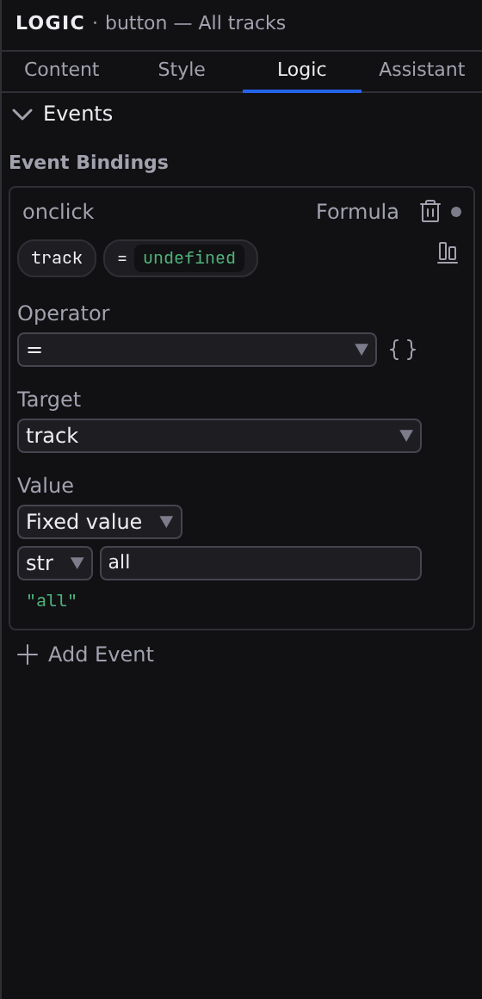

# Logic tab

Logic is the Inspector's third tab, :kbd[⌘⇧3], and it holds everything about how the selected element _behaves_. Binding a list to a collection, binding a condition to a state value, and binding a click to a handler are one job, so they share one tab. Select an element on the canvas or in [Outline](/docs/studio/design/layers), then click **Logic**; with nothing selected, the tab invites you to click anything on the canvas to wire it up.

The tab draws only the sections that apply to what you have selected:

- **Repeating list**: a repeater's items, filter and sort, and the way into its template.
- **Condition**: the value a `$switch` node switches on, and its cases.
- **Events**: what happens when the element is clicked, typed into, submitted, or hovered.
- **Observed Attributes**, **CSS Properties**, **CSS Parts**: a component's outward contract, on the root of a component file.

## Repeating list

Select a repeater and the first section holds its three inputs (**Items**, **Filter** and **Sort**) plus **Edit template →**, which selects the single element the repeater renders per item. All of it is covered in **[Repeaters](/docs/studio/design/repeaters)**.

A repeating list is not an element, so it gets no Events section: there is nothing to click.

## Condition

A condition node swaps what renders in one spot based on a value: a wizard step, a loading/ready/error switch, a client-side view. The section has two parts:

- **Expression**: the value being switched on. Its **value source** chip offers **From data…** (a signal) or **Mixed text**; a condition is inherently dynamic, so there is no fixed-value rung to drop to.
- **Cases**: one row per case. Edit a case's key in place to rename it, click **→** to select that case and edit what it renders, or click the trash button to remove it. **Add case** adds another.

:::doc-note
Studio has no gesture for creating a condition node yet. Add one in the **[Code editor](/docs/studio/logic/code)** (the format is described in **[Switching](/docs/framework/concepts/switching)**) and the Logic tab edits it from then on.
:::

## Events

### Add a binding

Click **Add Event**. Studio creates a binding on the first free event name and points it at your file's first function, or starts an inline handler instead if the file has no functions yet. Each binding row then carries:

- The **event name**, a button that opens a menu: the names this element already binds, then the ten most common (`onclick`, `oninput`, `onchange`, `onsubmit`, `onkeydown`, `onkeyup`, `onfocus`, `onblur`, `onmouseenter`, `onmouseleave`), then **Other name…**, which asks for any name at all. Those ten are suggestions, not a list you are held to: `ondragover`, `onpointerdown`, `onwheel` and the custom events your own components emit are all bindable here. A name that is not an `on…` handler is refused. Changing the name moves the binding rather than making a second one.
- The **value source** chip, one of the three ways to respond, below.
- One button carrying a dot, which removes the binding.

### Three ways to respond

**From data: call something you already declared.** A picker lists the functions declared in the **[Data panel](/docs/studio/logic/data)**; pick one and the event runs it. This is the tidiest option when the same behavior is used in more than one place.

**Formula: an inline formula.** The event runs a single formula, edited right in the tab with live value badges, which suits one-step reactions like `$count += 1` or `$menuOpen = true`. Inside a repeater template it previews against the first item, so the badges show real values. The **open below** icon moves it into the **[formula workspace](/docs/studio/logic/formula-workspace)** in the Bottom dock, where the page keeps rendering behind it.

**Inline function: a handler written on the element itself.** A **Statements** / **Code** toggle picks how you write it: as visual **[statement](/docs/studio/logic/statements)** cards, or as JavaScript in a small text field with an **Open in editor** button for the real **[code editor](/docs/studio/logic/code)**.

The chip opens the same rung picker every other bindable value in Studio uses, so the four words mean the same thing here as they do on a property row. Switching rungs replaces the binding with a fresh start on the new one, and switching back restores the body you left; undo restores the previous one either way.

### Read values from the event

Handlers can read from the event that triggered them. In expression and statement editors on this tab, the value pickers offer `event#/` entries alongside your state:

- `event#/target/value`: what the visitor has typed into the field. The classic `oninput` pattern is one step: set `$searchText` to `event#/target/value`.
- `event#/detail`: the data a component sent along when it dispatched a custom event.

An `event#/` reference can point at any property of the event (`event#/key` for the pressed key, for example) by writing the reference in the **[Code editor](/docs/studio/logic/code)**; the pickers offer the two common ones.

### Component events

When the open file is a component, a **Declared Events** section lists every event its functions declare they emit: the name, the function it comes from, and its payload type. That declaration is the component's contract: a page that uses the component reacts by handling the event and reading its payload as `event#/detail`. Declaring emits, and dispatching them, is covered in **[Statements](/docs/studio/logic/statements)**.

## Several elements at once

Select more than one element and wiring splits in two. Shift-click for a range and :kbd[⌘]-click (:kbd[Ctrl] on Windows and Linux) to accumulate, both in [Outline](/docs/studio/design/layers).

**Which events exist, and how each is produced**, is a decision about the batch. The event name, the mode, and removing the binding all write to every selected element inside one transaction, so binding one handler to six buttons (or clearing it off all six) is a single undo step. Where the selected elements disagree about an event, the row's chip reads **mixed** with a count, including when some of them don't bind it at all.

**What a handler contains** stays with the _primary_, the last element you added to the selection. Six elements do not share one function body, and showing one body while claiming to edit six is exactly the lie the Mixed chip exists to prevent. The same goes for an expression's operands, and for a repeater's source and template.

## A component's outward contract

On the root of a component file, three read-only sections state what a page may reach from outside:

- **Observed Attributes**: every state entry that declares an `attribute`, the entry it feeds, its type, and a **reflects** tag where it reflects back. With none declared, the section explains how to add one.
- **CSS Properties**: the `--custom-properties` set on the component's root, which a page may override.
- **CSS Parts**: the `part` names a page may style inside the component's shadow tree.

All three are declared elsewhere, in the **[Data panel](/docs/studio/logic/data)** and in the component's own styles; this tab is where you read them back.

:::doc-note
A binding is stored on the element itself, as an `onclick` (etc.) key in the file's JSON: a `$ref` to a function, an `$expression`, or an inline function definition. The handler model is documented in **[Reactivity](/docs/framework/concepts/reactivity)**.
:::

## Next

- Declare the functions your events call in the **[Data panel](/docs/studio/logic/data)**
- Watch state change as events fire, in the **[Data panel](/docs/studio/logic/data)**
- Multi-step handlers read best as **[Statements](/docs/studio/logic/statements)**
