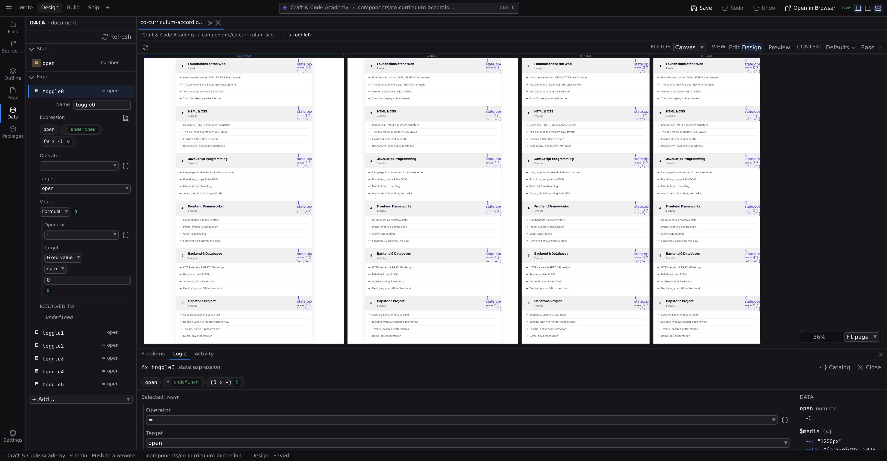

# Formula workspace

The formula workspace gives one formula a tab of its own in the **[Bottom dock](/docs/studio/interface#bottom-dock)**. The compact editors in the panels are fine for a two-step formula; when one grows branches, the workspace lays the whole tree out with live values at every step. Because it sits under the pane rather than over it, the page whose value you are computing keeps rendering while you work.

## Open it

Click **Open in formula workspace** beside any formula:

- On an **Expression** entry in the **[Data panel](/docs/studio/logic/data)**.
- On an **Expression** event binding in the Inspector's **[Logic tab](/docs/studio/logic/events)** (:kbd[⌘⇧3]).

The dock opens on its **Logic** tab with that formula in it. **Close**, in the workspace header, is what clears it. The tab leaves the strip, and your edits are already in the document. Everything short of closing keeps your place: collapse the dock with :kbd[⌘J], read your Problems and come back, switch to another document and return.

## The layout

- **Header**: the formula's name and kind (a state expression or an event expression), a **Catalog** button that opens the **[formula palette](/docs/studio/logic/formulas)**, and **Close**.
- **Chip strip**: the whole formula as a left-to-right pipeline of chips, each with its live value badge. This is the map.
- **Editor pane**: the currently selected step, edited with the same operator/operand form as everywhere else. A **Selected:** line above it names the step you're on.
- **Data**: a column on the right listing every value in scope with its type and an expandable tree of its contents, exactly as the **[Data panel](/docs/studio/logic/data)** shows it. A second opinion, now that the page itself is on screen.
- **Result**: the bottom line, literally `= result`, computed live. Formulas that change a value rather than produce one are marked **(mutates target)**, and an evaluation problem shows its error message here in red.

## Navigate by chip

Click any chip to select that step, and the editor pane retargets to it, so you edit one piece of a large formula without scrolling through the whole nested form. Click the first chip to jump back to the start of the pipeline; edits always land in the right place in the tree, and each edit is a single undo step.

## Live-context previews

The badges, the **Data** column and the result are all computed against the **running page**: real fetched data, real list items, real state. Two details make this more useful than a static preview:

- An event formula that lives inside a repeated list is previewed with the first item's data, so `$map/item` references show real values.
- Until the canvas has posted a data snapshot, the result line says so (**Preview unavailable**) rather than showing stale numbers. Values appear as soon as it does.

:::doc-tip
Watch the page while you edit. An edit lands in the document as one transaction, the canvas patches itself, and the element that displays the value updates beside the formula that computes it.
:::

## Insert from the catalog

The **Catalog** button opens the same searchable palette as the inline editors, but here a pick replaces the **selected step**, so you can navigate to a branch by chip, then drop `average` or a `switch` scaffold exactly there. Library formulas are copied into your file's state on first use, as described in **[Formulas and expressions](/docs/studio/logic/formulas)**.

## Next

- The editing vocabulary itself: **[Formulas and expressions](/docs/studio/logic/formulas)**
- Multi-step behavior belongs in **[Statements](/docs/studio/logic/statements)**, not one giant formula
- Check what the page's data actually looks like in the **[Data panel](/docs/studio/logic/data)**
