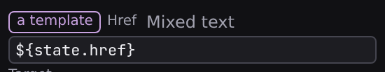

# Formulas and expressions

A formula is a value Studio calculates instead of one you type: a price times a quantity, a name in uppercase, a label that switches on a condition. Formulas aren't confined to one panel: nearly every value field in Studio can become one, and while you build it, Studio shows the live result computed from your page's real data.

## The value source chip: any value can be dynamic

Bindable value rows across the Inspector (**[Content](/docs/studio/design/properties)**, **[Style](/docs/studio/design/style-inspector)** and **[Logic](/docs/studio/logic/events)**) carry a **value source** chip beside their label. It names, in plain language, how that value is produced: grey while the value is fixed, accent-colored once it comes from somewhere else. Click it and a picker opens, listing every source the row accepts with a line of explanation each:

- **Fixed value**: a value you type here, the same every time.
- **From data…**: the current value of a signal, picked from a list.
- **Mixed text**: text with `${…}` placeholders that fill in from signals, like `Hello ${state.$name}`.
- **Formula**: computed from other values, built up operator by operator.

Those four names are the whole vocabulary. Every surface that asks how a value is produced (a field row, an operand inside a formula, a handler on the Logic tab) spells the answer the same way, so learning it once is learning it everywhere.

The picker lists them all at once, so **any source is one action away**. Which of them a row offers follows what the document format accepts in that position: an attribute, a component setting or an element's text take **Fixed value**, **From data…** or **Mixed text**; a CSS declaration takes **Fixed value** or **Mixed text**; a repeater's **Items**, **Filter** and **Sort** take **Fixed value** or **From data…**; an element's **Tag** takes **Fixed value** or **Formula**, and no _Mixed text_, because a tag is a name, not something you assemble from other text. A row with only one possible source shows its name and nothing to click, and **From data…** drops out of the picker while the document declares no signals to point at.

Studio remembers what you had at each source for the rest of your session, so switching away and back restores your value rather than resetting it. And because a keystroke can only ever move a value between **Fixed value** and **Mixed text**, typing a `${` doesn't swap the widget out from under your cursor mid-word. Prefer the plainest source that does the job. **From data…** is easier to read, and to revisit, than a formula that only fetches one value.

Formulas also appear as their own state entries (_+ Add… > Expression_ in the Data panel) and as event handlers (the **Expression** mode on the **[Logic tab](/docs/studio/logic/events)**).

## The formula editor

A formula is a tree of small operations, and the editor edits one operation at a time:

- **Operator**: what this step does. The picker groups the whole vocabulary: assignment, arithmetic, comparison, logical, conditional, array methods, pure string/array/number methods, aggregates (`map`, `filter`, `reduce`), and `call` for invoking a named formula. The complete list, with what each operator means, is the **[operator reference](/docs/framework/reference/operators)**.
- **Target** and **Value**: the operands. Each carries its own **Value source** picker, using the same names as everywhere else: **Fixed value** (a typed-in string, number, boolean, or null), **From data…** (a state value), or **Formula**, a nested formula of its own, drawn indented beneath its parent. Operands that can only be a signal (a `map`'s or `filter`'s target) show the signal picker alone, with no choice to make.

A **From data…** operand on a page that holds no values yet has nothing to pick from, so instead of an empty picker the row explains what a binding is and points you at the **[Data panel](/docs/studio/logic/data)** to declare one.

Operators bring their own rows: the conditional shows **If** / **Then** / **Else**; `switch` shows an **On** row plus one row per case and a default, with **+ Add case** to grow it; `call` shows a **Callee** and one argument row per parameter.

## Chips and live value badges

Above the editor, the whole formula reads left to right as a strip of **chips**: the starting value first, then each operation applied to it, with nested branches shown as parenthesized groups. It's the "pipeline" view of the same tree: `$name › trim › toUpperCase`.

Next to chips and operands, green monospace **badges** show live values. Each one is the actual result of that piece of the formula, evaluated against the running page's real data. The root's badge is the formula's final result, and if the formula can't evaluate, the error appears in red instead. Watching the badges while you edit is the fastest way to see where a formula goes wrong.

In the compact inline editor the chips are a summary; clicking them to navigate is what the **[formula workspace](/docs/studio/logic/formula-workspace)** is for.

## The formula palette

You don't have to assemble everything operator by operator. The brackets button beside the operator picker opens the **formula palette**, a search box over the whole catalog, grouped into formulas, operators and globals:

- Type to filter by name, group, or description; :kbd[↓] and :kbd[↑] move through results and :kbd[Enter] inserts the highlighted entry.
- **Formulas** lists the named formulas already defined in this file.
- **Formulas library** lists ready-made formulas that ship with Jx: `average`, `capitalize`, and friends. The full generated list is the **[formula catalog](/docs/framework/reference/formulas)**.
- The remaining groups are the operators themselves, plus the blessed standard-library functions (`Math.max`, `JSON.stringify`, …) callable from formulas.

## Formatting for a language

Eight of the blessed functions format text the way a language actually does, rather than the way English does:

| Function                  | What it's for                                                                 |
| ------------------------- | ----------------------------------------------------------------------------- |
| `Intl/formatNumber`       | Grouping, decimals, currency, percent, units                                  |
| `Intl/formatDate`         | Dates and times                                                               |
| `Intl/formatRelativeTime` | "3 days ago"                                                                  |
| `Intl/formatList`         | "a, b, and c", where the joining word and the commas differ by language       |
| `Intl/plural`             | Which plural form a number takes; many languages have more than two           |
| `Intl/compare`            | Comparing two strings for sorting                                             |
| `Intl/displayName`        | The name of a language, region, script or currency                            |
| `Intl/segment`            | Splitting text into characters, words or sentences the way a reader sees them |

**`Intl/compare` is the one to reach for whenever you sort a list of names.** Plain comparison orders text by its internal character numbers, which puts every capitalised word before every lowercase one and sorts every accented word to the end, so a list of French names comes out visibly wrong, and nothing about the formula says why.

:::doc-note
**A formula that names no language uses the page's, and a date with no time zone uses `UTC`**, never the machine that happens to be building the site. That is what stops the same page rendering `1,234.5` on your laptop and `1.234,5` on a colleague's, and it matters most for dates: `02:00` on the 16th in UTC is still the 15th in New York, so a build machine's time zone could quietly move a published date by a day. Pass a language and a `timeZone` when you want a different answer.

The page's locale is `$page.locale`, the tag its route implies, which is what `<html lang>` says (see [locales and languages](/docs/framework/site/i18n)). The fallback is `en-US` where there is no page: inside a component, whose state is its own, or in the expression editor's preview.
:::

Picking an entry replaces the current step with that operation, ready for you to fill in its operands.

:::doc-note
Library formulas are **copied in**, not linked: picking one writes its full definition into your file's state as a named formula, and the inserted step just calls it. Your project stays self-contained. There is no runtime dependency on the catalog, and you can open the copy in the Data panel to inspect or edit it.
:::

## Named formulas

An **Expression** entry in the Data panel is a formula with a name. Once it declares parameters, it becomes callable from any other formula via the `call` operator. The palette lists it under **Formulas**, and its argument rows are labeled with the parameter names. Library formulas arrive with their parameters declared; to add parameters to a formula of your own, edit its entry in the **[Code editor](/docs/studio/logic/code)**. That's how you build a vocabulary: define `discountedPrice` once, call it everywhere.

## Next

- Give a big formula the whole canvas in the **[Formula workspace](/docs/studio/logic/formula-workspace)**
- Every operator, defined precisely: **[Operator reference](/docs/framework/reference/operators)**
- Every packaged formula: **[Formula catalog](/docs/framework/reference/formulas)**
