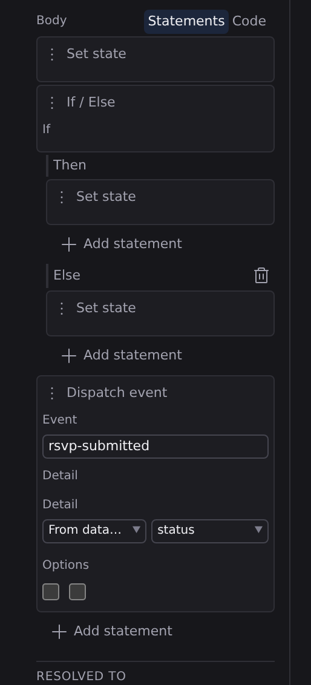

# Statements

Statements are function bodies built as a vertical list of visual steps instead of written as code. Each step is a card ("set this value", "call that function", "if this, then…") and the cards run top to bottom. For most handlers, this is all the programming a page needs.

## Where Studio offers it

Anywhere a function body appears, a **Statements** / **Code** toggle picks the representation:

- A **Function** entry's **Body** in the **[Data panel](/docs/studio/logic/data)**.
- An **Inline code** event handler in the Inspector's **[Logic tab](/docs/studio/logic/events)** (:kbd[⌘⇧3]).

**Statements** is the structured editor described here; **Code** is a JavaScript text body. See **[Code editing](/docs/studio/logic/code)**.

:::doc-warning
The toggle switches representations; it does not translate between them. Picking the other mode replaces the current body with an empty one. Undo (:kbd[⌘Z] / :kbd[Ctrl+Z]) brings the old body back.
:::

## Add steps

Every list of steps ends in an **Add statement** button. It opens a menu with five kinds:

- **Set state**: store a value in a state entry. This is the everyday step: the card is a one-step formula whose operator is an assignment (`=`, or `+=` and friends for read-modify-write), whose target is the entry, and whose value can be anything a **[formula](/docs/studio/logic/formulas)** can produce.
- **Call function**: run another function from your state, with rows for the arguments to pass it.
- **If / Else**: run different steps depending on a condition.
- **Switch**: pick one of several branches by matching a value.
- **Dispatch event**: send an event out of a component, so the page using it can react.

Each card has a header naming its kind, a delete button, and a drag handle (⠿). Drag cards to reorder them within their list.

## Branch with If / Else

An **If / Else** card holds:

1. An **If** row holding the condition, written as an operand: a state value, or a nested comparison formula.
2. A **Then** lane holding an indented list of steps with its own **Add statement** button, run when the condition holds.
3. Optionally an **Else** lane. Click **Add else** to add it, or the remove button on the lane to drop it.

Lanes nest: a step inside **Then** can itself be an **If / Else** or a **Switch**.

## Branch with Switch

A **Switch** card matches one value against several cases:

1. **Switch on**: the value to examine.
2. One lane per case, each labeled with the value it matches (edit the label field to change it). **Add case** appends another.
3. A **Default** lane for when nothing matches.

## Dispatch an event

A **Dispatch event** card sends a custom event from a component, the counterpart of the **Emits** list on a function in the Data panel:

- **Event**: the event's name. In a component whose functions declare emitted events, this is a combo box offering the declared names.
- **Detail**: the data to send along, as an operand (a state value, a literal, or a formula).
- **Options**: **Bubbles** and **Composed** checkboxes controlling how far the event travels.

Pages using the component can then bind that event in their own **[Logic tab](/docs/studio/logic/events)** and read the payload as `event#/detail`.

:::doc-note
Statement bodies are saved as a JSON list in the function's `body`, one object per card, in the same file the rest of the component lives in, and diffable like everything else Studio writes.
:::

## Next

- Bind a statement-bodied function to a click in the **[Logic tab](/docs/studio/logic/events)**
- When a body outgrows steps, switch to **[Code editing](/docs/studio/logic/code)**
- The formula vocabulary inside each step: **[Formulas and expressions](/docs/studio/logic/formulas)**
