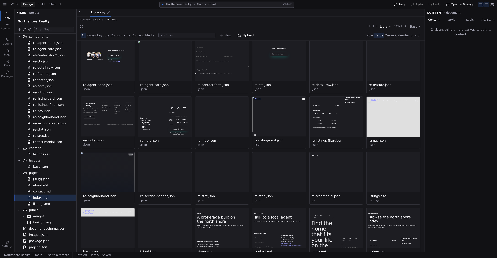

# The Library

The Library is your project seen whole: every page, layout, component, content entry and asset, in one place, with live previews. Press :kbd[⌘⇧E] to open it. It is also on :kbd[⌘K] as **Open Library**, in the **⬢ menu** in the Command Bar, and in the right-click menu of the Files tree.

It opens as a document tab like any other, which is the useful part. It sits in the strip beside the page you were working on, one click away for the rest of the session, and :kbd[⌘\] moves it into a second pane so you can browse the project with a page still live beside it.

## Narrow it down

Two controls sit at the top left, and they compose:

- **Categories**: **All**, **Pages**, **Layouts**, **Components**, **Content**, **Media**. A file's category comes from the folder it lives in (`pages/`, `layouts/`, `components/`, `content/` and `data/`, `public/` and `styles/`), except that anything with an image, video, audio, font or PDF extension counts as Media wherever it sits.
- **Filter files**: free text, matched against each file's name and its path, so `blog/` narrows to a folder and `hero` narrows to a name.
- **Language**: appears only on a [multilingual project](/docs/framework/site/i18n), and only once the scan actually holds more than one language. Each file's language is the locale directory it sits under (`pages/fr-ca/about.json` is French), shown in its own column and named in its own language (_français_, not _French_).

Every one of these is a command as well as a control, so the toolbar is never the only way in. :kbd[⌘K] → **Library: Show Category** → the category points the Library at Content whether or not the Library is the tab in front of you. **Library: Filter Files**, **Library: Show Language**, **Library: Set Layout** and **Library: Rescan Files** are the rest of the set; they are listed with everything else on **[Commands](/docs/studio/interface/commands)**.

:::doc-note
The Library lists files, so a draft entry sits in it beside a published one. Being a draft is a property of the entry: the switch, the pill on its tab and the project-wide **Include Drafts** perspective are covered in **[Content types](/docs/studio/projects/content-types#drafts)**.
:::

## Five layouts

The layout switch is on the right of the toolbar, and :kbd[⌘K] → **Library: Set Layout** does the same thing by name. All five draw the same scan, so switching layout repaints. It never re-reads your project.

| Layout       | What it is good for                                                                          |
| ------------ | -------------------------------------------------------------------------------------------- |
| **Table**    | Name, Category, Type, Size, Modified and Path in columns: the densest way to find one file   |
| **Cards**    | A live preview of every page, layout, component and entry, with its name and type underneath |
| **Media**    | Tight image-first tiles, the layout to reach for with **Media** selected                     |
| **Calendar** | Entries grouped by day, newest first: dated posts, in the order you published them           |
| **Board**    | One column per category, each with a count, for the shape of the project at a glance         |

:::doc-note
The Table lists files; it does not edit them. Names, sizes and paths are facts about the file, and changing one is a rename, not a cell edit, so renaming, duplicating and deleting live in the right-click menu below, where the confirmation can tell you what else is affected.
:::

**Calendar** places a file on the day its name starts with (`2026-04-12-spring-menu.md`), and falls back to the file's modification time. A file with neither is listed under **No date** rather than parked on today. It draws the 60 most recent days and says how many older ones it left out.

**Board** caps each column at 25 items and prints how many more there are, with the count of the whole column in its heading. Both grouped layouts draw names only. For the full list, switch to Table.

## Big projects stay quick

The Library renders what fits the window, not what is in the project: a 300-page site draws about forty cards, and the rest arrive as you scroll. A card's live preview is built the moment the card comes into view (never before), and a fixed number of rendered previews stay in memory however long you browse. Table, Calendar and Board draw text only, so they stay cheap by construction.

## Open, rename, duplicate, delete

Click any item to open it in a tab. Right-click for **Open**, **Rename…**, **Duplicate** and **Delete**. A duplicate lands beside the original with `-copy` on its name.

A media tile opens in the **[Media viewer](/docs/studio/projects/media#open-a-media-file)**: the picture at full size, with its dimensions, the reference a document writes for it, and the pages that use it.

Rename and delete go through the same confirmations as the Files panel, and they carry the same counts: a rename tells you how many references Studio will rewrite for you, and a delete tells you how many stop resolving. See **[Before you delete, rename or convert](/docs/studio/projects/pages-layouts-components#before-you-delete-rename-or-convert)**.

## Create something

**New** creates a Page, a Layout or a Component, and lists one row per content type your project defines. Each row names the folder the file lands in.

Studio asks for a name, tells you which folder it is creating in, and refuses a name that folder already holds. The new file opens in a tab straight away.

What it asks about the format depends on what the kind allows:

- **Page** offers a **Format** picker, because a page really can be a `.md` as easily as a `.json`. Pick one and the extension follows.
- **Layout** and **Component** are always `.json`. A layout is read as JSON by the build with no format dispatch at all, and a component needs a `tagName` a blank markdown file does not carry, so the choice would only ever produce a file nothing loads.

:::doc-tip
A content entry has a better route than a blank file: **New Entry** names the file with its collection's own extension and seeds every field from the collection's schema, so the entry is valid the moment it exists and opens in the entry form. See **[Content types](/docs/studio/projects/content-types)**.
:::

## Upload media

Drag images, video, audio, PDFs or fonts onto the Library, or click **Upload**, and Studio writes them into your project.

The destination is the active category's folder, and the Upload button says which one before you drop: with **Media** selected, files land in `public/`. **All** has no folder of its own, so it asks rather than picking one for you. An upload never overwrites: a file whose name is taken becomes `hero-1.jpg`. The site build optimizes images automatically (responsive `srcset`, WebP/AVIF).

The Library is one of four places you can add media from. See **[Media](/docs/studio/projects/media)** for the canvas, Files-panel and image-field routes.

## When the list is short

A short list has more than one cause, and the Library distinguishes them instead of printing one sentence for all of them:

- **Scanning the project…**: the scan is still running. Nothing is claimed yet.
- **This project has no files yet**: the scan finished and found nothing. The fix is **New**.
- **No files match "hero" in Content**: your filter matched nothing, with the project's total beside it and a **Clear filters** button.
- **Nothing to show, and the scan did not finish**: Studio could not read one or more of your project's directories, so the list is incomplete rather than empty. It offers **Retry**.

That last one also shows up as a banner above the partial list, saying how many directories could not be read and naming the first of them, and as a Problem in the bottom dock naming the directory and the error, with the same retry attached. A scan slow enough to look like a hang gets an **Activity** row while it runs. See **[Problems and progress](/docs/studio/interface/problems-and-progress)**.

:::doc-warning
An unreadable directory and an empty one mean very different things: one is a project you have not filled in yet, the other is a listing you should not trust. If you see the incomplete banner, fix the directory (or press **Retry**) before concluding a file is missing.
:::

**Library: Rescan Files** re-reads the project from scratch at any time. Studio also re-scans on its own after anything it creates, renames, duplicates or deletes here, and after an upload from anywhere in Studio.

## Next

- **[Pages, layouts, and components](/docs/studio/projects/pages-layouts-components)**: which kind of file you want
- **[Content types](/docs/studio/projects/content-types)**: collections, entries and the entry form
- **[Media](/docs/studio/projects/media)**: everything in `public/`
