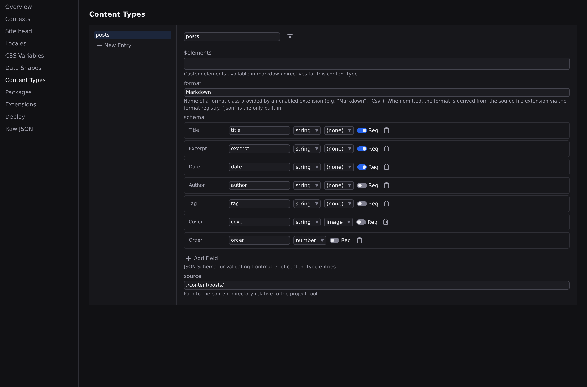

# Content types

Content types are your site's CMS schema. Each one describes a collection (blog posts, team members, projects) by naming the folder its entries live in, the file format they use, and the fields every entry carries. Once a type exists, Studio can create entries against it and draw their fields as a form.

The builder is a section of your project's configuration document. Pick **Open Project Settings › Content Types** from the **Settings** menu at the foot of the rail. You can also press :kbd[⌘K] and run **Open Project Settings**, or use the **⬢ menu** in the Command Bar, then choose **Content Types** from the section list: your types are listed on the left, and selecting one opens its editor on the right. Like every other section of that document, what you do here is recorded as a step you can take back with :kbd[⌘Z]; see **[Project settings](/docs/studio/projects/settings)**.

## Create a content type

1. Click **New Entry** at the bottom of the type list.
2. Type a name ("Blog Posts" becomes `blog-posts`) and click **Create**.

The new type starts with a matching source folder (`content/blog-posts/`) and an empty field schema, and is selected ready to edit.

## Source and format

- **Source**: the project folder entries are read from. The default matches the type's name; change it to point anywhere inside your project.
- **Format**: the file format entries use, by name (for example Markdown or Csv). Leave it empty and the format is worked out from each file's extension.

## Build the field schema

The fields you add here become the form every entry fills in. Each field row has:

- A **name**: click it to rename.
- A **type**: string (text), number, boolean (yes/no), array (a list), object (a group of sub-fields), or reference.
- A **format** for string and array fields (**image**, **date**, or **color**), which upgrades the field's editor: image fields get the [media picker](/docs/studio/projects/media), date fields a date, and so on.
- A **Req** toggle marking the field as required.

An **object** field opens a nested area where you add sub-fields the same way. A **reference** field gets a **Target** picker naming another content type, which is how a post points at its author. The trash icon deletes a field.

:::doc-tip
One field name is special by convention: a boolean called `draft` gives the collection the [draft workflow](#drafts) below.
:::

## Rename or delete a type

With a type selected, edit its name in the editor's header to rename it, or click the trash icon beside the name to delete it. Deleting the type does not delete the entry files in its source folder.

## Create an entry

The [Library](/docs/studio/projects/browse)'s **New** menu lists a row for every content type you have defined, each naming the folder its entries live in. Pick the type, type a file name carrying the collection's extension (`spring-menu.md`), and Studio writes the file into that folder and opens it. Entries then appear in the Library under the **Content** category, labeled with the type they belong to.

**New Entry** (`content.newEntry`) is the collection-scoped version of the same thing, and it does two things the generic route cannot: it names the file with the collection's **own extension**, so the entry is actually matched by the collection it was created in, and it **seeds the fields from the schema**, so the entry is valid the moment it exists rather than being a pile of absent required fields. It opens the new entry in the form below.

**The Files tree knows about this too.** Right-click a content type's folder and choose **New File…**: because that folder belongs to a collection, you get the New Entry flow (the collection's extension, the seeded fields, and the entry form) rather than a blank document. In a **subfolder** of it the format picker is locked to the collection's extension instead, because a document there is still one of its entries but the images and notes beside them are not; the picker's **Other…** row still creates those. What it will not accept is a document of a different format, which the collection would discover as an entry it cannot read.

A **localized** collection (a `{locale}` in its source) has no single folder to create into, so **New Entry** asks you to open the folder for the language you are writing in and create the entry there.

An entry is also not something you can convert: **Convert Format…** is not offered inside a content type's folder, in either direction. Changing the format of one entry would remove it from the collection; the collection's format belongs to the type, and you change it here.

Seeded means:

- a field that declares a **default** gets that default;
- a **required** field with no default gets its type's empty value: `""`, `0`, `false`, `[]`, or `{}` for an object;
- an **optional** field with no default is left out of the file. The form still draws a row for it, because the form draws the schema, not the file.

## Edit an entry's fields

Right-click an entry in the Files tree and choose **Open Entry Form**. The row offers it only for a file that belongs to a collection, because an ordinary file has no schema to draw. The form opens on the same tab, so :kbd[⌘Z] and :kbd[⌘S] behave as they do anywhere else.

The entry form is your schema, drawn as a form: one control per field, in the order the schema declares them, with the collection's name in the header.

- **Where the fields live depends on the format.** A Markdown entry keeps them in frontmatter above its body; a JSON entry _is_ its fields, with no body to separate. The form is identical either way, so you should not be able to tell from using it which shape the file has.
- **The field's type and format choose the control.** Text, numbers, yes/no switches, dates, colors and the [media picker](/docs/studio/projects/media) for image fields.
- **A reference field is a picker**, listing the entries of the collection it targets, so pointing a post at its author is a choice from a list, not an id you have to remember.
- **A required field the file does not have** is marked "Required — this entry does not have one." A required field that is present but empty is not an error: you have not done anything wrong by not having typed it yet.
- **Edits are ordinary document edits.** :kbd[⌘S] saves, :kbd[⌘Z] takes one back, and a collaborator sees the change as they would any other.

Open a file that belongs to no collection and the form says exactly that, and offers a button through to the Content Types section rather than drawing an empty form.

A Markdown entry's frontmatter is reachable while you write, too, from the Document Header card. See **[Frontmatter and page metadata](/docs/studio/editing/frontmatter)**.

## Drafts

Give a type a boolean field named `draft` and its entries get a draft workflow:

- a **Draft** switch in the entry form's header;
- a **Draft** or **Published** pill on the document's tab, so the state is visible while you are looking at the tab strip and not only while you are looking at the form;
- the **Set Draft** command (:kbd[⌘K], **Set Draft**, then **on** or **off**), which writes `draft: true` or `draft: false` on the open entry;
- a **Draft** column in the collection's grid: right-click the collection's folder in the Files panel and choose **Edit Collection in Grid**, where every schema field is a column you can sort and group by. See **[The grid](/docs/studio/editing/grid)**.

**Include Drafts** (:kbd[⌘K], **Include Drafts**, **on** or **off**) sets whether Studio's content listings include entries marked `draft: true`. It is one setting for the whole project rather than one per list: whether you want drafts in view is a fact about you, not about the surface you happen to be looking at.

A collection whose schema does not declare `draft` shows none of this: painting "Published" on entries of a project that never defined the state would be inventing one.

:::doc-warning
Marking an entry a draft filters it out of Studio's own listings. It does **not** keep the entry out of a build: a page that queries the collection will still render it unless the page's own query excludes it.
:::

:::doc-note
Studio stores your types in the `content` section of `project.json`, one entry per type, recording its `source` folder, `format`, and field `schema`. Pages query these collections to list and display entries; see [Site architecture](/docs/framework/site).
:::

## Next

- **[The Library](/docs/studio/projects/browse)**: where entries are listed and created
- **[Project settings](/docs/studio/projects/settings)**: the rest of the configuration document
