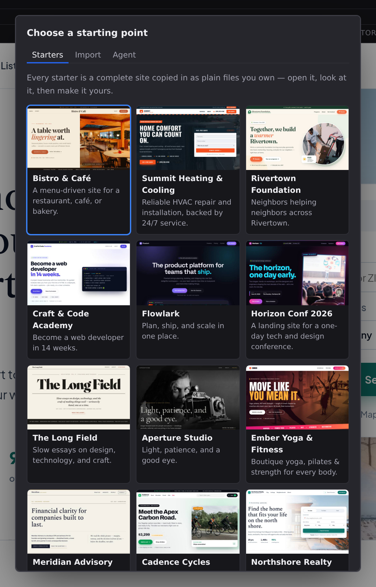

# Create a project

The New Project wizard is two steps: first you choose what to start from, then you name the project and say where it goes. Open it from the [Start pane](/docs/studio/interface/welcome-screen) with **New Project…**, or from the dropdown beside **Open Project** in the toolbar.

## Step 1: choose a starting point

The first screen (**Choose a starting point**) opens on the starter gallery, because a real site is easier to judge than an empty one:

- **Starters**: complete, themed websites (restaurant, shop, portfolio, blog, and more) that Studio copies in as plain files you own. The first one is selected for you. Browse the full gallery in **[Starter templates](/docs/studio/projects/starters)**.
- **Start from scratch**: the last card in the gallery, an empty site with one page, for when you already know what you want to build.
- **Import**: recreate an existing website as a Jx project. Give Studio the site's URL, how many pages to crawl, which model to use, and, optionally, a sentence about what you want done with the site once it's cloned. The import is AI-assisted, so this tab asks you to connect AI before it unlocks. Not every Studio platform offers this tab. Where it appears, the project lands wherever that platform makes projects, so the Location step asks for whichever of the two it needs: a folder you pick on the desktop app, or a repository it creates for you on a hosted one.
- **Agent**: describe the site you want in a sentence or two and the AI assistant builds it in the editor while you watch. Like Import, it needs AI connected first.

Both AI tabs unlock the moment AI is available, by whichever route your Studio offers. They are the same options the [AI assistant](/docs/studio/ai) sidebar gives you:

- **Connect Cloudflare**: on Jx Cloud, run Workers AI on your own Cloudflare account with no API key at all. Click the button, approve the Cloudflare authorization, and the tab unlocks when you land back in Studio. With no model of your own chosen, Studio uses the one that backend says it prefers rather than guessing a name it may not serve.
- **An AI provider key**: paste any OpenAI-compatible key into the form. This is the only route on desktop and the dev server.
- **Nothing to do**: if the Studio backend already holds a provider key (a dev server started with `OPENAI_API_KEY`, or a Cloudflare account you connected earlier), both tabs are unlocked from the start.

Pick a source and click **Next**. **Cancel** is available on this step and the next one, and :kbd[Escape] closes the wizard from either.

## Step 2: name your project

The second screen (**Name your project**) shows which source you picked, then asks for two things:

1. **Project Name** (required): the human-readable name, e.g. "My Site".
2. **Location** (required): the existing folder to create the project folder inside, e.g. `/home/you/Sites`. **Browse…** opens your system's folder picker. In a browser that has no folder-picking support, the button is hidden and you type the path instead.
3. **Directory**: the folder name for the project. Studio derives it from the name as you type (`My Site` becomes `my-site`); edit it to take over.

Under **Location** and **Directory**, Studio shows exactly where the project will land (`/home/you/Sites/my-site`) before you commit to it.

Nothing else is asked at creation time. The site's production URL, its deployment adapter, and its colors, fonts and breakpoints are all **project settings** you can change as often as you like. Set them from **[Project settings](/docs/studio/projects/settings)** once the project is open.

### On Jx Cloud

Cloud projects are GitHub repositories, so the same step asks for a **repository location** instead of a folder:

1. **Owner** (required): the account the repository is created under, either your personal account or any organization you've installed the Jx Suite app on.
2. **Repository**: the repository name, derived from the project name the same way the directory is. Studio warns you if that name is already taken under the chosen owner.
3. **Visibility**: **Private** (the default) or **Public**.

The preview line shows the repository that will be created, e.g. `acme/my-site`.

## Create it

Click **Create Project** (or **Create & Start Agent** on the Agent tab). Studio writes the project folder, **initializes a git repository in it**, and opens it. **Back** returns to the source step without losing what you've typed.

If the **Project Name** is missing, the error appears directly under that field. A missing or non-absolute **Location** (or, on the cloud, a missing **Owner**) is reported under the destination fields. If creation itself fails, the message appears just above the footer buttons, so it stays visible however far the form is scrolled.

:::doc-note
Studio creates the folder you named, with `pages/`, `components/`, and a `project.json` carrying your project's name. The full folder anatomy is documented in [Site architecture](/docs/framework/site).
:::

:::doc-tip
Because the new project is a git repository from its first minute, every later change, including a rename or a delete you regret, can be reviewed and reverted from [Source control](/docs/studio/publish/source-control). Cloud projects are already repositories, so nothing extra happens there.
:::

:::doc-warning
There is no default location. Studio never picks a folder for you and never falls back to whatever directory it happens to be running in. If the **Location** is empty, nothing is created.
:::

### What the Import tab asks for

Beyond the site's URL, the Import tab has five options, and a sixth that appears with the fifth:

1. **Crawl Depth**: how far from the starting page to follow links. `0` imports that one page and nothing else, on a much faster path that skips the crawl entirely.
2. **Max Pages**: the ceiling on how many pages to capture.
3. **Breakpoints**: how many of the site's own breakpoints your project ends up with. See below.
4. **AI component naming**: let the model name the repeated pieces it finds (a `Card`, a `PricingRow`) instead of numbering them. It costs one model call per component found, so it's worth turning off on a wide crawl.
5. **Check fidelity against the original**: after the import, build the new project, screenshot every page, and compare it against the site it came from. It roughly doubles the run, and it's the only thing that tells you how well the clone actually came out instead of what got skipped. Off by default, and absent entirely where projects are repositories rather than folders, because checking fidelity means building and running the project, which a hosted backend deliberately never does.

   The assistant reports the percentage per page, and alongside it the two things a percentage can't tell you: requests the rendered page made and didn't get, and any errors from building the project. A page that scores badly because fifteen images 404 is a different problem from one whose layout came out wrong, and only the first of those is quick to fix.

6. **Minimum fidelity**: appears once the fidelity check is on, and is the average below which the assistant tells you the clone did not match the original. It defaults to `25`, and it's a floor rather than a target: a faithful import of a complicated site still lands well under 100 for reasons no importer can fix, like a hero that rotates between screenshots or a font that renders a hair differently. What it catches is the other case, the clone that came out at 8% and would otherwise be reported like any other. Set it to `0` to see the score without it being judged.

   Missing the bar doesn't cancel anything. The project is written and opened either way; the assistant says so plainly and offers to look at what went wrong. (The `jx-import` command-line tool turns the same number into an exit code, because a script running in a pipeline has nobody to tell.)

#### Choosing the breakpoints

A site declares as many breakpoints as it has accumulated frameworks over the years. Nine is ordinary: `520`, `600`, `767`, `781`, `782`, `960`, `1024`, `1025`, `1390` came out of one real import, and every one of them would become a canvas size in Studio and a column in every style editor. Nobody writes CSS against nine breakpoints, and nobody picked these nine.

So the Import tab asks. There are three answers:

- **Limit to** a number (three by default): keep that many, spaced evenly across the widths the site declares. Three gives you the narrowest, the widest, and the one in the middle.
- **Custom widths**: name the widths your project should have, like `640, 1024, 1440`. Each one is backed by the declared width nearest it, because that's where the site's own rules actually change.
- **Keep all**: every breakpoint the site declares, which is what imports did before this option existed.

The first two also take a **rounding rule** (nearest, round down, or round up) deciding which declared width backs a kept one. A width that isn't kept is folded into the kept one nearest it, so nothing the site expressed is thrown away; the import's log says which widths went where.

You can change all of this afterwards in **[Project settings › Contexts](/docs/studio/projects/settings)**.

:::doc-note
Class names from the source site are not carried into your project. The import rebuilds every style from what the browser actually computed, and never emits the original stylesheets, so a `class="hero grid-cols-3"` left on a page would name rules that don't exist. The styles are all there; the class attributes are not.
:::

Under those, a **Model** picker and a box asking what the assistant should do with the site. Both are optional. The model here is for this import only, so it doesn't change the model the assistant uses for everything else. Leave the box empty and the assistant simply gets the site ready for you to work on; fill it in ("keep the layout but modernise the typography") and it carries straight on into that once the import lands.

### While an import runs

The dialog closes as soon as you click **Import Site**. The import doesn't run in the wizard. It runs in the [AI assistant](/docs/studio/ai), which opens in the Inspector and reports as it goes.

**The project opens straight away**, a few seconds in, long before the crawl finishes. That's deliberate: an import takes minutes, and watching a log against an empty welcome screen tells you very little. Instead the destination is created and opened immediately, and the Files panel fills up as the pipeline works: `public/assets/` gains the images and fonts it downloads, then `pages/`, `layouts/` and `components/` appear as it writes them. You can click into any of it while the run continues.

When it finishes, the assistant tells you how many pages it captured, what it had to skip, which pages didn't render faithfully, and, when the fidelity check ran, what those pages failed to load.

That's also why it can stop and ask you something. An import guesses at a lot: which pages matter, whether three similar blocks are one component, what to do about a page robots.txt kept it out of. When one of those is genuinely your call, the assistant asks you there in the Inspector and waits for your answer (see **[When the assistant asks you something](/docs/studio/ai/chat)**).

To stop a running import, use **Stop** in the assistant, or run **Assistant: Stop Responding** from the command palette.

A garbled line in the import's stream doesn't stop the run; the pages already crawled are kept. But it isn't ignored either: when the run finishes, Studio counts the lines it couldn't read and posts a warning saying so, because an import that quietly skipped a step looks exactly like one that didn't.

## Next

- **[Projects](/docs/studio/projects)**: the other ways to get a project, by opening a folder or cloning a repository
- **[The Library](/docs/studio/projects/browse)**: find your way around what was just created
- **[Starter templates](/docs/studio/projects/starters)**: the full starter gallery
