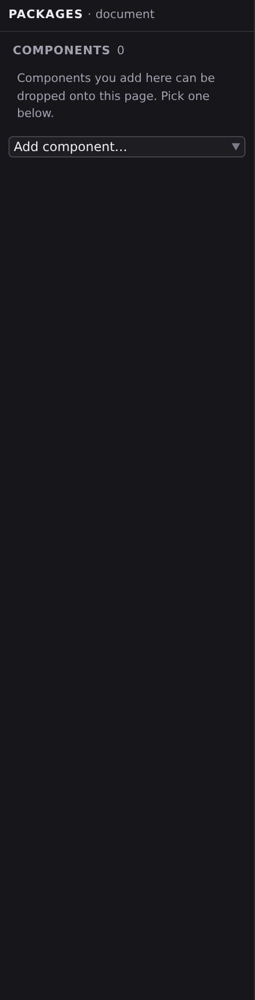

# Dependencies and imports

Packages is where you decide which building blocks a document, or the whole site, can use: components from your own project, and components from npm packages (the web's public library of ready-made building blocks). Open it by clicking **Packages** in the **Document** group of the Navigator rail, or with :kbd[⌘8].

## Opening a project that has never been installed

When you open a project whose `node_modules` is missing, Studio runs `bun install` for you behind a progress dialog before the editor loads, so component and format resolution see the real dependency tree rather than an empty one. When that install runs, Studio re-reads the project's [extensions](/docs/extending/extensions/formats) afterwards, which is what puts `Markdown` in the [New File format picker](/docs/studio/interface#creating-a-file) on a project you have just cloned rather than in the session after.

## Two contexts

The panel follows whatever document is focused, and its header says so, reading **PACKAGES · document**:

- **A page, layout, or component open** means you're managing that document's imports: which components it can place.
- **`project.json` open** means you're managing the whole site: packages, site-wide component availability, and imported modules. Running **Open Project Settings** puts you here too, because [Project settings](/docs/studio/projects/settings) opens that same `project.json` document.

## Import your own components

With a document open, the **Components** section lists what it already imports. Use the **Add component…** picker to import another component from your project, and it becomes available to place in that document. The × beside an entry removes the import. A document that imports nothing yet says what the section is for, and tells you if the project has no components to offer at all.

Dragging a component onto the canvas imports it for you, so the picker, the checkboxes and the drag all end at the same list. Importing the same component twice never adds a second entry, and two components that happen to share a file name are never mistaken for each other.

If you mostly build by placing cards from the [Insert palette](/docs/studio/design/elements), you rarely open this list. It's the same wiring, made visible.

## Add an npm package

With `project.json` open:

1. Type the package's name into **Add Dependency** and press :kbd[Enter].
2. Studio installs it. If the package publishes a component catalog (a custom elements manifest), a new section appears for it, listing every component inside.

Packages can also be added from the **Packages** section of [Project settings](/docs/studio/projects/settings): same result, different door.

## Cherry-pick components

Under each package section, every component has a checkbox. Nothing from a package is available until you tick it, so you pick exactly the pieces you want instead of importing the whole library:

- Tick a component in the **`project.json`** context to make it available across the site.
- Tick it with a page, layout, or component open to enable it for that document only.

The × in a package's header (site context) removes the package entirely, along with everything you'd picked from it.

## Imported modules

The site context also shows **Imported Modules**, which give the project extra kinds of data, such as a content collection, a CMS, or an API client. Each one gets a name your **[data sources](/docs/studio/logic/data-sources)** can then choose from the **+ Add…** picker. Name one with the fields under the section. This is advanced territory; most visual projects never touch it.

## Stay up to date

- The **Packages** section of [Project settings](/docs/studio/projects/settings) shows each package's current version beside its newest version on npm, with per-row update buttons and **Update all**. Every package is listed, Jx's own included, and each is measured against its own latest.
- When you open a project whose Jx packages are behind, Studio offers to update them. Accept, and it rewrites the versions and reinstalls for you. Each package goes to **its own** newest published version, checked against the registry: the Jx packages release on separate cadences, so there is no single number they all share. Decline, and it won't ask again until one of them publishes something newer.
- If a project's packages have never been installed on this machine (say, you just cloned it), Studio installs them automatically before the editor loads.

:::doc-note
Packages are recorded in your project's `package.json`; the components you tick are recorded as `$elements` entries: in `project.json` for site-wide picks, in the document's own file for per-document picks.
:::

## Next

- **[Project settings](/docs/studio/projects/settings)**: the Packages section of the configuration document
- **[Pages, layouts, and components](/docs/studio/projects/pages-layouts-components)**: what components are and when to make your own
  - packages/studio/src/surfaces/panel-imports.json
  - packages/studio/src/surfaces/panel-imports.ts
