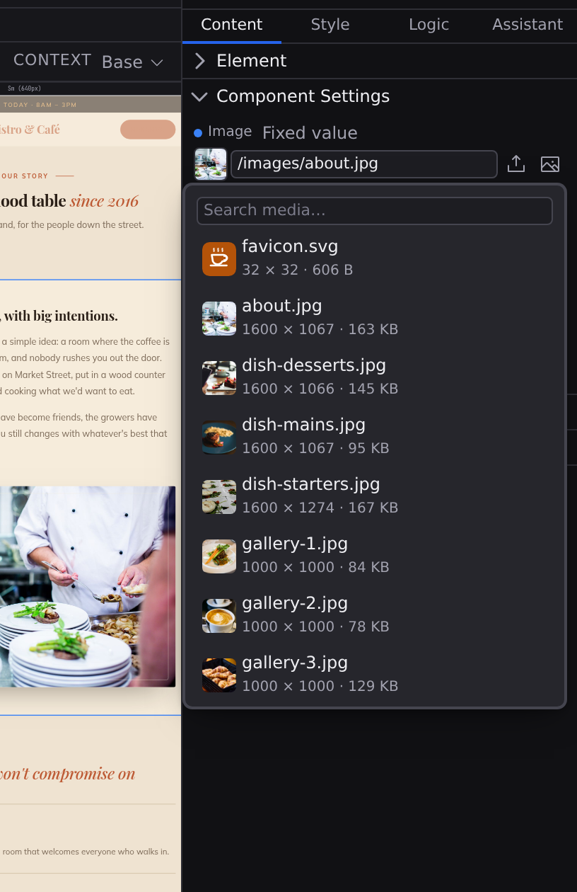
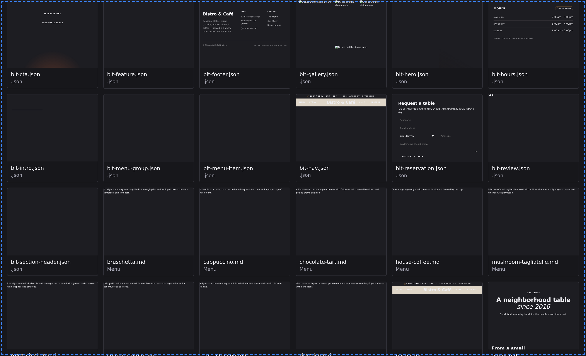

# Media

Your site's media (images, video, audio, PDFs, and fonts) lives in your project alongside everything else, and Studio can add it from wherever you already are. Drag a file onto the page you are designing, onto a folder in the Files panel, or onto the Library; or click **Upload** on any image field.

## Drag onto the canvas

Drag an image from your desktop onto the page:

- **Onto empty space**: Studio uploads it and drops an image in at that spot. You'll see the same insertion line you get when dragging an element from the Insert palette.
- **Onto an image that's already there**: the picture is highlighted, and dropping swaps it for the new one. Nothing else about the element changes: its size, alt text, and styling all stay put.

Video, audio, and other files work too. A video becomes a `<video>` player, audio becomes an `<audio>` player, and anything else (a PDF, say) becomes a download link labelled with the filename. Drop several files at once and they land in order.

:::doc-tip
Dropping onto a component that takes a single image (a card with a cover picture, for instance) replaces that picture, not the whole component. Dropping an image onto a video sets its poster frame, since a video's own `src` is the movie.
:::

## Upload from an image field

Studio asks for an image or file in several places: an image's **Content** tab, a frontmatter field, and the Icon and social-image fields in **[Search appearance](/docs/studio/editing/frontmatter)**. Every one of them has an **Upload** button beside the browse button. Click it, pick a file, and Studio adds it to the project and fills the field in for you.

The browse button opens the picker: a search box over the media already in `public/`, matched on name or path, with a thumbnail for every image. The list is in path order, so the same project always shows you the same list in the same place. It opens above whatever surface it was called from, so it works the same in a panel and in a window like Search appearance.

## Drag into the Files panel

Drag files onto any folder in the Files panel and they upload into that folder. The folder highlights as you hover it, and expands once the files land. Dropping onto a file puts the upload beside it, in the same folder. Dropping onto empty space in the panel puts it at the top level of your project.

You can also right-click a folder and choose **Upload Files…** to pick from a dialog instead.

## Drag into the Library

Open the Library by running **Open Library** from the palette (:kbd[⌘K]), then drag files anywhere onto it, or click **Upload**. The destination is the active category's own folder: with **Media** selected files go to `public/`, with **Layouts** selected they go to `layouts/`, and so on. The **Upload** button's tooltip names that folder before you press it.

**All** is the one category with no folder of its own, so it asks rather than guessing: dropping there opens a small dialog with `public` filled in, and the upload waits for your answer. An upload that lands somewhere you didn't choose is the surprise this exists to prevent.

Right-click any file to **Open**, **Rename…**, **Duplicate**, or **Delete** it. Renaming preselects just the name, so typing replaces `hero` in `hero.jpg` and leaves the extension alone.

## Where your files go

When you don't pick a folder yourself, Studio decides from what you're editing:

| You're editing             | Files land in                  | Referenced as       |
| -------------------------- | ------------------------------ | ------------------- |
| A content collection entry | `content/<collection>/images/` | `./images/hero.jpg` |
| Anything else              | `public/`                      | `/hero.jpg`         |

Everything in `public/` is served from your site's root, so `public/hero.jpg` becomes `/hero.jpg` on the published site. Media kept beside a content entry travels with it, which is useful when a blog post's pictures belong to that post rather than to the site as a whole. The folder layout is documented in [Site architecture](/docs/framework/site).

A post's own pictures are written the way any markdown editor expects (`./images/hero.jpg`, relative to the post), so the file still reads correctly outside Studio. On your published site those become `/content/posts/images/hero.jpg`, and the canvas previews them at that same address, so what you see while editing is what visitors get.

A **translated** collection keeps each language's pictures apart the same way. A collection sourced from `content/posts/{locale}` publishes each locale's folder separately, so a French post's `./images/hero.jpg` is `/content/posts/fr/images/hero.jpg` and its English translation's is `/content/posts/en/images/hero.jpg`: two different pictures at two different addresses, which is usually the point.

:::doc-note
Some hosts cap the size of a single upload. When yours does, Studio refuses an oversized file before sending it and says what the limit is, so a large video fails in a moment with a number rather than after a long wait.
:::

:::doc-note
Uploads never overwrite. If a file of the same name is already there, the new one becomes `hero-1.jpg`, then `hero-2.jpg`, and so on. The original is left alone. A batch doesn't collide with itself either.
:::

## Open a media file

Click an image in the Files panel, or a tile in the Library, and it opens in a tab of its own, the same as a page or a component and keyed by the same path. What that tab shows depends on the file: an image at full size, a video or audio file with playback controls, a font set as a specimen at five sizes, a PDF embedded. A format Studio has no viewer for says so plainly and notes that the file is still in the project and still builds.

Beside the file, three things:

- **What it is**: its kind, its pixel dimensions once the image has loaded, its size on disk, and when it was last modified. Anything Studio hasn't been told is left out rather than shown as a zero.
- **How to reference it**: the URL a document actually writes for this file, with a **Copy** button. This is worth having in front of you, because a file at `public/hero.jpg` is referenced `/hero.jpg`, a string that shares no part of its path, and writing the path instead is the commonest way an image goes missing from a page.
- **Used by**: every document that references it, with a count each. Click one to open it.

The viewer is read-only. Renaming, deleting and revealing a file belong to the Files panel, where you already do them for everything else.

:::doc-tip
This is the fastest way to check what an [imported site](/docs/studio/projects/create) actually brought in. Open `public/assets/images/` in the Files panel and click through: you'll see the real dimensions of every asset the crawl downloaded, and which of your new pages uses each one.
:::

## What Studio knows about a file

A row in the media picker carries a one-line caption as soon as Studio knows the numbers: `1200 × 800 · 84 KB`. Both halves are read from work already done, so a caption never costs a second download: the size comes from the directory listing that built the list, and the pixel dimensions from the thumbnail once the browser has decoded it.

A fact Studio doesn't have is left out of that line rather than filled in with a placeholder. A file whose size the listing didn't report shows only its dimensions; an image whose thumbnail hasn't loaded yet shows only its size. `0 × 0` is something a real file can nearly be, so it is never used to mean "we didn't find out".

## Deleting media

Deleting a picture is the one media gesture that can break pages you aren't looking at, so the confirmation says what it breaks **before** you press Delete. The count is resolved while the dialog is being built, never filled in after you've already answered it.

The dialog states how many references, in how many files, stop resolving, and that those files themselves stay on disk with their references left dangling. When nothing points at the file, it says so in its own words: _nothing else in this project refers to it_.

:::doc-warning
A count Studio could not produce is reported as **unknown**, never as zero. If the reference search fails, the dialog says the references could not be counted and that this may break more than it appears to. An unanswered question and an answer of "nothing" are different facts, and only one of them makes a delete safe. On a backend with no reference search at all, the dialog carries no count line rather than one implying a number it doesn't have.
:::

**Rename** is not a delete and doesn't read like one: its dialog states how many references will be **rewritten automatically**, because the rename repairs what the delete would break.

Studio finds those references wherever they are written. An image is referenced as a site URL (`/images/hero.jpg`), and the same file might be named by a page's `src`, by a component property you filled in on the canvas, by a content entry's front matter, or by the social card in your project settings. All of them count, and all of them are rewritten when the file moves. If the file leaves `public/`, the rewritten reference follows it, and Studio picks the form the published site will actually serve.

:::doc-note
A CSV collection is a data source Studio loads entries from, not a document it round-trips, so it is never rewritten wholesale. A reference in one is still repaired: Studio replaces that cell's text and leaves the rest of the file exactly as you wrote it. Where a reference genuinely cannot be updated (a file that will not parse), the rename reports a **warning** naming the file rather than a plain success. The same applies when you drag a file to a new folder.
:::

## What the build does to images

You only ever upload one copy of an image, at full quality. When your site is built for publishing, each image is optimized automatically: the build generates multiple sizes and modern formats (WebP, AVIF) and wires them up so every visitor's browser downloads the smallest version that looks sharp on their screen. There is nothing to configure in Studio. The pipeline is described in **[Site architecture](/docs/framework/site)**.

## Next

- **[The Library](/docs/studio/projects/browse)**: the rest of the Library
- **[Publish](/docs/studio/publish)**: how the optimized site goes live
