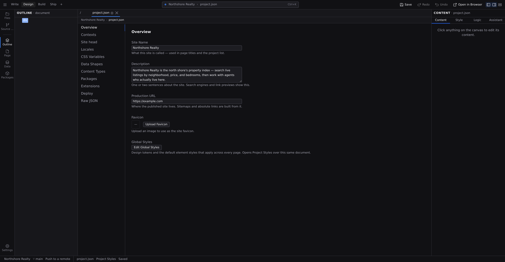

# Project settings

Everything that applies to your whole site rather than one page (the name, the favicon, the fonts, the design tokens, the packages) lives in your project's configuration. In Studio that configuration is **a document**: it opens as a tab in the pane, with its sections listed down the left, and you edit, undo and save it exactly as you would a page.

Open it from the **Settings** menu at the foot of the rail: **Open Project Settings**, whose submenu lists every section so you can land on the one you want. It is also on :kbd[⌘⇧,], on :kbd[⌘K] as **Open Project Settings**, and in the **⬢ menu** in the Command Bar. (:kbd[⌘,] is the other half of the pair: **Preferences**, which configures the app rather than this project.) Click a section on the left to move between them; the section you were last on is where you land next time.

## It behaves like a document

The tab you are editing is `project.json`, the file at the root of your project that defines it, and the ordinary document verbs all work on it:

- **Changes save as you make them.** There is no separate save button in the sections; typing a new site name and leaving the field writes the file.
- **A mistake is undoable.** Every change is recorded as a step, so :kbd[⌘Z] takes back the last one. Undoing leaves the document with unsaved changes, so press :kbd[⌘S] to write the value you went back to.
- **A failed write is visible.** If the file cannot be written (a read-only project, a full disk, a backend that has gone away), the change is not quietly dropped. Studio raises a problem naming `project.json` in the [Problems list](/docs/studio/interface/problems-and-progress), and the document stays marked unsaved so :kbd[⌘S] is the retry.
- **An edit that changes nothing writes nothing.** Re-committing a field's existing value leaves the file untouched, so your project's diff only ever shows what you actually changed.

:::doc-tip
Because it is one document, the same tab can be read three ways: this form, [Project Styles](/docs/studio/design/stylebook) for design tokens and element defaults, and the Code editor for the raw file. All three share one undo history and one unsaved-changes flag.
:::

## Overview

What the site _is_:

- **Site Name**: what the site is called. This is the name you gave it when [creating the project](/docs/studio/projects/create), and this is where you change it afterwards. It can't be left blank.
- **Description**: one or two sentences about the site, used by search engines and link previews. Studio stores it as the site-wide `<meta name="description">` tag, so it also shows up in the **Site head** section; clearing it here removes the tag.
- **Production URL**: where the published site lives, as a full address starting with `http://` or `https://`. Sitemap generation is switched on by having one, and absolute links are built from it. Clearing the field turns the sitemap back off.
- **Favicon**: click **Upload Favicon** and pick an image; Studio copies it into your project and shows the current one beside the button.
- **Global Styles**: **Edit Global Styles** switches this same document into **[Project Styles](/docs/studio/design/stylebook)**, where the design tokens and default element styles live with the canvas beside them. It runs **Open Project Styles**, which is also in the rail's **Settings** menu and on :kbd[⌘K]: one capability, three doors. Run **Open Project Settings** again to come back.

A value the section refuses (a blank name, an address that isn't a full URL) is reported under the control that caused it, and the stored value stays as it was.

## Contexts

The conditions your pages are rendered under, and the only place they are defined:

- **Base width**: how wide the Base canvas renders when no other context applies.
- **Size breakpoints**: width conditions like `(max-width: 768px)`. Each one gets its own canvas panel in Design view. See **[Breakpoints](/docs/studio/design/breakpoints)**.
- **Colour schemes**: a Light/Dark picker that writes the `prefers-color-scheme` query for you. Declaring one turns on the **Auto / Light / Dark** control in the pane's context bar.
- **Feature queries**: anything else a media query can ask, such as reduced motion, print, hover, orientation. These become toggles in the context bar rather than canvas panels.

Name a context in plain language; Studio derives the stored name ("Wide screen" becomes `--wide-screen`). Each change is schema-checked before it is written, and a refusal (a duplicate name, an empty query) appears under the control that caused it while the stored value stays as it was.

:::doc-note
The check looks at the whole `project.json`, but only holds you responsible for what your edit changed. If the file already had a problem, such as a key from an extension you removed or a key something else wrote, that problem is reported once at the top of the section, naming the key, and your edit still saves. It used to block every context edit instead: typing a base width into an imported project reported three copies of _"must NOT have unevaluated properties"_, none of which was about widths and none of which named the key at fault.
:::

The context bar's **Context** popover only _chooses_ among what is defined here; its **Manage contexts…** footer opens this section, so you can add a breakpoint without losing your element selection.

## Site head

What goes into every page's `<head>`, the invisible part of a web page that loads fonts, styles, and services:

- **Google Fonts**: type a font family name and press :kbd[Enter] or click **+ Add** to load it across the whole site. Loaded fonts are listed with a delete button each.
- **Head**: add a **Link** (external stylesheet), **Meta** (page metadata), **Script**, or **Style** entry and fill in its fields. Script and Style entries get a text box for their body, which is where an analytics snippet or a custom style block goes.

## Locales

The languages this site is published in. Add a [BCP 47](https://www.rfc-editor.org/info/bcp47) tag (`fr-CA`, `ar`, `de`), pick which one is the default, and choose whether the default language's pages sit at the bare URL (`/about`) or under a prefix like every other (`/en/about`).

Tags are checked as you type by the same parser the build uses, so a tag this field accepts is one that builds: `en_US` is refused here rather than discovered later. Declaring a second language is what turns on every other language surface in Studio. See **[Languages](/docs/studio/interface/languages)**.

## CSS Variables

Your design tokens: the named colors, fonts, and sizes your styles refer to, grouped into **Colors** (each with a color swatch you can click to pick), **Fonts** (each with a live preview line), **Sizes & Spacing**, and **Other**. Edit a value and every element that uses the token updates; a token can also carry per-context overrides so spacing tightens on small screens or a color changes in the dark scheme. If no colour scheme is declared yet, the Colors group says so and offers **Manage contexts…**, which takes you to **Contexts** to declare one.

The same tokens, with the live canvas beside them, are in **[Project Styles](/docs/studio/design/stylebook)**. See **[Design tokens](/docs/studio/design/tokens)** for working with them.

## Data Shapes

Reusable descriptions of a piece of data (an API response, a shared record type) that other parts of the project can refer to. A data shape uses the same visual field builder as content types: named fields with a type, an optional format, and a required toggle. **New Data Shape** adds one; pick a shape on the left to edit its fields, and a **reference** field gets a picker naming one of your content types. Most sites never need this section; for modeling your content itself, use **[Content types](/docs/studio/projects/content-types)** instead.

## Packages

The npm packages your project uses, as a table of name, current version, and latest version:

- **Latest** is that package's newest version on npm. Every row carries one, whether or not you're behind, and Jx's own packages are treated the same as any other. A row reads `—` only when there's no npm version to name: a local or workspace package, or a lookup npm didn't answer.
- Type a package name and click **Add** to install one.
- A refresh icon appears on any row that's actually behind, and never on one you've pinned ahead of npm on purpose. **Update all** takes every behind row to its own latest at once.
- **Reinstall** re-installs everything from scratch: the fix-it button if packages ever end up in a bad state.

Adding packages and choosing which of their components your site uses is covered in **[Dependencies and imports](/docs/studio/projects/dependencies)**.

## Extensions

Extensions add what Jx does not do on its own: content collections, site search, feeds, sign-ins and databases. Each one is a row with a switch, and the switch is the whole gesture.

- **Available** lists what your setup can run. Turning one on installs its package first if you do not have it, then enables it. The row says so before you click.
- **Installed** lists extensions already among your project's dependencies, including any third-party ones.
- **Named in project.json** lists anything your configuration asks for that Studio could not describe. You can still turn those off, which is what you usually want.

Each row names the settings sections the extension owns. Those sections appear beside this one as soon as the change is saved, so a section an extension contributes shows up without reloading Studio, and disappears again when you turn it off.

**Turning an extension off leaves its package installed.** Turning it back on is then instant, and nothing about your pinned version changes. To remove the package itself, use the delete button on its row, which is offered only once the extension is off: deleting the package while your configuration still names it would break the next build.

:::doc-note
An extension has to be two things at once: a dependency your project has installed, and a name in your configuration. That is why the switch does both. If a row warns that an extension is named but not installed, turning it off and on again installs it.
:::

## Deploy

- **Platform Adapter** decides how the build packages the site for your host: **Static**, **Bun**, **Node**, **Cloudflare Workers**, or **Cloudflare Pages**. This is where the choice is made; [creating a project](/docs/studio/projects/create) doesn't ask. **Static** emits plain files for any host that serves them; the other four additionally package the site's server tier, which is what answers a database, sign-ins, or server functions. One of them becomes _required_ once the project has a database or sign-ins, because the build stops with an error on **Static**. Server functions still build on **Static**, but only these four actually serve them. See [Build output and adapters](/docs/framework/site/deployment) for what each one writes into `dist/`.

## Raw JSON

The whole of `project.json` exactly as it is saved. **Edit as code** opens that same document in the Code editor: one undo history, one unsaved-changes flag, so you can move between the form and the text without forking the two.

## Sections added by extensions

Extensions contribute their own sections, which appear in the same list beside the built-in ones. **Content Types**, where you model your site's content, arrives this way from the parser extension and has its own page: **[Content types](/docs/studio/projects/content-types)**. **Connections** arrives from the connector extension: **[Connections](/docs/studio/data/connections)**. Turning an extension off in **Extensions** takes its section away again.

:::doc-note
Every section edits `project.json` at the root of your project, the same file the New Project modal first wrote. The full shape is documented in [Site architecture](/docs/framework/site).
:::

:::doc-note
`project.json` is not shared through [collaboration](/docs/studio/publish/collaboration) sessions. It configures your copy of the editor and is edited from surfaces that are not the canvas, so each person's project configuration stays their own.
:::

## Next

- **[Content types](/docs/studio/projects/content-types)**: model your content in the Content Types section
- **[Dependencies and imports](/docs/studio/projects/dependencies)**: packages and component imports in depth
  - packages/studio/src/surfaces/settings-overview.json
  - packages/studio/src/surfaces/settings-overview.ts
  - packages/studio/src/surfaces/settings-contexts.json
  - packages/studio/src/surfaces/settings-contexts.ts
  - packages/studio/src/surfaces/settings-head.json
  - packages/studio/src/surfaces/settings-head.ts
  - packages/studio/src/surfaces/settings-locales.json
  - packages/studio/src/surfaces/settings-locales.ts
  - packages/studio/src/surfaces/settings-deploy.json
  - packages/studio/src/surfaces/settings-deploy.ts
  - packages/studio/src/surfaces/settings-rawjson.json
  - packages/studio/src/surfaces/settings-rawjson.ts
  - packages/studio/src/surfaces/settings-css-vars.json
  - packages/studio/src/surfaces/settings-css-vars.ts
  - packages/studio/src/surfaces/settings-extensions.json
  - packages/studio/src/surfaces/settings-extensions.ts
  - packages/studio/src/surfaces/settings-packages.json
  - packages/studio/src/surfaces/settings-packages.ts
  - packages/studio/src/surfaces/settings-defs.json
  - packages/studio/src/surfaces/settings-defs.ts
