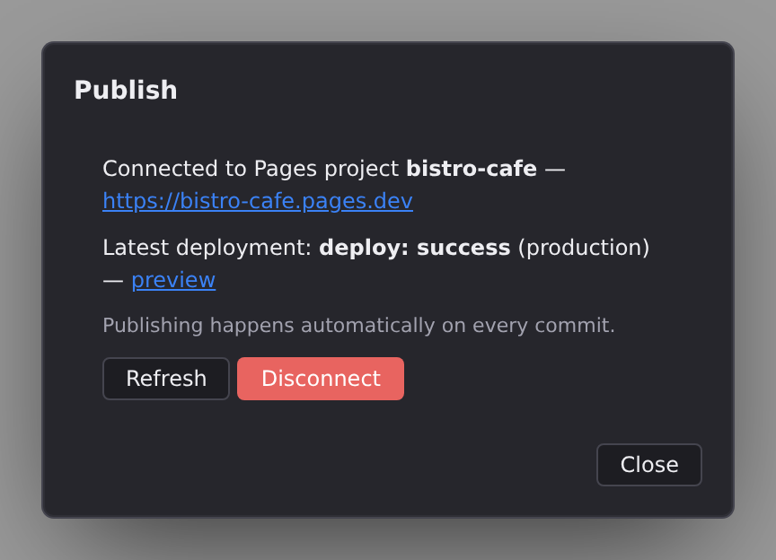

# Publish to Cloudflare Pages

The Publish panel connects your project to Cloudflare Pages, so that every commit you sync builds and publishes automatically. Cloudflare Pages is a free host that serves your prebuilt pages from a CDN, and if your project has a database or sign-ins, it also runs the small worker Jx emits for their `/_jx/*` routes. Open it with the **Publish** button in the toolbar.

Before you start, the project needs to live on GitHub. If it doesn't yet, **[GitHub](/docs/studio/publish/github)** walks you through publishing it from Studio.

## Connect your Cloudflare account

The first time you open the panel, it asks for a Cloudflare connection. What you see depends on your Studio platform:

- **Connect Cloudflare**: click it and sign in to Cloudflare in the window that opens. Done.
- **API token form**: some platforms ask you to paste a Cloudflare API token instead. Create one in the Cloudflare dashboard with the permissions the panel names (Account Settings Read, Pages Read/Write), then click **Verify & Connect**. The token stays on your machine.

:::doc-note
Once a token is stored, the panel reports that it is stored. It never renders the token back into the field. The box is drawn empty, and only when you ask to replace the token. Revoking lives with every other credential, in **[Preferences › Accounts](/docs/studio/interface/preferences)**.
:::

If the panel instead says it can't reach the Cloudflare API on this platform, you don't need it at all. Set up Pages once in Cloudflare's own dashboard and publishing still works the same way: commit and sync, your host builds.

Where the platform holds the connection for you, an authorization that has expired is named as exactly that: the panel says the connection expired and offers **Reconnect Cloudflare**, rather than asking you to connect an account you already connected. Your deployments are untouched. The site keeps serving, and only the panel's ability to read and change the Pages project is waiting on the reconnection.

## Create and connect a Pages project

Once connected, the panel offers to create a Pages project tied to your repository:

1. **Account**: pick your Cloudflare account.
2. **Pages project name**: pre-filled from your project's name; this becomes part of your free site address.
3. **GitHub owner** and **GitHub repository**: where the project lives.
4. **Production branch**: the branch that publishes to your live site, normally `main`.
5. Click **Create & Connect**.

Studio creates the Pages project (or reuses one with that name if it already exists) and configures it to build and publish your site on every push. If Cloudflare reports it can't see the repository, the error includes a link to install the **Cloudflare Pages** GitHub App. Install it on the repository and try again.

## Watch deployments

After connecting, the panel becomes a status view:

- The connected Pages project's name, with a link to your live site address.
- The latest deployment's stage and status (for example _deploy: success_), with a **preview** link to that exact build.
- **Refresh** re-checks; **Disconnect** removes the connection (your Pages project and site stay up; only the link from Studio is removed).

There is no publish button, because publishing is automatic: every **Commit and sync** in **[Source control](/docs/studio/publish/source-control)** triggers a fresh build and deployment. Right after connecting, the panel shows _No deployments yet_. Your next commit starts the first one.

## Sites with a database or sign-in

Pages serves both halves of a Jx site, but a project with **[data tables](/docs/studio/data)** or accounts needs three things arranged once:

1. **Set the adapter.** In _Settings > General_, set **Platform Adapter** to **Cloudflare Pages**, or to **Cloudflare Workers** if you deploy the site as a Worker instead. Connecting this panel doesn't change it for you, and the build stops with an error on **Static** as soon as the project declares data tables.
2. **Push the schema to the real database, from a terminal.** While you develop, a [D1 connection](/docs/studio/data/connections) is stood in by a local SQLite file. Studio's **Push Schema** button goes through that same local backend, so it creates your tables in `.jx/data/<connection>.sqlite` and never touches D1 or `wrangler.jsonc`. `jx db push` is the path that talks to the connection as declared: it applies the same additive plan to D1 itself, and writes D1's binding into your project's `wrangler.jsonc` on the way through. Reaching D1 from outside a deployed worker goes over Cloudflare's API, which needs three things together: the connection's **database ID**, a `CLOUDFLARE_API_TOKEN`, and an account ID (the connection's own **account ID**, or `CLOUDFLARE_ACCOUNT_ID`). Miss one and the push reports the connection as unreachable. Accounts need a second pass: the auth extension's own tables aren't part of the CLI push, and **[Auth and secrets](/docs/studio/data/auth-and-secrets)** covers where they come from.
3. **Set the secret values on Cloudflare.** `project.json` records only the _names_ of environment variables: the session signing secret, a database URL, OAuth credentials. Give each name a value on the Pages project, with `wrangler pages secret put <NAME>` or the environment settings in Cloudflare's dashboard; locally the same names are read from `.dev.vars`. **[Auth and secrets](/docs/studio/data/auth-and-secrets)** covers the whole arrangement.

Your pages stay prerendered and CDN-served either way, because only the `/_jx/*` routes reach the worker. The two adapters arrange that differently: **Cloudflare Pages** ships a `_routes.json` alongside the worker that tells Cloudflare to wake it for `/_jx/*` and nothing else, while a **Cloudflare Workers** deploy puts the worker in front of every request and hands anything that isn't one of its routes straight to the static assets.

:::doc-note
Studio records the connection under `build.deploy` in `project.json` (provider, account, project name, and live address), so it travels with the repository, and any copy of Studio that opens the project knows publishing is already set up. Cloudflare builds with `bunx jx build` and serves the `dist/` output.
:::

## Next

- **[Source control](/docs/studio/publish/source-control)** is the commit-and-sync flow that triggers each deployment.
- **[Other hosts](/docs/studio/publish/other-hosts)** puts the same site on Netlify, GitHub Pages, or anywhere else.
  - packages/studio/src/surfaces/publish.ts
