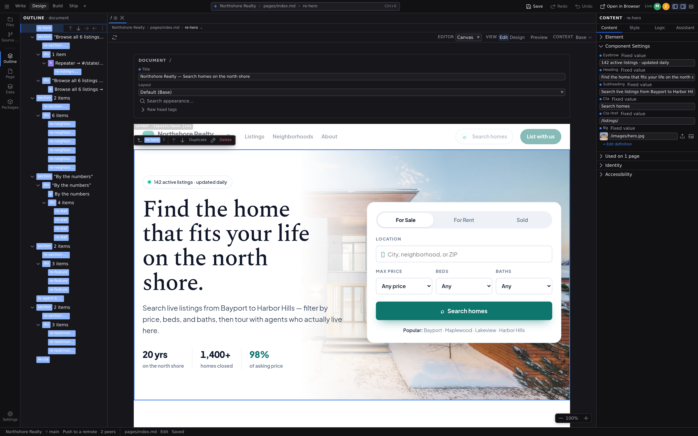

# Real-time collaboration

When two people open the same file through the same Studio backend, the tab becomes a shared session: everyone sees everyone's edits as they happen, on the canvas and in the code. There's nothing to turn on. If your setup supports it (see below), co-editing starts by itself the moment a second person opens the file, and a file opened alone behaves exactly as always.

## What you see

- **A status pill** in the toolbar reads **Live** while the session is connected, and names every other state plainly: **Solo** when nobody else is here, **Connecting…**, **`Offline — changes sync on reconnect`**, or **Not connected** when the session could not start. Hover it for the reason. It replaces the usual unsaved-changes dot for this tab.
- **Flags beside the pill**: **Read-only** when you may look but not publish, and **Code view held** while a collaborator has the text view (see below). Both are standing statements, not error messages.
- **Presence chips**: one colored circle per collaborator, showing their avatar or initial. Hover one to see who it is and which file they're in; peers elsewhere in the project show up too, labeled with the file they're browsing.
- **Selections on the canvas**: every element a peer has selected is outlined in their color, labeled with their name, and follows them live. A peer working across several elements at once shows all of them, so you can see the whole shape of what they are about to change rather than one node of it.
- **Cursors in Code view**: in the **[Code](/docs/studio/logic/code)** mode the shared text carries every writer's caret and selection in their color, with their name on the caret. A caret goes away when its author leaves Code view, so the ones you can see are the people actually in the text with you.

## How co-editing behaves

- **Edits merge.** Everyone edits the same live document. Changes apply as they arrive, and simultaneous edits to different parts of a file both land. No locking, no taking turns.
- **Undo is yours alone.** :kbd[⌘Z] / :kbd[Ctrl+Z] steps back through _your_ edits only, so you can't undo what a teammate just did. The status pill's tooltip says so, because it is the kind of rule that is easier to be told than to discover.
- **Forms sync too.** Page metadata and frontmatter fields co-edit the same way the canvas does.
- **Code view takes precedence, including over the person in it.** While someone is editing the file as text, the text is the truth: structural editing pauses for everyone, the text editor included. Their Outline, their Inspector and their canvas refuse the same edits everyone else's do, and say the same thing when they try. A **Code view held** flag stands beside the status pill for as long as it lasts, so a refused edit has a visible cause rather than looking like a fault. When the last text editor leaves Code view, normal editing resumes.

  The exemption is the part worth knowing about, because it is the part that used to exist. Holding the text lock while still editing the tree meant editing two representations of one document with only one of them shared: the structural edit never reached the text, and leaving Code view parsed the untouched text back over it. The layer you deleted reappeared, seconds later, with no explanation. And you were the one person the "structural editing paused" message was never shown to. One document, one truth at a time, and the pen-holder is not exempt from their own lock.

- **Read-only guests follow along.** On backends that grant view-only access, those visitors see everything (content, cursors, presence), but their edits are not published. A banner says so before you start typing, and a **Read-only** flag sits beside the status pill.

## Your project's configuration stays yours

One document is deliberately outside the session: **`project.json`**, the file behind **[Project settings](/docs/studio/projects/settings)** and **Project Styles**. Open it and there is no pill, no presence, no shared cursor. It edits like a file you are alone with, because for this purpose you are.

Two reasons, and both are about what the file _is_:

- **Its edits don't come from the canvas.** The surfaces that write it are forms, not text: a settings form, the packages list, the deploy fields. The shared session is built for a document two people type into. A collaborator holding the text view would otherwise pause your configuration edits, which contain no text at all.
- **Its value configures your editor.** Studio reads all of this out of `project.json` as you work: the formats you can open, the extensions that are loaded, the schemas your JSON is checked against, the style cascade the canvas renders with. Shared, a teammate turning an extension on would reconfigure your editor mid-keystroke.

The consequence to plan around: **a collaborator does not see your configuration edits live.** They arrive with the file: once you have saved it, and once that saved file has reached them, whether by [source control](/docs/studio/publish/source-control) or by their reopening it. Tell the room when you change a shared setting; nothing else will.

## Commands

Open the **[Command palette](/docs/studio/interface/commands)** and type `Collaborate` for the session's verbs:

- **Collaborate: Share this document** and **Collaborate: Stop sharing** join or leave the session for the open document.
- **Collaborate: Copy session link** copies a reference to the room. It names the session; it does not grant anyone access to it.
- **Collaborate: Follow a collaborator** reports which file a named collaborator is in, and offers to open it.
- **Collaborate: What is happening in this document?** gives the full state in one place: connection, who is here, whether you can publish, whether the code view is held, and the undo rule.

## Syncing is not saving

Your edits reach your collaborators instantly, but the file on disk still changes only when someone saves. The explicit **Save** is unchanged. What _is_ shared is the unsaved state itself: the moment anyone edits, the file counts as unsaved for the whole session, and one person saving saves the shared result for everyone. Committing in **[Source control](/docs/studio/publish/source-control)** saves open co-edited files first, so a commit always captures what the session currently sees.

:::doc-warning
On a shared dev server, unsaved co-edits live only in the server's memory. If everyone closes the file without saving, those edits are discarded shortly after, so save before you all walk away.
:::

## Which setups support it

- **A shared dev server** is the built-in case. Everyone who opens the same dev-server URL (see **[The dev server](/docs/framework/build/dev-server)**) co-edits; even two browser windows on your own machine will. The dev server has no user accounts, so collaborators appear with generic names (`local-1`, `local-2`, …) and everyone can write.
- **A hosted Studio backend** gives the same experience wherever it offers a collaboration endpoint, with real identities (name and avatar) and per-person write or read-only permission supplied by the platform.
- **The [desktop app](/docs/studio/desktop)** is always solo: it edits your local files directly and has no collaboration endpoint.

## Falling back to solo

Collaboration degrades, never blocks:

- A backend without the endpoint simply gives you ordinary solo editing, with no errors and no pill.
- A backend running a **different version of the co-editing wire format** also gives you solo editing, rather than a session. Studio and the backend agree on a format before the connection opens, and when they can't, joining anyway would mean two copies of the document merging edits neither side reads the same way. Updating whichever side is older restores it.
- If a session can't sync within a few seconds of opening, the tab proceeds solo and the pill reads **Not connected** with the reason on hover. This is deliberately not the same as **Solo**: **Solo** means nobody else is here, **Not connected** means something went wrong, and the two never wear the same word.
- If the connection drops, the pill reads **`Offline — changes sync on reconnect`**: keep editing, and your changes merge when the connection returns.
- If the file is replaced underneath the session (a git pull or discard, an outside edit), the session resets and rejoins on the new content automatically.

## Next

- **[Source control](/docs/studio/publish/source-control)** turns the shared result into a commit.
- **[Code](/docs/studio/logic/code)** is the text view that co-editing shares character by character.
