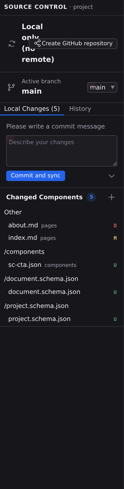
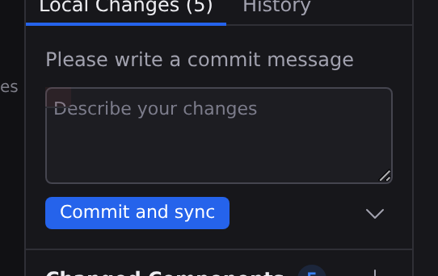

# Source control

Source Control is Studio's built-in git client, a Navigator panel that records your work as commits and keeps your copy of the project in sync with its repository. Open it by clicking **Source Control** in the **Project** group of the Navigator rail, or with :kbd[⌘3]; a badge on the button counts the files that have changed. It is a project-level panel: its header reads **SOURCE CONTROL · project**, and the badge stands whether or not a document is open.

If the project isn't tracked by git yet, the panel explains what source control buys you and offers **Initialize Repository** to start tracking it locally, or **Create GitHub repository** to go straight to a hosted one. See **[GitHub](/docs/studio/publish/github)**. Projects created from the [New Project wizard](/docs/studio/projects/create) are already tracked, so you'll only meet this on a folder that came from somewhere else.

With no project open at all, the panel says what source control is for and offers **Clone Git Repository** where the platform supports it.

## Review your changes

The **Local Changes** tab lists every changed file, grouped by the part of the project it belongs to. Each row shows the file's name and a status badge: **M** for modified, **A** for added, **D** for deleted, **U** for a brand-new untracked file.

- Click any changed file to see what changed since your last commit: the pane switches to its **Diff** editor, at full pane size. Put it in a [second pane](/docs/studio/interface/tabs#two-panes) with :kbd[⌘\] and the review sits beside the page it is about, both live.
- Every row opens, whatever kind of file it is. A page or a component opens as a picture of the change; a stylesheet, a script or a config file opens as text. Deleted and brand-new files open too, with one side empty.
- Click **+** on a row to stage it (mark it for the next commit), or the header's stage-all button to stage everything. Staged files move to a **Staged Changes** section, where **−** unstages them, and an unstage-all button beside its count clears the section.
- Click the undo icon on a row to discard its changes. Studio asks for confirmation first. An untracked file has nothing to go back to, so its undo icon is disabled rather than offering to throw the file away.

:::doc-warning
**Discard** permanently throws away a file's changes since the last commit. There is no undo beyond the confirmation dialog.
:::

## Read a change

The Diff editor compares your working copy against your last commit. It shows the change two ways, and the switch above the comparison chooses between them.

**Visual** draws the page twice, side by side: the committed version on the left and your version on the right. Added blocks are marked in green, removed blocks in red, and edited ones are marked on both sides so you can read the before and the after together. Each mark also carries a symbol and its own edge style, so the change is legible without relying on colour.

**Code** shows the file's text instead, with changed lines highlighted the way any code editor shows them. A page can be read either way. A file with no visual form, such as a stylesheet or a script, opens straight into Code and the switch reads as a label.

:::doc-note
The two views answer different questions and neither replaces the other. Visual tells you what moved on the page. Code tells you exactly which characters changed. Some changes are visible in one and not the other: reordering a key, or editing something inside a component, can leave the page looking identical while the text plainly differs.
:::

Use **Next change** and **Previous change**, or :kbd[F7] and :kbd[⇧F7], to walk the changes in order. The counter beside them says where you are. Both sides of the comparison move together, so the block you are reading stays lined up. The stepper stops at the last change rather than looping back to the first.

The comparison keeps up with your work. Saving the file you are reviewing, committing, discarding, pulling or switching branches all refresh it, and your place in the change list is kept rather than reset. A file you have just committed has nothing left to compare, and the pane says so.

Two kinds of change cannot be opened, and the panel says which. A **renamed** file needs both of its names to be compared and only the new one is recorded. An **image** or other binary file has no text on either side.

## Commit and sync

1. Type a summary of your work in the message box.
2. Click **Commit and sync**. Studio records the commit and pushes it to your repository in one step. That push is what triggers your host's build, as described in **[Publish](/docs/studio/publish)**.

To record a commit without pushing, open the dropdown beside the button and choose **Commit (don't sync)**, or press :kbd[⌘Enter] / :kbd[Ctrl+Enter] in the message box. If nothing is staged, the commit takes all changed files. Either way, Studio folds any live [co-editing](/docs/studio/publish/collaboration) session into the files first, so a commit never misses the last few keystrokes a collaborator typed.

## Stay in sync

The bar at the top of the panel shows where you stand against the repository, with a last-updated time: **Up to date**, or how many commits you are ahead or behind. Studio refreshes this automatically while the panel is open, and the circular arrow at the left of the bar re-checks on demand. Three buttons act on it:

- **Fetch**: check the repository for news without changing your files.
- **Pull**: bring teammates' commits into your copy.
- **Push**: send your local commits up.

Studio also pulls automatically when you open a project that has a remote, so a session starts from the current state. If a pull can't merge cleanly, Studio reports the error and changes nothing. There is one exception: conflicts caused purely by Studio's own automated package updates are resolved for you (Studio discards its own machine-generated edits, pulls, and re-applies them; if _you_ edited those files it asks before discarding anything).

A project with no remote yet shows **Local only (no remote)** here, with a **Create GitHub repository** shortcut.

## Branches

The **Active branch** row shows which branch you're on. Use its picker to switch to another branch, or choose **+ New branch…**. Studio opens a **New Branch** dialog; type a name and click **Create**. Branches let you try a redesign on the side and only merge it when it's ready.

## History

The **History** tab lists your project's recent commits (short hash, message, author, and how long ago), so you can see how the site got to where it is. Before your first commit it explains what one is; with nothing changed since the last commit, **Local Changes** says so too.

## Without the panel

Four of these verbs are also commands, listed in [Quick Access](/docs/studio/interface/quick-access) under **Source Control**:

| Command                      | What it does                                            |
| ---------------------------- | ------------------------------------------------------- |
| **Initialize Repository**    | starts tracking the open project with git               |
| **Create GitHub Repository** | creates a repository, sets it as the remote, and pushes |
| **Push**                     | sends the current branch to its remote                  |
| **Sign In to GitHub**        | authorizes this machine, with or without a project open |

Naming them gives everything else something to point at: the [deploy checklist](/docs/studio/publish) puts them on its steps, a failed push can put **Push** itself on the Problem as a working button, and the [AI assistant](/docs/studio/ai/chat) can run them. **Initialize Repository** is offered only where it makes sense (on a project git isn't already tracking), and says so when it isn't.

:::doc-note
**Sign In to GitHub** belongs to the app rather than the project: a GitHub token is one per machine, and it's revoked in **Preferences › Accounts**. The other three belong to one repository.
:::

## Next

- **[GitHub](/docs/studio/publish/github)** puts a local project on GitHub without leaving Studio.
- **[Publish](/docs/studio/publish)** covers how a push becomes a live site.
